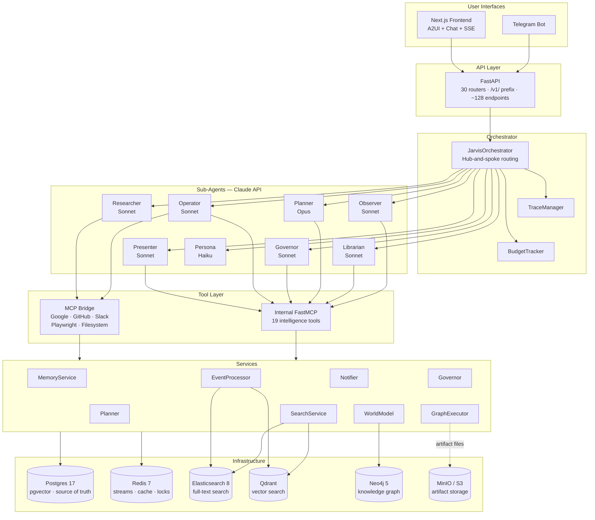

# Jarvis

A **Personal AI Operating System** for founders. Not a chatbot — an OS with a core loop:

```
Perceive -> Understand -> Update Model -> Plan -> Act -> Communicate
```

Jarvis continuously observes your data sources (Gmail, Calendar, Slack, GitHub), extracts entities and memories, plans actions, seeks approval for external writes, executes approved plans, and communicates results through Telegram and a Next.js web frontend.

## Architecture



### The 8 Sub-Agents

| Agent | Model | Role |
|-------|-------|------|
| **Observer** | Sonnet | Read external sources, detect changes, ingest events |
| **Librarian** | Sonnet | Extract entities, update world model |
| **Planner** | Opus | Determine intent, produce structured task graphs |
| **Governor** | Sonnet | Evaluate policies, gate approvals |
| **Operator** | Sonnet | Execute approved plans via MCP tools |
| **Presenter** | Sonnet | Generate user-facing output |
| **Researcher** | Sonnet | Deep context gathering (read-only) |
| **Persona** | Haiku | Learn user preferences from interactions |

Only Planner decides intent. Only Operator executes external actions. Only Presenter talks to the user. Governor sits before every external write.

> **Detailed architecture docs:** [`docs/architecture/`](docs/architecture/README.md) — sequence diagrams, data model, service reference, design decisions

## Quick Start

```bash
# 1. Start infrastructure (Postgres, Redis, MinIO, Elasticsearch, Qdrant, Neo4j)
docker compose up -d

# 2. Set up backend
cd backend
uv venv .venv --python 3.13 && source .venv/bin/activate
uv pip install -e ".[dev]"
cp .env.example .env  # edit with your API keys
alembic upgrade head
python run.py

# 3. Full system (API + background workers + Telegram bot)
python run.py --worker --bot

# 4. Frontend (optional)
cd frontend && npm install && npm run dev
```

## Deployment

Infrastructure is managed with Terraform in `infra/`. A single EC2 instance runs Postgres, Redis, the Jarvis backend, and Caddy (reverse proxy with auto-TLS).

## Project Structure

```
jarvis/
├── backend/
│   ├── src/
│   │   ├── api/            # 30 REST/SSE routers (/v1/ prefix, ~128 endpoints)
│   │   ├── config/         # Settings (pydantic-settings, JARVIS_ env prefix)
│   │   ├── connectors/     # Gmail, MCP bridge, 15 integration types
│   │   ├── interface/      # Telegram bot
│   │   ├── models/         # 54 SQLAlchemy tables (all workspace-scoped)
│   │   ├── orchestrator/   # JarvisOrchestrator, agents, hooks, tracing, budget, contracts
│   │   ├── services/       # 69 services (planner, governor, operator, etc.)
│   │   ├── tools/          # FastMCP intelligence server + MCP config
│   │   ├── ui/             # A2UI renderer + contracts
│   │   └── workflows/      # inbox_triage, meeting_prep, research
│   ├── tests/              # ~1196 tests (pytest + pytest-asyncio)
│   └── alembic/            # 44 database migrations
├── frontend/               # Next.js + A2UI renderer + chat panel (7 pages)
├── infra/                  # Terraform (AWS: EC2, VPC, Route53, IAM, SSM)
├── docs/architecture/      # Detailed architecture documentation
└── docker-compose.yml      # Local dev infrastructure
```

## Tech Stack

| Layer | Technology |
|-------|-----------|
| Backend | Python 3.13+ / FastAPI |
| Frontend | Next.js / React / A2UI |
| Database | PostgreSQL 17 (pgvector) — source of truth |
| Full-text Search | Elasticsearch 8.16 — BM25 indexing |
| Vector Search | Qdrant 1.12 — semantic similarity (4 collections) |
| Knowledge Graph | Neo4j 5 — multi-hop traversal, community detection |
| Object Storage | MinIO / S3 — artifact documents and media |
| Cache/Queue | Redis 7 — streams, cache, locks, pubsub, surface tracking |
| AI Models | Claude Opus/Sonnet/Haiku via Anthropic API or AWS Bedrock |
| Embeddings | AWS Bedrock Titan V2 (1024 dim) |
| Tool Protocol | MCP (Model Context Protocol) via FastMCP |
| Delivery | Telegram Bot API + Web SSE |
| Infrastructure | AWS (Terraform), Caddy reverse proxy |

## Key Features

- **Multi-tenant workspace isolation**: All 54 data tables scoped by `workspace_id` with CASCADE deletes
- **Real-time streaming**: Claude API streaming with extended thinking (Opus) + SSE to frontend
- **Full cost tracking**: Cache tokens (1.25x write, 0.1x read), thinking tokens, per-agent cost breakdown
- **Graduated trust**: TrustEngine scores + time-based policy overrides for autonomous operation
- **Runtime contracts**: Pydantic-validated boundaries (PlannerOutput, PolicyDecision, StepResult, ToolCallRequest)
- **Dynamic routing**: DB-backed agent routes with condition matching and pipeline composition
- **Knowledge graph**: 15 entity types, 17 relation types, temporal tracking, embedding-based fuzzy dedup
- **Proactive autonomy**: InitiativeScorer, time-based triggers, 7 default schedules
- **Auth system**: Magic links, OAuth (Google/GitHub), session tokens, Fernet-encrypted credentials
- **Command palette**: Cmd+K with 8 quick commands, slash command support

## Status

~1196 tests passing, 44 migrations, 54 tables, ~128 API endpoints, all lint clean.
