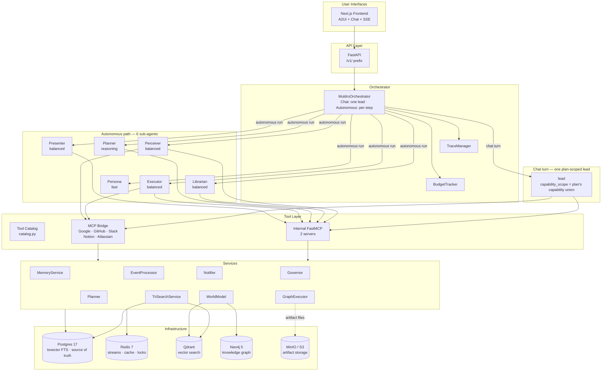

# Muldro

A **Personal AI Operating System** for founders. Not a chatbot — an OS with a core loop:

```
Perceive -> Understand -> Update Model -> Plan -> Act -> Communicate
```

Muldro continuously observes your data sources (Gmail, Calendar, Slack, GitHub), extracts entities and memories, plans actions, gates external writes for approval — staging them for review when you are not around rather than acting unasked — executes what is approved, and communicates results through a Next.js web frontend.

## Architecture



### The 6 Sub-Agents

| Agent | Tier | Role |
|-------|------|------|
| **Perceiver** | balanced | Observe external sources, gather context, detect changes (merges former Observer + Researcher) |
| **Librarian** | balanced | Extract entities, update world model |
| **Planner** | reasoning | Determine intent, produce capability-based plans |
| **Executor** | balanced | Execute approved plans via tools, scoped to each step's capability |
| **Presenter** | balanced | Generate user-facing output and live execution surfaces |
| **Persona** | fast | Learn user preferences from interactions |

Tiers are **provider-neutral**. Which model backs `reasoning` / `balanced` / `fast` is DB data
(`ModelBinding`, overridable per workspace via `PUT /v1/model-config`); the defaults are Claude
Opus / Sonnet / Haiku, and OpenAI, Gemini and local Ollama models are in the catalog.

Only Planner decides intent. These six are the **autonomous** path's cast — `GraphExecutor` routes each plan step to one of them by capability, only the Executor performs external actions, and only Presenter talks to the user.

A **chat** turn works differently: it builds one synthetic `lead` (not a registry agent) whose `capability_scope` is the union of the plan's steps, and that lead acts and answers for itself. The boundary that holds there is the scope, enforced at tool-execution time by the `capability_scope` middleware.

Writes are gated at action time — TrustEngine on the autonomous path (graduated autonomy: first_use, learning, trusted, autonomous), `permission_gate` on chat. Both have three outcomes: allow, interrupt, or — when no human is on the turn — **prepare** the action for later review rather than executing it. The Governor is **not** a routed agent — it is a deterministic policy service invoked as an audit-only pre-tool hook.

> **Detailed architecture docs:** [`docs/architecture/`](docs/architecture/README.md) — sequence diagrams, data model, service reference, design decisions

## Quick Start

The only thing you must provide is an Anthropic API key — that is what the default
model bindings use; other providers can be configured later from the UI. Everything
else — Postgres, Redis, Qdrant, Neo4j, the backend (API + background worker) and the
Next.js frontend — comes up together in Docker.

```bash
# 1. Prerequisites: Docker + Docker Compose, and an Anthropic API key
#    (get one at https://console.anthropic.com)

# 2. Provide your key
cp .env.minimal backend/.env
#    then edit backend/.env and set MULDRO_ANTHROPIC_API_KEY

# 3. Build and start the whole stack (migrations run automatically on first boot)
docker compose --profile app up

# 4. Open the app
#    Frontend → http://localhost:3000
#    API      → http://localhost:8000/v1/health
```

> Bare `docker compose up` (without `--profile app`) starts **infrastructure
> only** — use that for the native development loop below.

### Develop natively (hot reload)

```bash
# Infrastructure only
docker compose up -d

# Backend
cd backend
uv venv .venv --python 3.13 && source .venv/bin/activate
uv pip install -e ".[dev]"
cp .env.example .env          # edit with your keys
alembic upgrade head
python run.py --worker        # API + background worker

# Frontend
cd frontend && npm install && npm run dev
```

## Deployment

Infrastructure is managed with Terraform in `infra/`. A single EC2 instance runs Postgres, Redis, the Muldro backend, and Caddy (reverse proxy with auto-TLS).

## Project Structure

```
muldro/
├── backend/
│   ├── src/
│   │   ├── api/            # REST/SSE routers (/v1/ prefix)
│   │   ├── config/         # Settings (pydantic-settings, MULDRO_ env prefix)
│   │   ├── connectors/     # Perception source pollers
│   │   ├── contracts/      # Neutral boundary contracts (PlanOutput, PolicyDecision, SurfaceUpdate, ...)
│   │   ├── deep_runtime/   # The single execution engine (LangGraph deep agent + middleware chain)
│   │   ├── integrations/   # MCP bridge + external server management (remote HTTP / uvx / npx)
│   │   ├── llm/            # Provider-neutral model factory + utility completions
│   │   ├── models/         # SQLAlchemy models (all workspace-scoped)
│   │   ├── orchestrator/   # MuldroOrchestrator, agents, hooks, tracing, budget, intent classifier
│   │   ├── services/       # Business logic (planner, executor, trust_engine, tri_search, etc.)
│   │   ├── tools/          # Tool catalog, schemas, validation, FastMCP servers
│   │   └── ui/             # A2UI renderer + contracts
│   ├── tests/              # pytest (custom asyncio hook in conftest.py)
│   └── alembic/            # database migrations
├── frontend/               # Next.js + A2UI renderer + chat panel
├── infra/                  # Terraform (AWS: EC2, VPC, Route53, IAM, SSM)
├── docs/architecture/      # Detailed architecture documentation
└── docker-compose.yml      # Local dev infrastructure
```

## Tech Stack

| Layer | Technology |
|-------|-----------|
| Backend | Python 3.12+ / FastAPI |
| Frontend | Next.js / React / A2UI |
| Database | PostgreSQL 17 (tsvector FTS) — source of truth |
| Vector Search | Qdrant 1.17 — semantic similarity (enriched payloads) |
| Reranking | Local fastembed cross-encoder — ms-marco-MiniLM-L-12-v2 (ONNX, no external API) |
| Knowledge Graph | Neo4j 5 — multi-hop traversal, community detection |
| Object Storage | MinIO / S3 — artifact documents and media |
| Cache/Queue | Redis 7 — streams, cache, locks, pubsub, surface tracking |
| AI Models | Provider-configurable tiers (reasoning/balanced/fast) — Anthropic by default; OpenAI, Gemini, local Ollama in the catalog |
| Embeddings | Local fastembed — BAAI/bge-base-en-v1.5 (768 dim, ONNX, no external API) |
| Tool Protocol | MCP (Model Context Protocol) via FastMCP |
| Delivery | Web SSE + A2UI surfaces |
| Infrastructure | AWS (Terraform), Caddy reverse proxy |

## Key Features

- **Multi-tenant workspace isolation**: All data tables scoped by `workspace_id` with CASCADE deletes
- **Real-time streaming**: a LangGraph agent stream adapted to frozen SSE frames, with extended thinking
- **Full cost tracking**: Cache tokens (1.25x write, 0.1x read), thinking tokens, per-agent cost breakdown
- **Graduated autonomy**: TrustEngine with 4 trust tiers (first_use, learning, trusted, autonomous), composed on chat and batch turns with a per-action `permission_gate` that never consults trust — GraphExecutor DAG steps install no `permission_gate`, so graduation is genuinely silencing there ([`docs/architecture/execution.md`](docs/architecture/execution.md))
- **Capability-based authority**: a plan's capabilities decide what may run — scoping the chat lead's authority, and selecting the agent per step on the autonomous path (never a decision type)
- **Live execution surfaces**: Real-time step progress via A2UI during plan execution
- **Prepared work**: a write that needs a human when nobody is present is *staged*, not dropped or forced through — recorded with its redacted payload and the acting agent's capability scope, surfaced in a standing review queue, and confirmed by replaying the exact recorded call
- **TriSearch**: Parallel Qdrant + Postgres FTS + Neo4j search with local cross-encoder reranking
- **Knowledge graph**: Neo4j with typed relationship edges, weighted traversal, temporal scoping
- **Signal-driven perception**: Relevance assessment with tiered notification (not fixed-interval polling)
- **Runtime contracts**: Pydantic-validated boundaries (PlanOutput, PolicyDecision, StepResult, ToolCallRequest)
- **Auth system**: Magic links, OAuth (Google/GitHub), session tokens, Fernet-encrypted credentials
- **Command palette**: Cmd+K with quick commands, slash command support

## Status

Unified tool registry; workspace-scoped models; Alembic migrations; lint clean.
