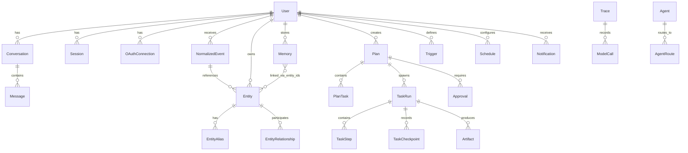
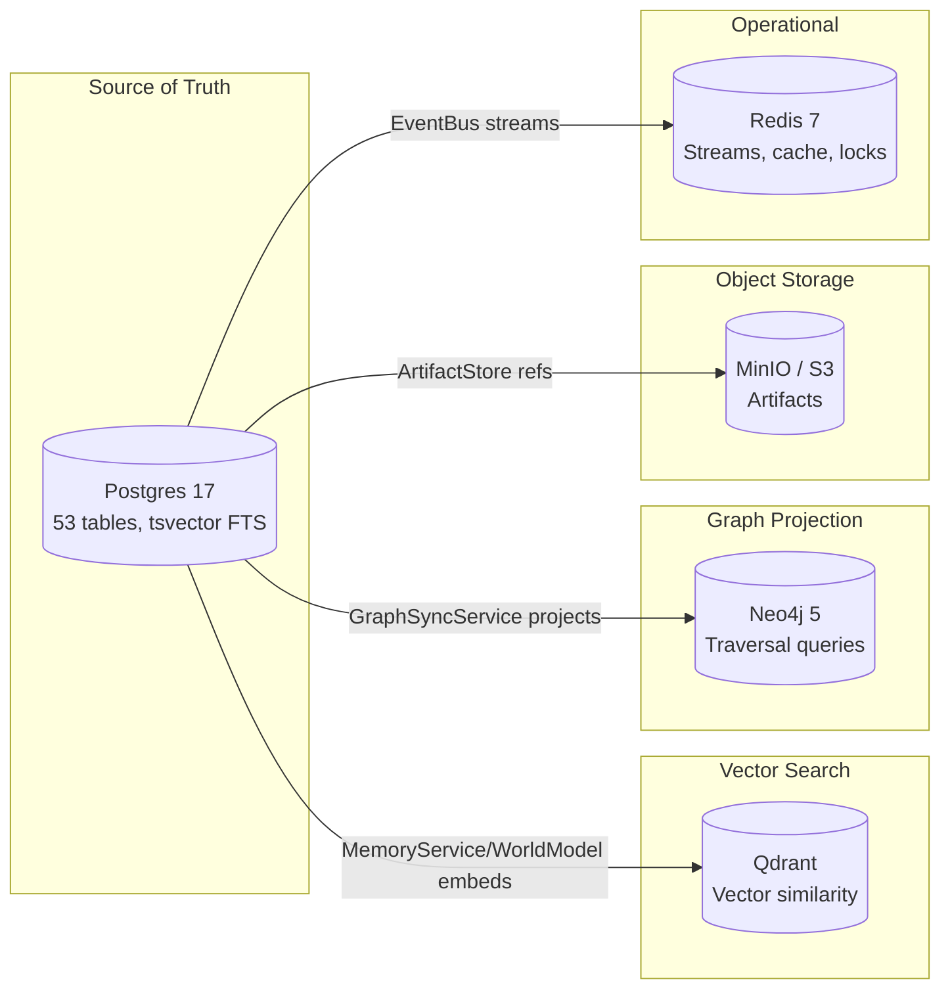

# Data Model & Persistence

## Entity-Relationship Overview



## Workspace Isolation

All data tables include `workspace_id` (`String(64)`, NOT NULL FK to `workspaces` with CASCADE delete) for multi-tenant isolation. The only exceptions are user-level tables (`users`, `workspaces`, `workspace_members`, `sessions`, `magic_links`) and system-global tables (`agents`, `agent_routes`).

## Tables by Category

### Authentication & Users (4 tables)

| Table | PK Prefix | Key Columns | Notes |
|-------|-----------|-------------|-------|
| `users` | `usr_` | email, display_name, status, timezone, settings (JSONB) | Unique on email |
| `sessions` | - | user_id, token_hash, expires_at, surface, device_info (JSONB) | Unique on token_hash |
| `oauth_connections` | - | user_id, provider, access_token_encrypted, refresh_token_encrypted, scopes (JSONB) | Unique on user+provider |
| `workspaces` / `workspace_members` | - | Multi-tenant support with role (owner, admin, member) | |

### Events (1 table)

| Table | PK Prefix | Key Columns | Notes |
|-------|-----------|-------------|-------|
| `normalized_events` | `evt_` | source, event_type, entity_type, entity_id, occurred_at, importance_score, urgency_score, correlation_id, idempotency_key | Unique on idempotency_key |

### Knowledge Graph (3 tables)

| Table | PK Prefix | Key Columns | Notes |
|-------|-----------|-------------|-------|
| `entities` | `ent_` | entity_type, canonical_name, attributes (JSONB), importance_score, search_tsv (tsvector), last_seen_at, interaction_count | 15 entity types |
| `entity_aliases` | - | entity_id (FK), alias_type, alias_value | Cascade delete |
| `entity_relationships` | `rel_` | from_entity_id, relation_type, to_entity_id, strength, active | 17 relation types |

### Memory (1 table)

| Table | PK Prefix | Key Columns | Notes |
|-------|-----------|-------------|-------|
| `memories` | `mem_` | memory_type, fact_text, search_tsv (tsvector), confidence, stability_score, refresh_count, last_accessed_at, superseded_by, entity_ids (ARRAY), status | GIN index on entity_ids + search_tsv |

### Plans & Execution (5 tables)

| Table | PK Prefix | Key Columns | Notes |
|-------|-----------|-------------|-------|
| `plans` | `plan_` | trigger_type, goal, priority, decision, risk_level, execution_mode, status | |
| `plan_tasks` | - | plan_id (FK), task_id, task_type, input_data (JSONB), depends_on (JSONB), status | Cascade on plan |
| `task_runs` | `run_` | plan_id (FK), status (11 states: pending, running, paused, awaiting_approval, completed, failed, cancelled, blocked, partially_completed, archived, timed_out), graph_definition (JSONB), current_step_ids (ARRAY), checkpoint (JSONB), trace_id, context_pack_json (JSONB) | |
| `task_steps` | `step_` | run_id (FK), task_id, step_type, depends_on (ARRAY), status (9 states: pending, running, completed, failed, skipped, cancelled, awaiting_approval, blocked, timed_out), input_data (JSONB), output_data (JSONB) | Cascade on run |
| `task_checkpoints` | - | run_id (FK), step_id, state_snapshot (JSONB), reason | |

### Governance (2 tables)

| Table | PK Prefix | Key Columns | Notes |
|-------|-----------|-------------|-------|
| `approvals` | `apr_` | execution_id, approval_type, title, risk_level, status (4 states), decided_at, expires_at, step_id, run_id | |
| `trust_scores` | - | user_id, action_type, approved_count, rejected_count, trust_score, auto_approve_threshold | Unique on user+action_type |

### Observability (3 tables)

| Table | PK Prefix | Key Columns | Notes |
|-------|-----------|-------------|-------|
| `traces` | `trace_` | trigger, status, started_at, ended_at, duration_ms, total_input_tokens, total_output_tokens, total_cost_usd, agents_invoked (ARRAY), tools_called (ARRAY), spans_json (JSONB) | |
| `model_calls` | - | trace_id (FK), agent_name, model, input_tokens, output_tokens, cost_usd, duration_ms, tools_called (ARRAY), decision | Cascade on trace |
| `token_usage` | - | agent_name, model, input_tokens, output_tokens, cost_usd, trigger, trace_id, conversation_id | |

### Agent Configuration (2 tables)

| Table | PK Prefix | Key Columns | Notes |
|-------|-----------|-------------|-------|
| `agents` | `agt_` | name (unique), display_name, system_prompt, model_tier, tool_scope (JSONB), max_tokens, temperature, enabled | |
| `agent_routes` | `rt_` | name (unique), decision_type, agent_pipeline (JSONB), conditions (JSONB), priority, keywords (ARRAY), weight, enabled | |

### Notifications & Triggers (2 tables)

| Table | PK Prefix | Key Columns | Notes |
|-------|-----------|-------------|-------|
| `notifications` | `notif_` | channel, title, body, priority_score, status (5 states), sent_at, read_at, follow_up_at, payload_json (JSONB) | |
| `triggers` | `trg_` | name, conditions (JSONB), action_type, action_config (JSONB), status (4 states), fire_count, last_fired_at, cooldown_until | |

### Scheduling & Observation (2 tables)

| Table | PK Prefix | Key Columns | Notes |
|-------|-----------|-------------|-------|
| `schedules` | `sched_` | name, cron_expr, action_type, action_config (JSONB), enabled, next_run_at, run_count, priority | |
| `observation_cursors` | - | source, cursor_value, poll_interval_seconds | |

> **Note:** `observation_statuses` was consolidated into `perception_state` (see Perception & Runtime section below).

### Conversations (2 tables)

| Table | PK Prefix | Key Columns | Notes |
|-------|-----------|-------------|-------|
| `conversations` | `conv_` | status, surface, last_active_at | |
| `messages` | `msg_` | conversation_id (FK), role, content, metadata_ (JSONB) | |

### Assets (3 tables)

| Table | PK Prefix | Key Columns | Notes |
|-------|-----------|-------------|-------|
| `artifacts` | `art_` | artifact_type, title, mime_type, s3_key, run_id, step_id, task_id, entity_links (ARRAY) | |
| `browser_sessions` | - | status, url, page_title, run_id, last_action_at | |
| `browser_actions` | - | session_id (FK), action_type, selector, value, result_status, output_json (JSONB) | |

### Tools (1 table)

| Table | PK Prefix | Key Columns | Notes |
|-------|-----------|-------------|-------|
| `tool_definitions` | `tool_` | name (unique), version, input_schema (JSONB), output_schema (JSONB), risk_level, requires_approval, connector_type, enabled | |

### Governance & Audit (3 tables)

| Table | PK Prefix | Key Columns | Notes |
|-------|-----------|-------------|-------|
| `audit_logs` | - | user_id, action, resource_type, resource_id, details (JSONB), correlation_id | Immutable audit trail |
| `dead_letter_queue` | - | source, event_data (JSONB), error_message, retry_count, status | Failed event retry queue |
| `agent_decision_logs` | - | agent_name, decision_type, input_summary, output_summary, trace_id | Agent decision audit trail |

### Briefings (2 tables)

| Table | PK Prefix | Key Columns | Notes |
|-------|-----------|-------------|-------|
| `briefings` | - | user_id, briefing_type, content (JSONB), generated_at | Generated briefing snapshots |
| `briefing_feedback` | - | briefing_id (FK), rating, feedback_text | User feedback on briefings |

### Procedures & Working Memory (2 tables)

| Table | PK Prefix | Key Columns | Notes |
|-------|-----------|-------------|-------|
| `procedures` | - | name, description, steps (JSONB), trigger_conditions (JSONB), enabled | Reusable workflow procedures |
| `working_memory` | - | user_id, conversation_id, context (JSONB), expires_at | Short-term conversation context |

### UI & OAuth (3 tables)

| Table | PK Prefix | Key Columns | Notes |
|-------|-----------|-------------|-------|
| `ui_surfaces` | - | user_id, surface_type, state (JSONB), last_active_at | Active UI surface tracking |
| `oauth_tokens` | - | connection_id (FK), token_type, token_encrypted, expires_at | Individual OAuth token storage |
| `magic_links` | - | user_id, token_hash, expires_at, used_at | Passwordless auth links |

### MCP & Integration Trust (4 tables)

| Table | PK Prefix | Key Columns | Notes |
|-------|-----------|-------------|-------|
| `mcp_server_catalog` | - | name, uri, transport, status, capabilities (JSONB) | Discovered MCP servers |
| `server_trust_records` | - | server_name, trust_level, verified_at | MCP server trust scores |
| `capability_bindings` | - | server_name, capability, agent_name, enabled | Agent-to-MCP capability mapping |
| `org_allowlists` | - | domain, approved_by, reason | Approved external domains |

### Integration & Webhooks (3 tables)

| Table | PK Prefix | Key Columns | Notes |
|-------|-----------|-------------|-------|
| `integration_installations` | - | provider, status, config (JSONB), installed_at | Installed OAuth integrations |
| `integration_audit_events` | - | integration_id (FK), action, details (JSONB) | Integration activity audit |
| `webhook_subscriptions` | - | url, event_types (ARRAY), secret_hash, enabled | Inbound webhook registrations |

### Perception & Runtime (3 tables)

| Table | PK Prefix | Key Columns | Notes |
|-------|-----------|-------------|-------|
| `perception_state` | - | source, user_id, last_run_at, next_run_at, status | Per-source perception scheduling |
| `runtime_events` | - | event_type, agent_name, payload (JSONB), created_at | Internal runtime event log |
| `approval_policies` | - | action_type, risk_level, auto_approve, conditions (JSONB) | Configurable approval rules |

> **Note:** All data tables listed above include `workspace_id` for multi-tenant isolation unless noted as user-level or system-global.

## ID Scheme

All IDs use ULID (Universally Unique Lexicographically Sortable Identifier) with a type prefix:

| Prefix | Table | Example |
|--------|-------|---------|
| `usr_` | users | `usr_01HWQX3Y...` |
| `evt_` | normalized_events | `evt_01HWQX3Z...` |
| `ent_` | entities | `ent_01HWQX40...` |
| `rel_` | entity_relationships | `rel_01HWQX41...` |
| `mem_` | memories | `mem_01HWQX42...` |
| `plan_` | plans | `plan_01HWQX43...` |
| `run_` | task_runs | `run_01HWQX44...` |
| `step_` | task_steps | `step_01HWQX45...` |
| `apr_` | approvals | `apr_01HWQX46...` |
| `trace_` | traces | `trace_01HWQX49...` |
| `notif_` | notifications | `notif_01HWQX4A...` |
| `trg_` | triggers | `trg_01HWQX4B...` |
| `sched_` | schedules | `sched_01HWQX4C...` |
| `art_` | artifacts | `art_01HWQX4D...` |
| `agt_` | agents | `agt_01HWQX4E...` |
| `rt_` | agent_routes | `rt_01HWQX4F...` |
| `tool_` | tool_definitions | `tool_01HWQX4G...` |
| `conv_` | conversations | `conv_01HWQX4H...` |
| `msg_` | messages | `msg_01HWQX4I...` |

**Benefits:**
- Time-sortable (ULID encodes timestamp)
- Human-readable type prefix for debugging
- Collision-free across tables
- No need for composite keys

## Vector Embeddings

| Configuration | Value |
|--------------|-------|
| Provider | AWS Bedrock Titan V2 |
| Dimensions | 1024 |
| Storage | Qdrant (4 collections) |
| Full-text | Postgres tsvector + GIN indexes (7 tables) |
| Reranking | Bedrock amazon.rerank-v1:0 |

> **Note:** pgvector embedding columns were removed from Postgres (migration 046). All vector storage is now in Qdrant only. Full-text search uses native Postgres tsvector columns with GIN indexes.

Embeddings enable:
- Semantic memory search (cosine similarity via Qdrant)
- Entity fuzzy dedup (>0.92 threshold)
- Memory dedup (>0.92 threshold)
- Memory consolidation (>0.95 threshold)
- Contradiction detection (>0.7 threshold)

## JSONB Fields

Key JSONB columns used for flexible structured data:

| Table | Column | Content |
|-------|--------|---------|
| entities | attributes | Freeform entity metadata |
| memories | entity_ids | ARRAY of linked entity IDs (GIN indexed) |
| plan_tasks | input_data | Task parameters |
| plan_tasks | depends_on | Dependency task IDs |
| task_runs | graph_definition | DAG structure |
| task_runs | context_pack_json | Pre-built context |
| task_steps | input_data / output_data | Step I/O |
| triggers | conditions | Match criteria |
| agent_routes | agent_pipeline | Ordered pipeline steps |
| agent_routes | conditions | Route match conditions |
| agents | tool_scope | Allowed tool names |
| tool_definitions | input_schema / output_schema | Tool API schemas |

## Multi-Store Data Distribution

Data is distributed across 5 infrastructure services. Postgres is always the source of truth; other stores are projections or specialized indexes.



### What Lives Where

| Data | Postgres | Qdrant | Neo4j | S3/MinIO | Redis |
|------|----------|--------|-------|----------|-------|
| Events | rows + tsvector FTS | vector index | - | - | streams |
| Entities | rows + tsvector FTS | vector index | nodes + edges | - | cache |
| Memories | rows + tsvector FTS | vector index | - | - | - |
| Artifacts | metadata + S3 key | vector index | - | file content | - |
| Traces | rows (primary) | - | - | - | - |
| Plans/Runs | rows | - | - | - | progress pubsub |
| Approvals | rows + tsvector FTS | - | - | - | notification streams |
| Agent config | rows | - | - | - | - |
| Sessions | rows | - | - | - | surface tracking |

### Qdrant Collections (4)

| Collection | Dimensions | Payload Fields | Purpose |
|-----------|------------|---------------|---------|
| `memories` | 1024 | user_id, memory_type, fact_text, confidence | Semantic memory retrieval |
| `entities` | 1024 | user_id, entity_type, canonical_name, attributes | Entity search |
| `events` | 1024 | user_id, source, event_type, title, summary | Event discovery |
| `artifacts` | 1024 | user_id, artifact_type, title, mime_type | Artifact search |

### Postgres FTS Indexes (tsvector + GIN)

| Table | tsvector Column | Indexed Fields | Migration |
|-------|----------------|---------------|-----------|
| `memories` | `search_tsv` | fact_text | 045 |
| `entities` | `search_tsv` | canonical_name, attributes | 045 |
| `normalized_events` | `search_tsv` | title, summary | 045 |
| `conversations` | `search_tsv` | title | 045 |
| `briefings` | `search_tsv` | content | 045 |
| `approvals` | `search_tsv` | title, justification | 045 |
| `artifacts` | `search_tsv` | title | 045 |

> **Note:** Elasticsearch was fully removed. All full-text search now uses Postgres native tsvector with GIN indexes, which provides comparable BM25-style keyword matching without the operational overhead of a separate search cluster.

### Neo4j Graph Schema

**Nodes:** Entity label with properties (entity_id, entity_type, name, user_id, attributes)

**Edges:** RELATES_TO type with properties (relation_id, relation_type, user_id, strength)

**Graph queries enabled:**
- Multi-hop traversal (up to N depth)
- Shortest path between entities
- Degree centrality (most connected entities)
- Connected component detection (communities)
- Subgraph extraction for context building

### Redis Data Structures

| Pattern | Type | TTL | Purpose |
|---------|------|-----|---------|
| `jarvis:events:{user_id}` | Stream | Unbounded | Event streaming + consumer groups |
| `jarvis:tasks` | Stream | Unbounded | Background task queue |
| `jarvis:surfaces:{user_id}` | Hash | 120s-86400s | Active connection tracking |
| `jarvis:run_progress:{run_id}` | PubSub channel | - | Real-time execution progress |
| `brief:{user_id}:{date}` | String (JSON) | 1 hour | Briefing cache |
| `entity:{user_id}:{query}` | String (JSON) | 5 min | Entity lookup cache |
| `prefs:{user_id}` | String (JSON) | 10 min | Preferences cache |
| `dedup:{key}` | String | 24 hours | Event dedup window |
| `lock:{resource}` | String | 30s | Distributed mutex |

## Migrations

The project uses Alembic for database migrations. As of the current state, there are 48 migrations covering all schema changes from initial setup through the complete system redesign, including FTS tsvector columns (045) and pgvector column removal (046).

```bash
# From backend/
alembic revision --autogenerate -m "description"
alembic upgrade head
```
