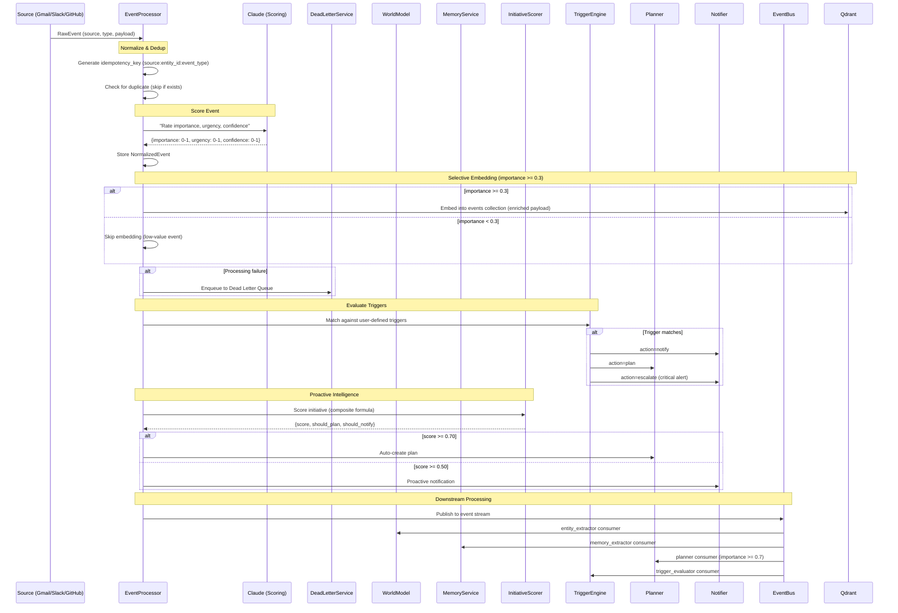

# Event Ingestion & Proactive Intelligence

## Event Processing Pipeline



## Dead Letter Queue

Failed event processing attempts are sent to `DeadLetterService` (`src/services/dead_letter.py`). The DLQ tracks:
- `user_id`, `workspace_id`
- `operation_type` (e.g., `metrics_recording`, `event_processing`)
- Error message and original payload
- Retry count

The scheduler retries DLQ items every 5th tick (~150s).

## Event Scoring

Events are scored via Claude with three dimensions:

| Dimension | Range | Signals |
|-----------|-------|---------|
| **Importance** | 0.0 - 1.0 | From priority person, related to active project, financial impact, deadline |
| **Urgency** | 0.0 - 1.0 | Time-sensitive, requires immediate response, blocking others |
| **Confidence** | 0.0 - 1.0 | How certain the scoring is (data quality, context available) |

Default scores (on Claude error): `{importance: 0.3, urgency: 0.2, confidence: 0.5}`

Events with importance < 0.4 are skipped for planning.

### Selective Embedding

Only events with `importance >= 0.3` are embedded into Qdrant's `events` collection. This prevents low-value signals from polluting the vector search space while still storing all events in Postgres for audit.

## Qdrant Collections

Collections with enriched payloads and payload indexing (`ensure_indexes()`):

| Collection | Content | Key Payload Fields |
|------------|---------|-------------------|
| `memories` | All memory embeddings | `memory_type`, `confidence`, `scope`, `stability_score`, `preference_strength` |
| `entities` | Entity embeddings | `entity_type`, `importance_score` |
| `events` | Event embeddings (importance >= 0.3) | `event_type`, `source`, `importance_score` |
| `artifacts` | Artifact embeddings | `artifact_type`, `mime_type` |
| `conversations` | Conversation embeddings | `user_id`, `workspace_id` |
| `approvals` | Approval embeddings | `status`, `decision_type` |

## Memory Stability Decay

Memory stability decays over time and refreshes on access:

```
new_stability = min(1.0, max(0.0, current_stability - 0.02 * days_since_access) + 0.1)
```

- **Decay rate**: 0.02 per day since last access
- **Access boost**: +0.1 on each access (via `refresh_stability()`)
- **Range**: Clamped to [0.0, 1.0]

7 memory types: `episodic`, `semantic`, `procedural`, `preference`, `goal`, `task_context`, `briefing_item`.

## Engagement History

`EngagementHistory` (`src/models/engagement_history.py`) tracks user interaction with insights and notifications. Used by `EngagementService` (`src/services/engagement_service.py`) to:
- Record dismissed insights per signal source and category
- Track engagement patterns to improve future relevance scoring
- Feed dismissal data back to the RelevanceAssessor for personalization

## Initiative Scoring

The `InitiativeScorer` determines when Jarvis should proactively act without explicit user request.

### Composite Formula

```
score = 0.30 * importance
      + 0.25 * urgency
      + 0.20 * goal_relevance
      + 0.15 * entity_significance
      + 0.10 * novelty
```

### Signal Boosts

| Boost | Value | Condition |
|-------|-------|-----------|
| Priority person | +0.15 | Event actor is a high-importance entity |
| Contains deadline | +0.10 | Event mentions a deadline or due date |

Final score is capped at 1.0.

### Signal Computation

| Signal | How It's Computed |
|--------|-------------------|
| `importance` | From event scoring (Claude) |
| `urgency` | From event scoring (Claude) |
| `goal_relevance` | Keyword overlap between event title/summary and active user goals |
| `entity_significance` | Importance score of actors in event (via WorldModel.find_entity) |
| `novelty` | 1.0 minus top similarity if no related memories found; inverted relevance otherwise |

### Thresholds

| Threshold | Value | Action |
|-----------|-------|--------|
| `auto_plan_threshold` | 0.70 | Auto-create plan via Planner |
| `notify_threshold` | 0.50 | Send proactive notification to user |

## Search: Graph Boost & Preference Strength

TriSearch (`src/services/tri_search.py`) supports graph-boosted search via `search_with_graph_boost()`:
- Fetches 2x results, then boosts scores by **10% per entity overlap** with context entities
- Preference strength boost: `strong` preference +0.05, `weak` preference -0.03

## Trigger System

Users can define triggers that fire reactive rules when events match conditions.

### Trigger Conditions

| Condition | Description |
|-----------|-------------|
| `event_type` | Match specific event type |
| `source` | Match source (gmail, slack, github) |
| `entity_type` | Match entity type (person, project, etc.) |
| `importance_threshold` | Fire only if importance >= threshold |
| `keyword_match` | Text pattern match on event content |
| `cooldown` | Minimum time between firings |

### Trigger Actions

| Action | Effect |
|--------|--------|
| `notify` | Send notification via Notifier |
| `plan` | Create plan via Planner |
| `escalate` | Send critical alert to all surfaces |
| `procedure` | Execute a predefined procedure |

### Trigger Lifecycle

```
active -> evaluating -> triggered -> active (with cooldown)
                    \-> active (no match)
```

Triggers track `fire_count`, `last_fired_at`, and respect `cooldown_until`.

## Domain Events

The system publishes domain event types via Redis-backed EventBus. All events include a `workspace_id` for multi-tenant scoping.

| Category | Event Types |
|----------|-------------|
| **Execution** | `run.started`, `run.completed`, `run.failed`, `run.cancelled` |
| **Steps** | `step.started`, `step.completed`, `step.failed`, `step.skipped` |
| **Planning** | `plan.created`, `plan.approved`, `plan.rejected` |
| **Approvals** | `approval.requested`, `approval.approved`, `approval.rejected` |
| **Tools** | `tool.started`, `tool.completed`, `tool.failed` |
| **Connectors** | `connector.synced`, `connector.error` |
| **Memory** | `memory.created`, `memory.updated` |
| **Entities** | `entity.created`, `entity.updated` |
| **Triggers** | `trigger.evaluated` |
| **Notifications** | `notification.sent`, `notification.delivered` |
| **UI** | `surface.updated` |

### Event Schema

```python
class DomainEvent(BaseModel):
    event_type: str           # e.g., "run.completed"
    user_id: str
    workspace_id: str         # Workspace scope for multi-tenant isolation
    payload: dict[str, Any]
    trace_id: str | None
    timestamp: datetime       # UTC
```

## Worker Consumer Groups

Background workers consume events from Redis streams:

| Consumer Group | Handler | Action |
|---------------|---------|--------|
| `entity_extractor` | WorldModel.extract_from_event() | Extract entities + relationships |
| `memory_extractor` | MemoryService.extract_and_store() | Extract memories with entity linking |
| `planner` | Planner.plan_for_event() | Auto-plan for high-importance events |
| `trigger_evaluator` | TriggerEngine.evaluate() | Match triggers against events |
