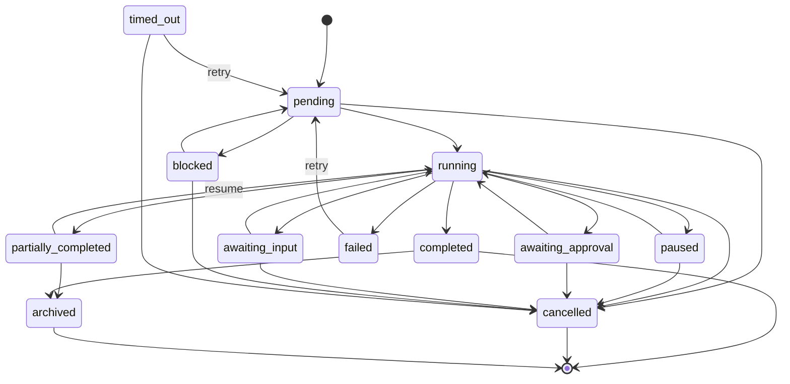
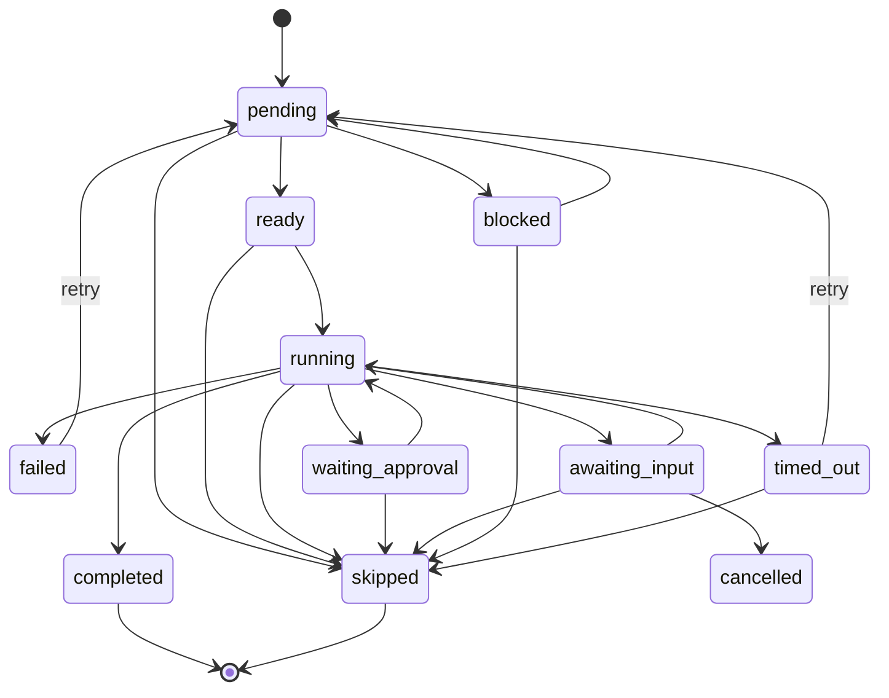

# Task Execution Engine

## Plan to Execution Flow

```mermaid
sequenceDiagram
    participant PL as Planner
    participant OP as Operator
    participant GE as GraphExecutor
    participant TE as TrustEngine
    participant CB as ContextBuilder
    participant TR as ToolRegistry
    participant MCP as MCP Bridge
    participant VER as Verifier
    participant MS as MemoryService
    participant NT as Notifier

    Note over PL,OP: Phase 1: Planning
    PL->>PL: Create PlanOutput (steps with capabilities)
    PL-->>OP: PlanOutput (plan_id, steps, capability_gaps)

    Note over OP,GE: Phase 2: DAG Construction
    OP->>GE: create_run(plan_id)
    GE->>GE: Build DAG from PlanTasks
    GE->>GE: Resolve dependencies (topological sort)
    GE->>CB: Build context pack
    CB-->>GE: ContextPack (goals, entities, memories)
    GE->>GE: Create TaskSteps from tasks
    GE->>GE: _emit_surface_update(plan_ready)

    Note over GE,MCP: Phase 3: DAG Execution (single TrustEngine gate per step)
    loop Until all steps complete
        GE->>GE: Query ready_steps (deps satisfied)
        GE->>GE: _emit_surface_update(executing)

        par Execute independent steps
            GE->>TE: evaluate(trust_level, risk_level) → 4×4 matrix
            alt auto_execute_silent / auto_execute_notify
                GE->>MCP: Execute via MCP bridge
                MCP-->>GE: Tool result
            else approval_required
                GE->>GE: Create Approval record
                GE->>NT: Notify user
                GE->>GE: _emit_surface_update(approval_needed)
                GE->>GE: Pause run (awaiting_approval)
            else blocked
                GE->>GE: Mark step failed (blocked by policy)
            end
        end

        GE->>GE: Checkpoint (TaskCheckpoint)
        GE->>GE: Advance to next batch
    end

    Note over GE,VER: Phase 4: Verification
    GE->>VER: Verify run output
    VER-->>GE: Verdict (pass/fail, score)

    Note over GE,MS: Phase 5: Memory Writeback
    GE->>MS: Extract facts from step outputs
    MS-->>GE: memory_ids[]

    GE->>GE: _emit_surface_update(completed/failed)
    GE->>NT: Notify user of completion
```



## Execution State Machine

### TaskRun Statuses (12)



### TaskStep Statuses (10)



All state transitions are enforced by the `ExecutionState` service (`src/services/execution_state.py`). The `transition_run()` and `transition_step()` functions validate that only legal transitions occur; any illegal transition raises `InvalidTransitionError`. No direct status mutation is permitted — all status changes must go through these functions.

## DAG Resolution

The GraphExecutor builds a directed acyclic graph from PlanTasks:

1. **Parse dependencies** - Each PlanTask has a `depends_on` list of task_ids
2. **Topological sort** - Determines execution order respecting dependencies
3. **Ready step detection** - Steps whose dependencies are all `completed`
4. **Parallel execution** - Independent steps run concurrently via `asyncio.gather()`

```
Example DAG:
  A (fetch data)
    ├── B (analyze) ──── D (report)
    └── C (summarize) ──┘

Execution order: [A] -> [B, C] (parallel) -> [D]
```

## Execution Contracts

All execution boundaries use typed contracts from `src/orchestrator/contracts.py`:

- **StepResult** — Wraps the outcome of each TaskStep execution (status, output_data, error, duration)
- **ToolCallRequest** — Typed request for tool invocation (tool_name, arguments, requires_approval)
- **ToolCallResult** — Typed result from tool invocation (success, output, error, duration)
- **SurfaceUpdate** — Live execution surface event (run_id, status, step_summary, progress). Emitted at 9 points in GraphExecutor: plan_ready, executing, step_started, step_completed, step_failed, approval_needed, approval_resolved, completed, failed.
- **InsightSurfaceData** — Structured data for insight-type surfaces pushed during execution.

These contracts ensure structured data flows between GraphExecutor, tool dispatch, memory writeback, and live UI surfaces.

## Live Execution Surfaces (SurfaceUpdate)

The GraphExecutor emits `SurfaceUpdate` events via Redis pubsub at key execution milestones. The frontend receives these via WebSocket and renders live progress in the workspace.

Surface update lifecycle: `plan_ready` → `executing` → `approval_needed` (if gated) → `completed` / `failed`

## InteractionLog

Simple interactions that do not produce a full TaskRun (e.g., greetings, quick answers, chitchat) are recorded in the `interaction_logs` table. This provides a lightweight audit trail without the overhead of the full execution state machine.

## Unified Registry Dispatch

When a step requires tool execution, one registry lookup determines the dispatch path:

```
Step action request
    │
    └── ToolRegistry.get_tool(name) → match backend:
        │
        ├── internal_mcp → In-process FastMCP (intelligence + communication servers)
        │   19 tools: search, ingest_event, send_telegram, etc.
        │
        ├── external_mcp → MCP Bridge (external servers)
        │   Google Workspace, GitHub, Slack, Notion, Linear,
        │   Playwright, Filesystem — real MCP names, no normalization
        │
        └── composite → Multi-MCP orchestration (e.g., web_search)
```

Tool identity is defined in `catalog.py` (163 seeds). Unknown MCP tools auto-register on discovery.

## Checkpoints

After each step completion, the GraphExecutor saves a `TaskCheckpoint`:

| Field | Content |
|-------|---------|
| `checkpoint_id` | Unique ID |
| `run_id` | Parent TaskRun |
| `step_id` | Completed step (optional) |
| `state_snapshot` | JSONB: run status + current_step_ids |
| `reason` | `step_completed`, `approval_gate`, `error_retry`, `manual_pause` |

Checkpoints enable:
- **Resumption** after failures or approval waits
- **Audit trail** of execution progress
- **Debugging** by inspecting state at each step

## Approval Gates

A single TrustEngine gate in GraphExecutor handles all approval decisions. There is no separate Governor plan-level check — Governor hooks are audit-only.

### TrustEngine 4x4 Matrix

The TrustEngine evaluates each step using a 4x4 matrix of `trust_level` (new, developing, established, trusted) x `risk_level` (low, medium, high, critical):

| PolicyDecision | Meaning |
|----------------|---------|
| `auto_execute_silent` | Execute without notification |
| `auto_execute_notify` | Execute and notify user |
| `approval_required` | Pause run, require explicit user approval |
| `blocked` | Reject execution entirely |

Higher trust + lower risk = more autonomy. Trust graduates over time based on successful executions.

### Step-Level Flow
1. GraphExecutor calls `TrustEngine.evaluate()` per step
2. If `approval_required`: create Approval record, pause run in `awaiting_approval`, notify user
3. If `auto_execute_notify`: execute and send notification
4. If `auto_execute_silent`: execute silently
5. If `blocked`: mark step as failed

Approvals are delivered via Telegram inline buttons and/or web UI.

## Execution Timeout

- **Background runs** (`source="background"`): 600-second timeout (configurable via `run.timeout_seconds`)
- **User-initiated runs**: No timeout (unlimited)

## Memory Writeback

After run completion, the GraphExecutor calls `_writeback_memories()` to extract learnings from execution results:

1. Collects `output_data` from all completed steps
2. Calls `MemoryService.extract_and_store()` with output text
3. Links memories to relevant entity_ids from the context pack
4. Performs entity fuzzy dedup via embeddings in WorldModel (cosine similarity threshold to merge near-duplicate entities)
5. Newly created memories are available for future context assembly

## Verification

The optional `Verifier` service checks execution output quality:

1. Runs after all steps complete
2. Evaluates output against the original goal
3. Returns verdict (pass/fail) with a confidence score
4. Failed verification can mark the run as `failed`
5. Stores verdict in the final checkpoint

## Data Model Notes

- Only `TaskRun` and `TaskStep` models exist for execution tracking. There are no separate `Execution` or `ExecutionTaskRun` models.
- `workspace_id` is present on `TaskRun`, `TaskStep`, and `TaskCheckpoint` for multi-tenant scoping.
- `TaskRun` includes `task_id_ref` (indexed) for standalone task linkage and `trace_id` for orchestrator trace correlation.
- Artifact provenance: `run_id`, `step_id`, `task_id` foreign keys on the Artifact model link outputs back to their execution context.

## Run Lifecycle API

| Endpoint | Method | Purpose |
|----------|--------|---------|
| `/v1/runs/{run_id}` | GET | Run details with all steps |
| `/v1/runs/{run_id}/steps` | GET | Step list ordered by execution |
| `/v1/runs/{run_id}/trace` | GET | Linked orchestrator trace |
| `/v1/runs/{run_id}/artifacts` | GET | Artifacts produced by the run |
| `/v1/runs/{run_id}/resume` | POST | Resume a paused or partially completed run |

## Data Retention

The `EvictionService` enforces 90-day retention for completed runs, expired approvals, and resolved dead-letter entries. Eviction is triggered periodically by the scheduler via `_tick_eviction()`.
