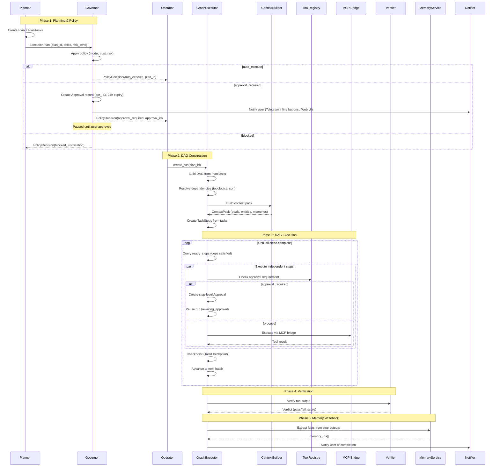
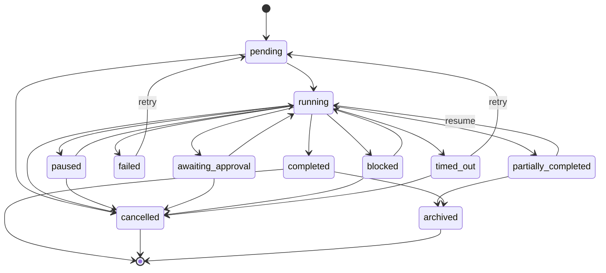
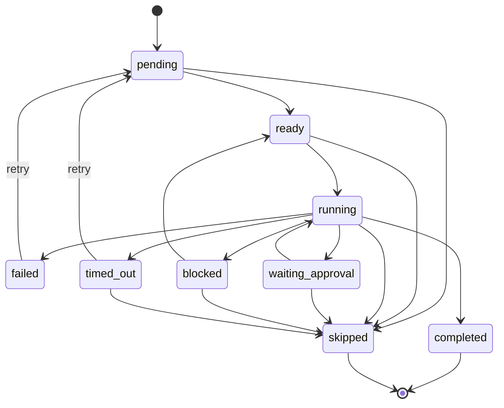

# Task Execution Engine

## Plan to Execution Flow



## Execution State Machine

### TaskRun Statuses (11)



### TaskStep Statuses (9)



All state transitions are enforced by the `ExecutionState` service (`src/services/execution_state.py`). The `transition_run()` and `transition_step()` functions validate that only legal transitions occur; any illegal transition raises `InvalidTransitionError`. No direct status mutation is permitted — all status changes must go through these functions.

## DAG Resolution

The GraphExecutor builds a directed acyclic graph from PlanTasks:

1. **Parse dependencies** - Each PlanTask has a `depends_on` list of task_ids
2. **Topological sort** - Determines execution order respecting dependencies
3. **Ready step detection** - Steps whose dependencies are all `completed`
4. **Parallel execution** - Independent steps run concurrently via `asyncio.gather()`

```
Example DAG:
  A (fetch data)
    ├── B (analyze) ──── D (report)
    └── C (summarize) ──┘

Execution order: [A] -> [B, C] (parallel) -> [D]
```

## Execution Contracts

All execution boundaries use typed contracts from `src/orchestrator/contracts.py`:

- **StepResult** — Wraps the outcome of each TaskStep execution (status, output_data, error, duration)
- **ToolCallRequest** — Typed request for tool invocation (tool_name, arguments, requires_approval)
- **ToolCallResult** — Typed result from tool invocation (success, output, error, duration)

These contracts ensure structured data flows between GraphExecutor, tool dispatch, and memory writeback.

## 3-Tier Tool Dispatch

When a step requires tool execution:

```
Step action request
    │
    ├── Tier 1: Internal Intelligence Handlers (FastMCP)
    │   Tools: ingest_event, search_memory, get_entities, plan_command,
    │          create_task, get_goals, build_context, verify_run, etc.
    │
    ├── Tier 2: MCP Bridge (External MCP Servers)
    │   Servers: Google Workspace, GitHub, Slack, Playwright, Filesystem
    │   Discovered dynamically via tool listing
    │
    └── Tier 3: ToolRegistry / Connector Fallback
        DB-backed tool definitions with connector dispatch
        Maps tool_name -> connector_type -> execute_action()
```

If a tier doesn't handle the tool, it falls through to the next tier.

## Checkpoints

After each step completion, the GraphExecutor saves a `TaskCheckpoint`:

| Field | Content |
|-------|---------|
| `checkpoint_id` | Unique ID |
| `run_id` | Parent TaskRun |
| `step_id` | Completed step (optional) |
| `state_snapshot` | JSONB: run status + current_step_ids |
| `reason` | `step_completed`, `approval_gate`, `error_retry`, `manual_pause` |

Checkpoints enable:
- **Resumption** after failures or approval waits
- **Audit trail** of execution progress
- **Debugging** by inspecting state at each step

## Approval Gates

Approvals can occur at two levels:

### Plan-Level Approval (Governor)
- Entire plan requires user consent before any execution
- Created by Governor during `evaluate_plan()`
- 24-hour expiry

### Step-Level Approval (GraphExecutor)
- Individual step requires consent (e.g., sending an email)
- Checked via ToolRegistry `requires_approval` flag
- Run pauses in `awaiting_approval` state

Both approvals are delivered via Telegram inline buttons and/or web UI.

## Memory Writeback

After run completion, the GraphExecutor calls `_writeback_memories()` to extract learnings from execution results:

1. Collects `output_data` from all completed steps
2. Calls `MemoryService.extract_and_store()` with output text
3. Links memories to relevant entity_ids from the context pack
4. Performs entity fuzzy dedup via embeddings in WorldModel (cosine similarity threshold to merge near-duplicate entities)
5. Newly created memories are available for future context assembly

## Verification

The optional `Verifier` service checks execution output quality:

1. Runs after all steps complete
2. Evaluates output against the original goal
3. Returns verdict (pass/fail) with a confidence score
4. Failed verification can mark the run as `failed`
5. Stores verdict in the final checkpoint

## Data Model Notes

- Only `TaskRun` and `TaskStep` models exist for execution tracking. There are no separate `Execution` or `ExecutionTaskRun` models.
- `workspace_id` is present on `TaskRun`, `TaskStep`, and `TaskCheckpoint` for multi-tenant scoping.
- `TaskRun` includes `task_id_ref` (indexed) for standalone task linkage and `trace_id` for orchestrator trace correlation.
- Artifact provenance: `run_id`, `step_id`, `task_id` foreign keys on the Artifact model link outputs back to their execution context.

## Run Lifecycle API

| Endpoint | Method | Purpose |
|----------|--------|---------|
| `/v1/runs/{run_id}` | GET | Run details with all steps |
| `/v1/runs/{run_id}/steps` | GET | Step list ordered by execution |
| `/v1/runs/{run_id}/trace` | GET | Linked orchestrator trace |
| `/v1/runs/{run_id}/artifacts` | GET | Artifacts produced by the run |
| `/v1/runs/{run_id}/resume` | POST | Resume a paused or partially completed run |
