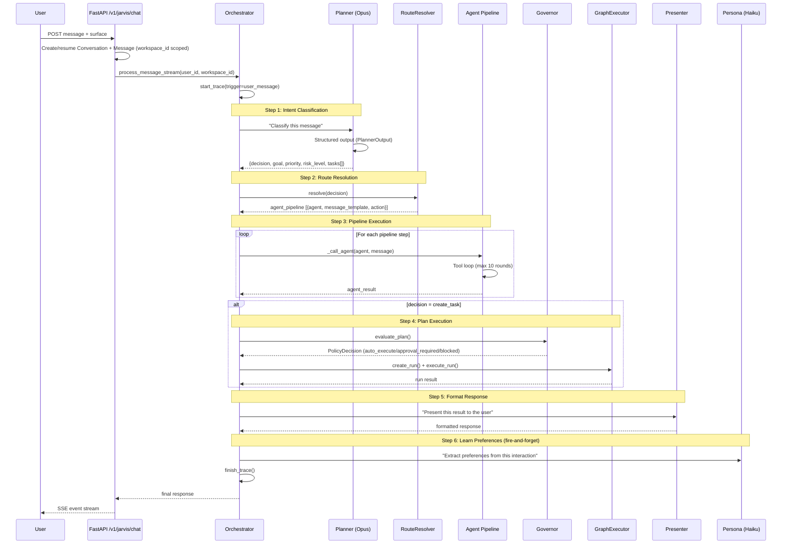
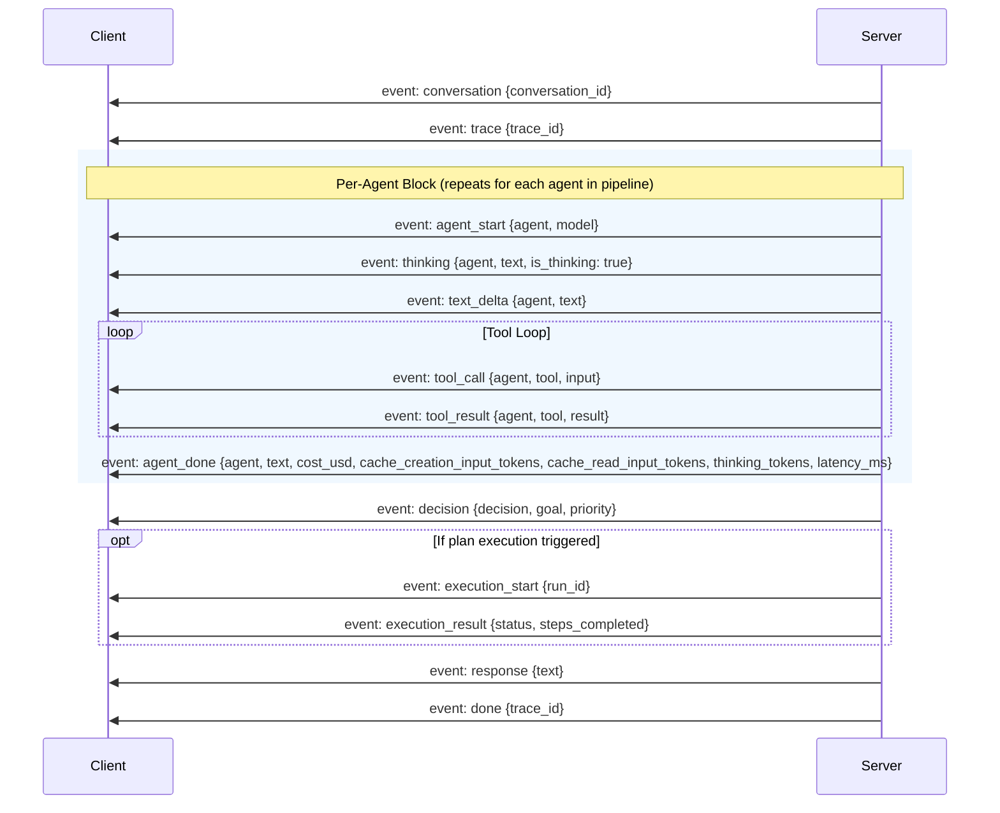

# Message Processing Pipeline

## User Chat to Response

When a user sends a message (via Telegram or the web frontend), it flows through the following pipeline. Both `process_message()` and `process_message_stream()` require explicit `user_id` and `workspace_id` parameters (no default user):



## SSE Event Stream

The chat endpoint returns a Server-Sent Events stream. Each event has a `type` field:



### Event Types Reference

| Event | Payload | When |
|-------|---------|------|
| `conversation` | `{conversation_id}` | Start of stream |
| `trace` | `{trace_id}` | Trace created |
| `agent_start` | `{agent, model}` | Agent begins work |
| `thinking` | `{agent, text, is_thinking: true}` | Agent reasoning (thinking blocks, Opus only) |
| `text_delta` | `{agent, text}` | Incremental text output |
| `tool_call` | `{agent, tool, input}` | Tool invocation |
| `tool_result` | `{agent, tool, result, blocked?, latency_ms?}` | Tool output |
| `agent_done` | `{agent, text, cost_usd, cache_creation_input_tokens, cache_read_input_tokens, thinking_tokens, latency_ms}` | Agent complete |
| `decision` | `{decision}` | Planner decision extracted |
| `execution_start` | `{run_id}` | GraphExecutor begins |
| `execution_result` | `{status, steps}` | Execution outcome |
| `response` | `{text}` | Final user-facing response |
| `error` | `{message}` | Error occurred |
| `done` | `{trace_id}` | Stream end |

## Planner Decisions

The Planner returns a structured `PlannerOutput` (Pydantic model) with one of 19 decision types:

| Decision | Meaning | Triggers Execution? |
|----------|---------|-------------------|
| `acknowledge` | Confirm message received | No |
| `answer_directly` | Respond without planning | No |
| `create_task` | Create structured task graph | Yes (Governor -> GraphExecutor) |
| `draft_reply` | Prepare but don't send response | Yes (Governor -> Operator) |
| `search_memory` | Query knowledge base | No |
| `add_to_brief` | Include in daily briefing | No (direct handler) |
| `ignore` | No action needed | No |
| `watcher_create` | Create a monitoring rule | No |
| `goal_update` | Create/update user goal | No |
| `read_source` | Read from external source | No (Observer -> Presenter) |
| `research` | Deep context gathering | No (Researcher) |
| `observe` | Background observation | No (Observer) |
| `remember` | Entity/memory updates | No (Librarian) |
| `ask_user` | Request clarification | No (Presenter) |
| `recommend` | Suggest options | No (Presenter) |
| `summarize` | Summarize information | No (Presenter) |
| `schedule_reminder` | Create one-shot reminder | No (direct handler) |
| `set_goal` | Store goal in memory | No (direct handler) |
| `set_instruction` | Create trigger/schedule | No (direct handler) |

### PlannerOutput Contract

```python
class PlannerOutput(BaseModel):
    decision: Literal["acknowledge", "answer_directly", "create_task", ...]
    goal: str = ""
    reasoning_summary: str = ""
    priority: Literal["low", "medium", "high", "critical"] = "medium"
    risk_level: Literal["none", "low", "medium", "high"] = "low"
    execution_mode: Literal["auto_execute", "approval_required", "draft_only"] = "approval_required"
    tasks: list[PlannerTask] = []
```

The Planner uses Claude's `tool_use` structured output with a text fallback parser for resilience.

## Route Resolution

The `RouteResolver` dynamically maps planner decisions to agent pipelines, replacing the previous hardcoded if/elif routing. Routes are stored in the database and seeded with 16 defaults:

| Decision Type | Agent Pipeline | Notes |
|--------------|---------------|-------|
| `create_task` | governor -> operator | Execution via GraphExecutor |
| `draft_reply` | governor -> operator | Gmail draft creation via `_draft_action` |
| `read_source` | observer -> presenter | External source reads (gmail_*, calendar_*) |
| `research` | researcher | Deep context gathering |
| `observe` | observer | Source observation |
| `remember` | librarian | Entity/memory extraction |
| `add_to_brief` | librarian | Stores as `briefing_item` memory |
| `search_memory` | researcher | Knowledge search |
| `ask_user` | (empty) | Direct response |
| `recommend` | (empty) | Direct response |
| `summarize` | (empty) | Direct response |
| `answer_directly` | (empty) | Context-based answer |
| `watcher_create` | observer | Create monitoring rule |
| `goal_update` | planner | Goal CRUD |
| `schedule_reminder` | (empty) | Direct handler → one-shot schedule |
| `acknowledge` | (empty) | Fallback |

**Direct handlers** (`set_goal`, `set_instruction`, `schedule_reminder`, `add_to_brief`) execute before pipeline resolution in both `process_message` and `process_message_stream`.

Each pipeline step can have conditions (`has_key`, `has_truthy_key`, `not_has_key`, `field:name`) and special actions (`execute_plan` for GraphExecutor bridging). The `has_truthy_key` condition checks that a key exists AND has a truthy value (avoids Pydantic null serialization issues).

Routes are fully customizable via the `/v1/routes` CRUD API.

## Context Assembly

Four agents receive pre-loaded context (Planner, Presenter, Researcher, Librarian):

```mermaid
graph TD
    CB[ContextBuilder] --> M[MemoryService<br/>Episodic + Preference memories]
    CB --> WM[WorldModel<br/>Relevant entities with importance]
    CB --> GM[MemoryService<br/>Goal memories (memory_type=goal)]
    CB --> P[ProcedureLibrary<br/>Task-type procedures]

    M --> CP[ContextPack]
    WM --> CP
    GM --> CP
    P --> CP

    CP --> SP[System Prompt<br/>--- CONTEXT ---<br/>goals, entities, memories, procedures]
```

The `ContextPack` is converted to a markdown block appended to the agent's system prompt via `to_prompt(max_tokens)`. When the context exceeds `max_tokens`, it is truncated by priority order: goals > entities > events > preferences > artifacts > procedures. Memory retrieval uses a composite ranking formula (see [Services Reference](services.md)).

**Prompt architecture:** System prompts are split into `JARVIS_SOUL_CORE` (shared by all 8 agents) and `JARVIS_DECISION_FRAMEWORK` (Planner-only). This prevents non-Planner agents from making routing decisions.

## Streaming Implementation

The `_call_agent_stream()` method uses `client.messages.stream()` with thinking support for Opus. The stream emits:

- **thinking** events with `is_thinking: true` for Opus reasoning blocks
- **text_delta** events for incremental text output
- **tool_call** / **tool_result** events for tool invocations
- **agent_done** with full cost breakdown: `cost_usd`, `cache_creation_input_tokens`, `cache_read_input_tokens`, `thinking_tokens`

All chat interactions create `Conversation` and `Message` records scoped by `workspace_id`.

## Runtime Contracts

All inter-agent communication is validated through Pydantic contracts:

- **PlannerOutput** is validated after Planner returns (graceful fallback to text parsing on validation failure)
- **AgentEnvelope** / **AgentResult** wrap every `_call_agent()` invocation
- **PolicyDecision** returned by Governor for plan evaluation
- **StepResult** / **ToolCallRequest** / **ToolCallResult** used in GraphExecutor execution
