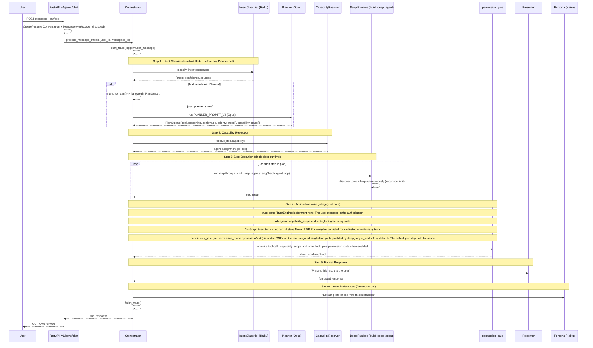
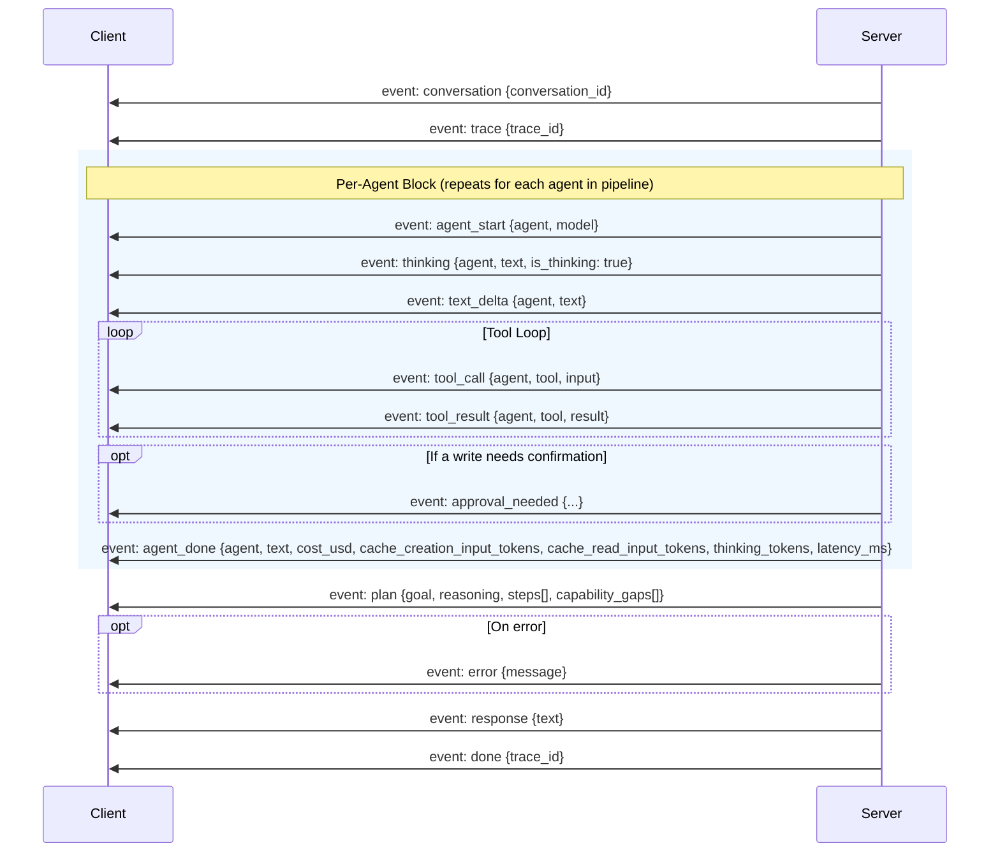
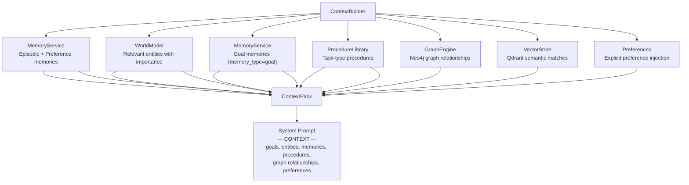

# Message Processing Pipeline

## User Chat to Response

When a user sends a message (via the web frontend), it flows through the following pipeline. Both `process_message()` and `process_message_stream()` require explicit `user_id` and `workspace_id` parameters (no default user):



> **Chat vs autonomous path.** The diagram above is the **chat path**. Both chat variants run on the deep runtime with TrustEngine/`trust_gate` **dormant** (the user's message is the authorization) and create **no** `GraphExecutor` run (`run_id = None`) — though a DB `Plan` record *is* persisted for multi-step or write-risky turns (`chat_processor.py` `persist_plan_record`). They differ only in write gating:
>
> - **Default** (`deep_single_lead = False`, the current shipping config): the legacy per-step path (`chat_processor.py` → `call_agent_stream` → `build_deep_agent` per step). Writes are held by the always-on `capability_scope` + `write_lock` middlewares — there is **no `permission_gate`**.
> - **Feature-gated single-lead** (`deep_single_lead = True` **and** `can_pause` **and** a durable checkpointer): the `chat_single_lead.py` `stream_deep_lead` path, which additionally installs **`permission_gate`** to confirm writes per the turn's `permission_mode` (`bypass` / `ask` / `auto`). `_resolve_effective_mode()` fail-safe downgrades to the default path when `ask`/`auto` has no durable checkpointer.
>
> The **autonomous path** (scheduler/perception-triggered runs) persists a DB `Plan`, drives it per-step via `GraphExecutor` (`create_run()` / `execute_run()`), and gates every step with TrustEngine's 4×4 trust_level × risk_level matrix (`PolicyDecision`: `auto_execute_silent` / `auto_execute_notify` / `approval_required` / `blocked`).

## SSE Event Stream

The chat endpoint returns a Server-Sent Events stream. Each event has a `type` field:



> **Chat SSE frames** (emitted by `stream_adapter.py`): `agent_start`, `thinking`, `text_delta`, `tool_call`, `tool_result`, `agent_done`, `error`, `approval_needed`. The `execution_start` / `execution_result` frames are **autonomous-path only** — they are not part of the chat stream.

### Event Types Reference

| Event | Payload | When |
|-------|---------|------|
| `conversation` | `{conversation_id}` | Start of stream |
| `trace` | `{trace_id}` | Trace created |
| `agent_start` | `{agent, model}` | Agent begins work |
| `thinking` | `{agent, text, is_thinking: true}` | Agent reasoning (thinking blocks; enabled for all 6 agents, not Opus-only) |
| `text_delta` | `{agent, text}` | Incremental text output |
| `tool_call` | `{agent, tool, input}` | Tool invocation |
| `tool_result` | `{agent, tool, result, blocked?, latency_ms?}` | Tool output |
| `approval_needed` | `{...}` | Chat write awaiting confirmation (`permission_gate`) |
| `agent_done` | `{agent, text, cost_usd, cache_creation_input_tokens, cache_read_input_tokens, thinking_tokens, latency_ms}` | Agent complete |
| `plan` | `{goal, reasoning, steps[], capability_gaps[]}` | Planner plan extracted |
| `execution_start` | `{run_id}` | GraphExecutor begins (autonomous path only) |
| `execution_result` | `{status, steps}` | Execution outcome (autonomous path only) |
| `response` | `{text}` | Final user-facing response |
| `error` | `{message}` | Error occurred |
| `done` | `{trace_id}` | Stream end |

## Planner Output

The Planner returns a structured `PlanOutput` (Pydantic model) with capability-based steps rather than decision types:

### PlanOutput Contract

```python
class PlanOutput(BaseModel):
    goal: str
    reasoning: str
    achievable: Literal["full", "partial", "not_achievable"] = "full"
    priority: Literal["low", "medium", "high", "critical"] = "medium"
    steps: list[PlanStep] = []
    success_criteria: str = ""
    capability_gaps: list[CapabilityGap] = []
    plan_id: str | None = None
    requires_user_input: bool = False

class PlanStep(BaseModel):
    step_id: str
    description: str
    actor: Literal["jarvis", "user"] = "jarvis"   # who performs the step, NOT the agent
    capability: str               # e.g., "email.read", "search.web"
    input: dict = {}
    depends_on: list[str] = []    # step_id references
    risk: Literal["none", "low", "medium", "high"] = "none"
    user_context: str | None = None
```

Both `PlanOutput` and `PlanStep` are frozen (`frozen=True`, `extra="ignore"`). The `actor` field distinguishes a step performed by Jarvis from one that must be performed by the user; the **agent** that executes a Jarvis step is assigned by the `CapabilityResolver` from the step's `capability`, not from `actor`.

The Planner uses Claude's `tool_use` structured output with a text fallback parser (`extract_plan`) for resilience. A circular dependency validator ensures step DAGs are acyclic.

## Capability Resolution

The `CapabilityResolver` (`src/services/capability_resolver.py`) maps step capabilities to agents. This replaces the former `RouteResolver` and decision-type routing.

Each `PlanStep` has a `capability` field (e.g., `email.read`, `search.web`, `memory.store`). The `CapabilityResolver` looks up which agent owns that capability via the agent's `capability_scope` and assigns the step accordingly. The Planner can discover available capabilities via the `discover_capabilities` tool and `capability_summary` service.

There are no hardcoded decision-to-agent mappings. Routing is purely capability-driven.

## Context Assembly

Context-enriched agents (`CONTEXT_ENRICHED_AGENTS`) receive pre-loaded context: Planner, Presenter, Perceiver, Librarian, Executor, and Lead.



The `ContextPack` is converted to a markdown block appended to the agent's system prompt via `to_prompt(max_tokens)`. When the context exceeds `max_tokens`, it is truncated by priority order: goals > entities > events > preferences > artifacts > procedures. Memory retrieval uses a composite ranking formula (see [Services Reference](services.md)).

The `ContextBuilder` also accepts `graph_engine` (Neo4j) and `vector_store` (Qdrant) for enrichment. Explicit preferences are always injected via `get_user_preferences()` to ensure they influence decisions even when they do not match the current query semantically.

**Prompt architecture:** System prompts are split into `JARVIS_SOUL_CORE` (shared by all 6 agents) and `PLANNER_PROMPT_V2` (Planner-only 7-step decomposition). Perceiver has `PERCEIVER_PROMPT` (7-step read-only). This prevents non-Planner agents from making routing decisions.

## Streaming Implementation

The `_call_agent_stream()` method uses `client.messages.stream()` with thinking enabled for all 6 agents (budgets: Planner 8192, Perceiver 6144, Librarian 4096, Presenter 4096, Executor 2048, Persona 2048). The stream emits:

- **thinking** events with `is_thinking: true` for reasoning blocks (all agents, Sonnet and Haiku included)
- **text_delta** events for incremental text output
- **tool_call** / **tool_result** events for tool invocations
- **agent_done** with full cost breakdown: `cost_usd`, `cache_creation_input_tokens`, `cache_read_input_tokens`, `thinking_tokens`

All chat interactions create `Conversation` and `Message` records scoped by `workspace_id`.

## Runtime Contracts

All inter-agent communication is validated through Pydantic contracts:

- **PlanOutput** is validated after Planner returns (graceful fallback to text parsing via `extract_plan` on validation failure)
- **PlanStep** defines each step with capability, actor, dependencies, and risk
- **AgentEnvelope** / **AgentResult** wrap every `_call_agent()` invocation
- **PolicyDecision** returned by TrustEngine for plan evaluation (includes `auto_execute_notify` and `auto_execute_silent` modes)
- **StepResult** / **ToolCallRequest** / **ToolCallResult** used in GraphExecutor execution
- **SurfaceUpdate** tracks execution phases (plan_ready, executing, approval_needed, completed, failed) with emission points in GraphExecutor
