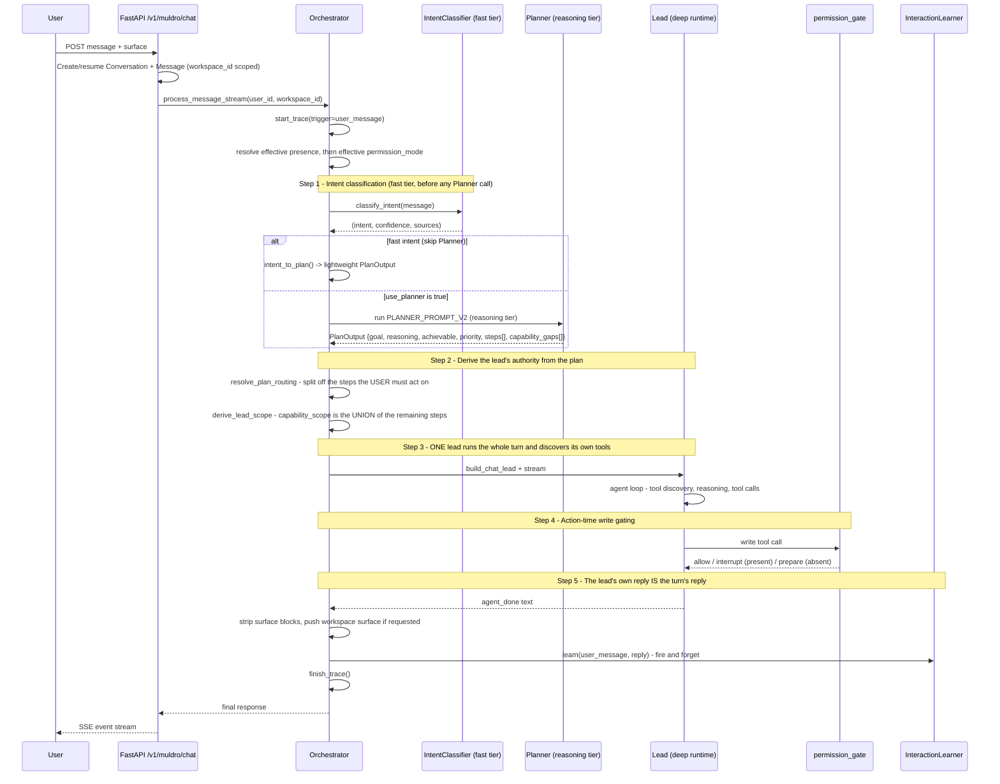
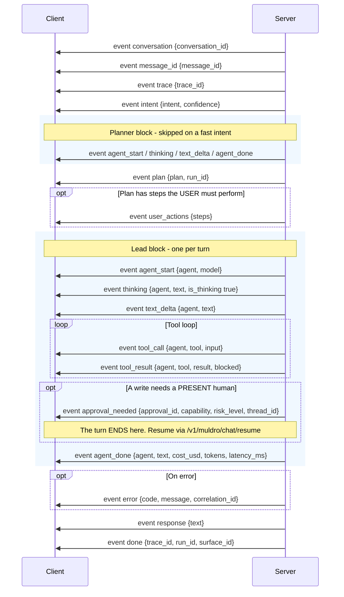
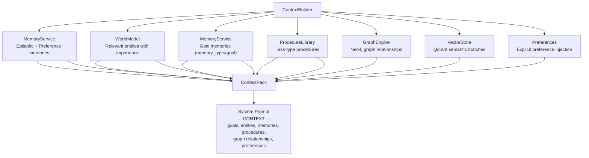

# Message Processing Pipeline

## User Chat to Response

When a user sends a message (via the web frontend), it flows through the following pipeline. Both `process_message()` and `process_message_stream()` require explicit `user_id` and `workspace_id` parameters (no default user):



> **One chat shape.** There is a single chat path: one lead per turn, built with the plan's capability union (`lead_builder.derive_lead_scope`) and discovering its own tools. The former per-step arm — which routed each plan step to an agent by *identity* and then ran a Presenter step to word the reply — is deleted, along with the `deep_single_lead` flag that had gated the alternative. `resolve_plan_routing` survives as a pure filter selecting the steps whose `actor` is the **user**; those are reported, never executed. `CapabilityResolver` survives for `resolve_for_step` (autonomous path) and `capabilities_for_step` (feeding `derive_lead_scope`).
>
> **One shape by default, not by construction.** `settings.chat_planless` (`MULDRO_CHAT_PLANLESS`, default **off**) reroutes the turn to a *planless* lead: it skips `classify_intent`, the Planner, the `Plan` record, `PlanReady` and `UserActionsReady` entirely, and scopes the lead from the workspace's standing **connector scope** (`orchestrator/connector_scope.py`) rather than from a plan. That turn emits one agent block, not two. Everything below describes the default (planned) shape.
>
> **Two independent facts gate the turn's writes** (`deep_runtime/confirmation.py`):
>
> - `permission_mode` — `bypass` | `ask` | `auto` — *which* writes need a human.
> - `presence` — `present` | `absent` — *whether* a human is reachable on this turn.
>
> Neither derives from the other, and `presence` may only **downgrade**: `bypass` + absent → `auto`. An unknown mode fails closed to `ask`. `permission_gate` is installed whenever the effective mode is `ask` or `auto`.
>
> **The gate has three outcomes.** Allow; **interrupt** (a human is present — the turn pauses on an `approval_needed` frame); or **prepare** (nobody is present — the write is recorded as an `Approval` with `approval_type="prepared_action"`, carrying the redacted payload and a snapshot of the lead's `capability_scope`, and the turn **continues**). Preparing returns a `status="success"` ToolMessage on purpose: `status="error"` maps to the frozen `blocked` SSE frame and would stop the lead at the first prepared write.
>
> On the chat path `trust_gate` (TrustEngine) is **dormant** — a user-typed turn carries `authorization_source=DIRECT_USER_REQUEST`, the one literal that short-circuits it, because the user's message *is* the authorization. Non-chat callers of `process_message` (scheduler dispatch, the WebSocket unknown-action fallback) declare `AUTONOMOUS` instead, which wakes the gate for the turn's **lead** — the Planner leg runs through `call_agent_stream`, which hardcodes `DIRECT_USER_REQUEST` and installs no `permission_gate`. Those turns are also `presence="absent"`, so an `approval_required` verdict becomes PREPARE. Chat creates **no** `GraphExecutor` run (`run_id = None`), though a DB `Plan` record *is* persisted for multi-step or write-risky turns.
>
> The **autonomous path** (scheduler/perception-triggered runs) persists a DB `Plan`, drives it per-step via `GraphExecutor` (`create_run()` / `execute_run()`), and gates every step with TrustEngine's 4×4 trust_level × risk_level matrix (`PolicyDecision`: `auto_execute_silent` / `auto_execute_notify` / `approval_required` / `blocked`). **On DAG steps that matrix is the whole gate**: `run_autonomous_deep_step` passes no `permission_mode`, so `permission_gate` is never installed, and `pre_approved_capabilities={step.capability}` short-circuits the deep `trust_gate` before its irreversible-union override. Graduation to `autonomous` therefore does silence an irreversible write there. The fall-through composition — `trust_gate` **outer**, `permission_gate` **inner** and never consulting trust, so a risky write is staged at every trust level — holds only on turns that *carry* a `permission_mode`: chat, and the `process_message` batch entry used by scheduler dispatch. Do not generalise either half to "the autonomous path"; see `execution.md` § the DAG-level gate and CLAUDE.md's "Which gates are actually installed".

## SSE Event Stream

The chat endpoint returns a Server-Sent Events stream. `_process_core` yields typed `CoreEvent`s and `core_event_to_sse` (`orchestrator/core_events.py`) translates each to its SSE dict; `routes_chat.py` writes them out. **The dict shapes and event names are a frozen contract** — the web client consumes them by name. `tests/test_core_events.py` pins the CoreEvent→SSE mapping *including* the name literals, but nothing pins the **frontend** switch, so a coordinated backend-plus-test rename still breaks the UI silently.

A normal turn contributes exactly **two** agent blocks: the Planner and the lead. (A fast-intent turn skips the Planner block.)



> **A prepared write emits no frame of its own.** When a write is staged because nobody is present, the gate returns an ordinary `tool_result` (with `blocked` **false** — the ToolMessage carries `status="success"` by design) and the turn continues to `response` / `done`. Discovery is the `prepared_work` queue surface and the briefing pointer, not the chat stream.
>
> **Two event names cross, deliberately, and must not be tidied:** the `PlanReady` CoreEvent maps to SSE `"plan"`, while `PlanModeStepSkipped` maps to SSE `"plan_ready"`. Renaming either to "fix" the confusion silently breaks the client.
>
> **`PlanModeStepSkipped` and `StepError` are currently dead** — both are defined, in the `CoreEvent` union, and SSE-mapped, but nothing constructs them, so neither frame reaches a live stream. They are listed in `core_events.py`, not in the table above.
>
> The autonomous path reports progress through **`SurfaceUpdate` phases**, not through chat SSE frames.

### Event Types Reference

| SSE event | Source `CoreEvent` | Payload | When |
|-------|-------|---------|------|
| `conversation` | — (route-level) | `{conversation_id}` | Start of stream |
| `message_id` | — (route-level) | `{message_id}` | The assistant `Message` row's real id, so the client can reference it |
| `trace` | `TraceStarted` | `{trace_id}` | Trace created |
| `intent` | `IntentClassified` | `{intent, confidence}` | Fast classification done |
| `agent_start` | `AgentStarted` | `{agent, model}` | Agent begins work |
| `thinking` | `AgentThinking` | `{agent, text, is_thinking: true}` | Reasoning blocks (every agent, not the reasoning tier only) |
| `text_delta` | `AgentTextDelta` | `{agent, text}` | Incremental text output |
| `tool_call` | `AgentToolCall` | `{agent, tool, input}` | Tool invocation |
| `tool_result` | `AgentToolResult` | `{agent, tool, result, blocked, latency_ms}` | Tool output; `blocked` ← `ToolMessage.status == "error"` |
| `plan` | **`PlanReady`** | `{plan, run_id}` | Plan extracted (`run_id` is `None` on chat) |
| `user_actions` | `UserActionsReady` | `{steps}` | Steps whose `actor` is the user |
| `approval_needed` | `ApprovalRequired` | `{approval_id, capability, risk_level, thread_id}` | A write paused for a **present** human |
| `agent_done` | `AgentDone` | `{agent, text, cost_usd, token counts, tools_called, latency_ms}` | Agent complete |
| `response` | `Presentation` | `{text}` | Final user-facing reply — the only frame that fills the assistant bubble (`error` is the fallback). The **server** persists the message in `routes_chat`'s `finally` |
| `error` | `ValidationFailed` / `RunFailed` / the deep stream adapter | `{message}` / `{code, message, correlation_id}` / `{agent, ...}` | Error occurred. A failed turn can emit **two** — the adapter's, then the `RunFailed`-sourced one |
| `done` | `RunCompleted` | `{trace_id, run_id, surface_id?}` | Stream end |

## Planner Output

The Planner returns a structured `PlanOutput` (Pydantic model) with capability-based steps rather than decision types:

### PlanOutput Contract

```python
class PlanOutput(BaseModel):
    goal: str
    reasoning: str
    achievable: Literal["full", "partial", "not_achievable"] = "full"
    priority: Literal["low", "medium", "high", "critical"] = "medium"
    steps: list[PlanStep] = []
    success_criteria: str = ""
    capability_gaps: list[CapabilityGap] = []
    plan_id: str | None = None
    requires_user_input: bool = False

class PlanStep(BaseModel):
    step_id: str
    description: str
    actor: Literal["muldro", "user"] = "muldro"   # who performs the step, NOT the agent
    capability: str               # e.g., "email.read", "search.web"
    input: dict = {}
    depends_on: list[str] = []    # step_id references
    risk: Literal["none", "low", "medium", "high"] = "none"
    user_context: str | None = None
```

Both `PlanOutput` and `PlanStep` are frozen (`frozen=True`, `extra="ignore"`). The `actor` field distinguishes a step performed by Muldro from one that must be performed by the user — `actor == "user"` steps are reported to the user and never executed. On the **autonomous** path the agent that executes a Muldro step is assigned from the step's `capability` via `CapabilityResolver`; on the **chat** path no per-step assignment happens at all — every Muldro step folds into the single lead's `capability_scope`.

The Planner uses the model's structured tool-call output (Anthropic `tool_use`, or the provider equivalent) with a text fallback parser (`extract_plan`) for resilience. A circular dependency validator ensures step DAGs are acyclic.

## Capability Resolution

Each `PlanStep` has a `capability` field (e.g., `email.read`, `search.web`, `memory.store`). What that capability resolves *to* depends on the path, and the difference is the point:

- **Chat — capability to authority.** `derive_lead_scope` (`src/orchestrator/lead_builder.py`) walks the plan's Muldro steps and unions each one's authority into the single lead's `capability_scope`: a real capability `C` contributes `{C}` plus its read-only family (`CapabilityResolver.capabilities_for_step(C)`); `perceive` contributes the Perceiver's *entire* `capability_scope` (mostly reads, plus a few internal bookkeeping capabilities such as `internal.ingest_event` that are `requires_approval=False`); `system.*`, the non-tool capabilities `reason` / `respond` / `none`, and user-actor steps contribute nothing. The result is plan-bounded and fail-closed — a read-only plan yields a lead with no write capability, and a write plan grants only that plan's writes, never the Executor's full write union. No agent is selected.
- **Autonomous — capability to tool offering.** `StepRunner` calls `CapabilityResolver.resolve_for_step(capability)` to scope the tools offered for that step.

`classify_capability_agent` still maps a capability to an owning agent, but its only consumer is `runtime_projection`. There are no hardcoded decision-to-agent mappings anywhere; the Planner discovers available capabilities via the `discover_capabilities` tool and the `capability_summary` service.

## Context Assembly

Context-enriched agents (`CONTEXT_ENRICHED_AGENTS`) receive pre-loaded context: Planner, Presenter, Perceiver, Librarian, Executor, and Lead.



The `ContextPack` is converted to a markdown block appended to the agent's system prompt via `to_prompt(max_tokens)`. When the context exceeds `max_tokens`, it is truncated by priority order: goals > entities > events > preferences > artifacts > procedures. Memory retrieval uses a composite ranking formula (see [Services Reference](services.md)).

The `ContextBuilder` also accepts `graph_engine` (Neo4j) and `vector_store` (Qdrant) for enrichment. Explicit preferences are always injected via `get_user_preferences()` to ensure they influence decisions even when they do not match the current query semantically.

**Prompt architecture:** System prompts are split into `MULDRO_SOUL_CORE` (shared by all 6 agents) and `PLANNER_PROMPT_V2` (Planner-only 7-step decomposition). Perceiver has `PERCEIVER_PROMPT` (7-step read-only). This prevents non-Planner agents from making routing decisions.

## Streaming Implementation

Streaming is a LangGraph stream translated into the frozen SSE shapes, not a direct Anthropic SDK stream. `stream_adapter.py` consumes the compiled deep agent with `stream_mode=["messages", "updates"]` and emits the frozen frames:

- **agent_start** — synthesized before the stream, once the agent and model are known
- **thinking** — `AIMessageChunk` blocks of type `thinking`, with `is_thinking: true` (enabled for every agent, at every tier)
- **text_delta** — plain-string chunk content or `text` blocks (both shapes occur; thinking turns yield block lists)
- **tool_call** / **tool_result** — `AIMessage.tool_calls` from an `updates` payload and the matching `ToolMessage`; `blocked` is set from `ToolMessage.status == "error"`, and latency is monotonic-clocked between the two
- **agent_done** — synthesized at stream end from telemetry summed over `usage_metadata`: `cost_usd`, `cache_creation_input_tokens`, `cache_read_input_tokens`, `thinking_tokens`
- **error** — sanitized; the raw exception is logged and only a generic frame reaches the client

Thinking budgets live in `orchestrator/agents.py`. Because `blocked` is derived from `status == "error"`, a **prepared** write must return `status="success"` — see the gate's three outcomes above.

All chat interactions create `Conversation` and `Message` records scoped by `workspace_id`.

## Runtime Contracts

All inter-agent communication is validated through Pydantic contracts:

- **PlanOutput** is validated after Planner returns (graceful fallback to text parsing via `extract_plan` on validation failure)
- **PlanStep** defines each step with capability, actor, dependencies, and risk
- **AgentEnvelope** / **AgentResult** wrap every `_call_agent()` invocation
- **PolicyDecision** returned by TrustEngine for plan evaluation (includes `auto_execute_notify` and `auto_execute_silent` modes)
- **StepResult** / **ToolCallRequest** / **ToolCallResult** used in GraphExecutor execution
- **SurfaceUpdate** tracks execution phases (plan_ready, executing, approval_needed, completed, failed) with emission points in GraphExecutor
