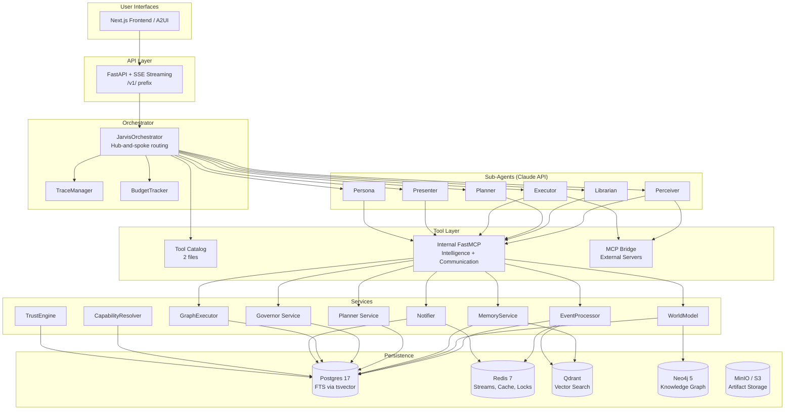
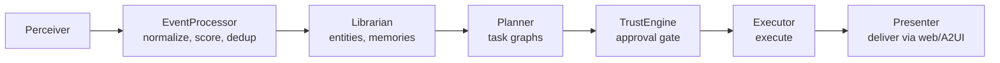

# System Overview

## What Jarvis Is

Jarvis is a **Personal AI Operating System** for founders. It is NOT a chatbot. It is an OS with a core intelligence loop:

```
Perceive -> Understand -> Update Model -> Plan -> Act -> Communicate
```

Jarvis continuously observes data sources (Gmail, Calendar, Slack, GitHub), extracts entities and memories, plans actions, seeks approval for external writes, executes approved plans, and communicates results through a Next.js web frontend.

## High-Level Architecture



## The 6 Sub-Agents

The orchestrator routes to 6 specialized sub-agents via Claude API. Each agent has a defined role, model tier, write scope, and tool scope. Agents never call each other directly — all coordination flows through the orchestrator. The former Observer and Researcher agents were merged into the Perceiver.

| Agent | Model Tier | Role | Write Scope | Tool Scope |
|-------|-----------|------|-------------|------------|
| **Perceiver** | Sonnet | Read external sources, detect changes, ingest events, deep context gathering | `normalized_events` | Gmail/Calendar/Drive/Slack/GitHub read + cursors, web_search, Playwright browser |
| **Librarian** | Sonnet | Extract entities, update world model | `entities`, `relationships`, `memories` | update_entity, search |
| **Planner** | Opus | Determine intent, produce capability-based plans (PlanOutput) | `plans`, `plan_tasks` | plan_command, get_active_plans, search, discover_capabilities |
| **Executor** | Sonnet | Execute approved plans via tools, scoped to each step's capability | `task_runs`, `task_steps` | Per-step capability tools (Gmail/Calendar/Slack/GitHub sends, etc.) |
| **Presenter** | Sonnet | Generate user-facing output | `briefings`, `UI payloads` | get_briefing, search, push_ui_update |
| **Persona** | Haiku | Learn user preferences from interactions | `memories` (preference type) | search, extract_preferences |

> The **Governor** is not a routed sub-agent. It is a deterministic policy service (`services/governor.py`) invoked as an audit-only pre-tool hook — see [Design Decisions](decisions.md#19-single-trustengine-gate).

### Agent Boundaries

These boundaries are strict and must not be violated:

- **Only Planner** decides intent (what to do)
- **Only the Executor** executes external actions (sends emails, posts messages), scoped to each step's capability
- **Only Presenter** talks to the user (formats output)
- **TrustEngine** in GraphExecutor is the single approval gate for the autonomous path. The Governor is not a routed agent — it is a deterministic policy service invoked as an audit-only pre-tool hook

### Model Tier Rationale

| Tier | Model | Used By | Rationale |
|------|-------|---------|-----------|
| Opus | claude-opus-4-8 | Planner | Deepest reasoning for intent classification and task graph generation |
| Sonnet | claude-sonnet-4-6 | Perceiver, Librarian, Executor, Presenter | Best balance of capability and cost for most agent work |
| Haiku | claude-haiku-4-5 | Persona | Lightweight preference extraction, called frequently |

## Infrastructure Services

Jarvis uses 5 infrastructure services. Postgres and Redis are required; the rest are optional with graceful degradation.

| Service | Version | Role | Required? | Fallback |
|---------|---------|------|-----------|----------|
| **PostgreSQL** | 17 | System of record: all models, tsvector FTS with GIN indexes | Yes | None |
| **Redis** | 7 | Event streams, task queue, caching, distributed locks, surface tracking, pubsub | Yes | In-memory (limited) |
| **Qdrant** | 1.17 | Semantic vector search (collections: memories, entities, events, artifacts, conversations, approvals) | No | Postgres FTS only |
| **Neo4j** | 5 Community | Knowledge graph projection: multi-hop traversal, shortest-path, community detection | No | Postgres entity tables only |
| **MinIO / S3** | - | Artifact document/media storage (Postgres holds metadata + S3 key ref) | No | No artifact storage |

### Search Architecture (TriSearch)

Jarvis uses **TriSearch** — a three-engine parallel search with reranking:

```
User query
    ├── Qdrant: semantic vector search (local fastembed bge-base-en-v1.5, 768-dim)
    ├── Postgres FTS: tsvector + GIN keyword search
    ├── Neo4j: graph entity search (CONTAINS matching)
    └── Local cross-encoder reranker (ms-marco-MiniLM-L-12-v2) merges + reranks results
```

The `TriSearchService` (`src/services/tri_search.py`) runs all three backends in parallel, deduplicates results, and reranks via the local cross-encoder. Full-text search currently uses a GIN-indexed Postgres `tsvector` on **`entities` only** (activated by migration `b3e8c1f5a9d2`); the other models define a nullable `search_vector` column that is provisioned but not yet trigger-populated or indexed — see [Data Model → Postgres FTS](data-model.md#postgres-fts-indexes-tsvector--gin). Elasticsearch has been fully removed.

### Knowledge Graph (Neo4j)

Neo4j is a **read-only projection** synced from Postgres:
- `GraphSyncService` listens to entity/relationship events and syncs to Neo4j
- `GraphEngine` provides multi-hop traversal, shortest-path, centrality analysis, community detection
- Postgres `entities` + `entity_relationships` tables remain the source of truth

### Redis Usage

Redis serves 6 distinct purposes:

| Purpose | Pattern | Example Keys |
|---------|---------|-------------|
| Event streaming | Redis Streams + consumer groups | `jarvis:events:{user_id}` |
| Task queue | Redis Streams | `jarvis:tasks` |
| Caching | SET with TTL | `brief:{user_id}:{date}`, `entity:{user_id}:{query}`, `dedup:{key}` |
| Distributed locks | SET NX EX | `lock:{resource}` |
| Surface tracking | Hash with TTL | `jarvis:surfaces:{user_id}` |
| Real-time pubsub | PUB/SUB | `jarvis:run_progress:{run_id}` |

## Data Flow



## Execution State Machine

Every task progresses through a defined state machine:

```
detected -> planned -> policy_checked -> approved -> executing -> completed/failed
```

Every external write requires approval in v1. An audit log with correlation IDs tracks all external writes.

## Multi-Tenant Workspace Isolation

All data tables have a `workspace_id` column (`String(64)`, NOT NULL FK to `workspaces` with CASCADE delete). This enforces strict multi-tenant isolation at the database level.

- **API routes** resolve the workspace via the `get_current_workspace_id()` dependency.
- **Background services** resolve the workspace via `resolve_workspace_id(db, user_id)`.
- **User-level tables** (not workspace-scoped): `users`, `workspaces`, `workspace_members`, `sessions`, `magic_links`.
- **System-global tables** (shared across workspaces): `agents`.
- All functions require explicit `user_id` from the auth context; there is no default user fallback.
