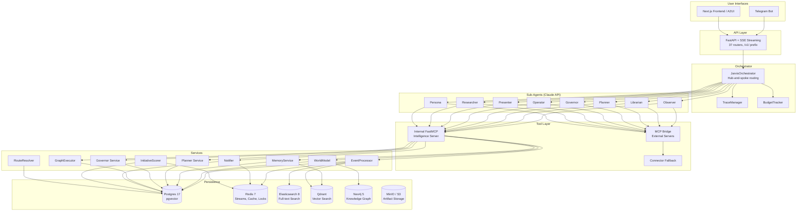
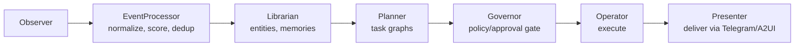

# System Overview

## What Jarvis Is

Jarvis is a **Personal AI Operating System** for founders. It is NOT a chatbot. It is an OS with a core intelligence loop:

```
Perceive -> Understand -> Update Model -> Plan -> Act -> Communicate
```

Jarvis continuously observes data sources (Gmail, Calendar, Slack, GitHub), extracts entities and memories, plans actions, seeks approval for external writes, executes approved plans, and communicates results through Telegram and a Next.js web frontend.

## High-Level Architecture



## The 8 Sub-Agents

The orchestrator routes to 8 specialized sub-agents via Claude API. Each agent has a defined role, model tier, write scope, and tool scope. Agents never call each other directly — all coordination flows through the orchestrator.

| Agent | Model Tier | Role | Write Scope | Tool Scope |
|-------|-----------|------|-------------|------------|
| **Observer** | Sonnet | Read external sources, detect changes, ingest events | `normalized_events` | Gmail/Calendar/Drive/Slack/GitHub read + cursors |
| **Librarian** | Sonnet | Extract entities, update world model | `entities`, `relationships`, `memories` | update_entity, get_entities, search_memory |
| **Planner** | Opus | Determine intent, produce structured task graphs | `plans`, `plan_tasks` | plan_command, get_active_plans, search_memory, get_entities |
| **Governor** | Sonnet | Evaluate policies, gate approvals | `policy decisions`, `approvals` | evaluate_policy, approve_action |
| **Operator** | Sonnet | Execute approved plans via MCP tools | `executions`, `task_runs` | Gmail/Calendar/Slack/GitHub sends + execution tracking |
| **Presenter** | Sonnet | Generate user-facing output | `briefings`, `UI payloads` | get_briefing, search_memory, send_telegram, push_ui_update |
| **Researcher** | Sonnet | Deep context gathering (read-only) | None | All read tools + Perplexity search + Playwright browser |
| **Persona** | Haiku | Learn user preferences from interactions | `memories` (preference type) | search_memory, extract_preferences |

### Agent Boundaries

These boundaries are strict and must not be violated:

- **Only Planner** decides intent (what to do)
- **Only Operator** executes external actions (sends emails, posts messages)
- **Only Presenter** talks to the user (formats output)
- **Governor** sits before every external write (approval gate)

### Model Tier Rationale

| Tier | Model | Used By | Rationale |
|------|-------|---------|-----------|
| Opus | claude-opus-4 | Planner | Deepest reasoning for intent classification and task graph generation |
| Sonnet | claude-sonnet-4 | Observer, Librarian, Governor, Operator, Presenter, Researcher | Best balance of capability and cost for most agent work |
| Haiku | claude-haiku-4 | Persona | Lightweight preference extraction, called frequently |

## Infrastructure Services

Jarvis uses 6 infrastructure services. Postgres and Redis are required; the rest are optional with graceful degradation.

| Service | Version | Role | Required? | Fallback |
|---------|---------|------|-----------|----------|
| **PostgreSQL** | 17 (pgvector) | System of record: all models, pgvector for dedup | Yes | None |
| **Redis** | 7 | Event streams, task queue, caching, distributed locks, surface tracking, pubsub | Yes | In-memory (limited) |
| **Elasticsearch** | 8.16 | Full-text BM25 search for traces, events, entities, memories, artifacts | No | Postgres-only search |
| **Qdrant** | 1.12 | Semantic vector search (4 collections: memories, entities, events, artifacts) | No | pgvector fallback |
| **Neo4j** | 5 Community | Knowledge graph projection: multi-hop traversal, shortest-path, community detection | No | Postgres entity tables only |
| **MinIO / S3** | - | Artifact document/media storage (Postgres holds metadata + S3 key ref) | No | No artifact storage |

### Search Architecture

Jarvis uses **hybrid search** combining full-text and semantic approaches:

```
User query
    ├── Qdrant: semantic vector search (Titan V2 1024-dim embeddings)
    ├── Elasticsearch: BM25 full-text search (phrase + keyword)
    └── Reciprocal Rank Fusion (RRF) merges results
```

The `SearchService` indexes all events, entities, memories, and artifacts to both ES and Qdrant in parallel. Queries run against both and merge results via RRF scoring.

### Knowledge Graph (Neo4j)

Neo4j is a **read-only projection** synced from Postgres:
- `GraphSyncService` listens to entity/relationship events and syncs to Neo4j
- `GraphEngine` provides multi-hop traversal, shortest-path, centrality analysis, community detection
- Postgres `entities` + `entity_relationships` tables remain the source of truth

### Redis Usage

Redis serves 6 distinct purposes:

| Purpose | Pattern | Example Keys |
|---------|---------|-------------|
| Event streaming | Redis Streams + consumer groups | `jarvis:events:{user_id}` |
| Task queue | Redis Streams | `jarvis:tasks` |
| Caching | SET with TTL | `brief:{user_id}:{date}`, `entity:{user_id}:{query}`, `dedup:{key}` |
| Distributed locks | SET NX EX | `lock:{resource}` |
| Surface tracking | Hash with TTL | `jarvis:surfaces:{user_id}` |
| Real-time pubsub | PUB/SUB | `jarvis:run_progress:{run_id}` |

## Data Flow



## Execution State Machine

Every task progresses through a defined state machine:

```
detected -> planned -> policy_checked -> approved -> executing -> completed/failed
```

Every external write requires approval in v1. An audit log with correlation IDs tracks all external writes.

## Multi-Tenant Workspace Isolation

All 49 data tables have a `workspace_id` column (`String(64)`, NOT NULL FK to `workspaces` with CASCADE delete). This enforces strict multi-tenant isolation at the database level.

- **API routes** resolve the workspace via the `get_current_workspace_id()` dependency.
- **Background services** resolve the workspace via `resolve_workspace_id(db, user_id)`.
- **User-level tables** (not workspace-scoped): `users`, `workspaces`, `workspace_members`, `sessions`, `magic_links`.
- **System-global tables** (shared across workspaces): `agents`, `agent_routes`.
- All functions require explicit `user_id` from the auth context; there is no default user fallback.
