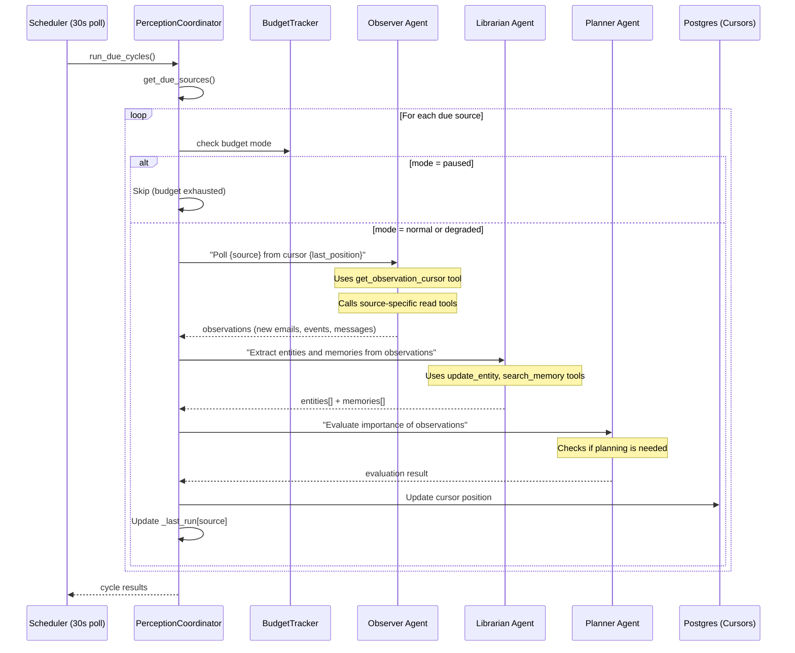
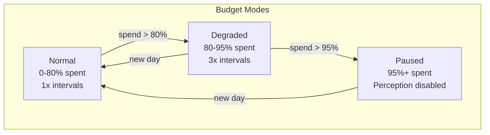

# Perception & Ambient Intelligence

## Perception Cycle

The `PerceptionCoordinator` manages scheduled ambient observation cycles. Each coordinator instance is per-user (there is no default user); the scheduler creates a separate `PerceptionCoordinator` for each user ID queried from the database at startup. For background perception cycles, `workspace_id` is resolved via `resolve_workspace_id()` to ensure all ingested events and entities are correctly scoped.



## Source Intervals

| Source | Default Interval | Degraded Interval (3x) |
|--------|-----------------|----------------------|
| Gmail | 5 minutes | 15 minutes |
| Calendar | 15 minutes | 45 minutes |
| Slack | 5 minutes | 15 minutes |
| GitHub | 10 minutes | 30 minutes |

## Cursor-Based Incremental Fetch

Each source maintains a cursor in the `observation_cursors` table:

| Field | Purpose |
|-------|---------|
| `source` | Source name (gmail, calendar, slack, github) |
| `cursor_value` | Last-seen position (timestamp, message ID, etc.) |
| `poll_interval_seconds` | Configured interval for this source |
| `user_id` | Owner |

The Observer agent uses `get_observation_cursor` to retrieve the cursor, then fetches only new items since that position. After processing, it updates the cursor via `update_observation_cursor`.

### Startup Cursor Restore

On startup, `PerceptionCoordinator.restore_cursors()` loads cursor positions from the database, ensuring no gaps in observation even after restarts.

## Budget-Aware Scheduling

The `BudgetTracker` controls perception behavior based on daily token spend:



| Mode | Interval Multiplier | Perception Active? |
|------|--------------------|--------------------|
| Normal | 1x | Yes |
| Degraded | 3x | Yes (reduced frequency) |
| Paused | N/A | No |

### Per-Cycle Budget Cap

Each perception cycle is capped at **50,000 input tokens**. The `BudgetTracker.check_cycle_budget()` method enforces this, preventing a single observation cycle from consuming excessive resources.

## Budget Tracking

### Cost Model

| Model | Input ($/1M tokens) | Output ($/1M tokens) |
|-------|---------------------|----------------------|
| Claude Opus 4 | $15.00 | $75.00 |
| Claude Sonnet 4 | $3.00 | $15.00 |
| Claude Haiku 4 | $0.80 | $4.00 |

### Cache & Thinking Token Pricing

`BudgetTracker.calculate_cost()` handles all token types with real cost calculation (not hardcoded `0.0`):

| Token Type | Pricing Rule |
|------------|-------------|
| **Cache write tokens** | 1.25x the model's input price per token |
| **Cache read tokens** | 0.1x the model's input price per token |
| **Thinking tokens** | Charged at the model's output price per token |
| **Standard input** | Model's input price per token |
| **Standard output** | Model's output price per token |

Per-agent cost breakdown is tracked via `AgentSpan` fields (`cost_usd`, `cache_creation_input_tokens`, `cache_read_input_tokens`, `thinking_tokens`) and aggregated per trace.

### Token Usage Persistence

Token usage is persisted to the `token_usage` table via the `async with db_factory()` pattern. Previously, usage was flushed without commit, causing rollback on session close and silent data loss. The fix ensures every recording site uses `async with db_factory() as db:` followed by `await db.commit()`.

### Daily Budget Lifecycle

1. Budget resets at UTC midnight
2. Every Claude API call records usage to `token_usage` table (including cache and thinking token columns added in migration 025)
3. `BudgetTracker.get_budget_status()` computes current spend using real `calculate_cost()` across all token types
4. Mode transitions trigger interval multiplier changes
5. Default daily limit: `$5.00` (configurable via `JARVIS_DAILY_TOKEN_BUDGET_USD`)

### BudgetStatus

```python
@dataclass
class BudgetStatus:
    daily_spend_usd: float
    daily_limit_usd: float
    budget_mode: str        # normal, degraded, paused
    remaining_usd: float
    percent_used: float
```

## Observation Health

The `observation_statuses` table tracks per-source health:

| Field | Purpose |
|-------|---------|
| `source` | Source name |
| `last_observed_at` | Last successful observation |
| `status` | healthy, degraded, failed |
| `items_found` | Items discovered in last cycle |
| `items_ingested` | Items successfully ingested |

This data feeds into the `/v1/system/dashboard` health endpoint.

## Multi-Agent Perception

The perception cycle uses three agents in sequence:

1. **Observer** reads raw data from external sources
2. **Librarian** extracts structured knowledge (entities, relationships, memories)
3. **Planner** evaluates whether the observations warrant action

This three-agent chain ensures separation of concerns: reading, understanding, and deciding are handled by different specialized agents.
