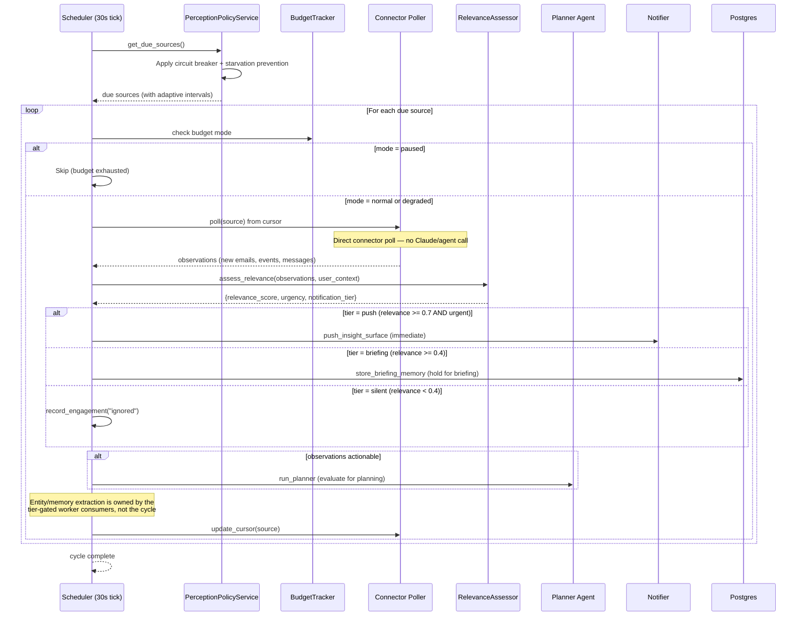
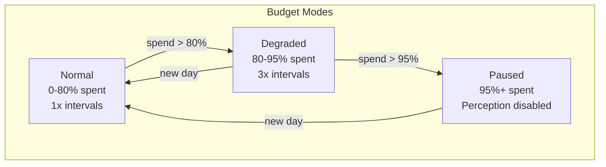

# Perception & Ambient Intelligence

## Signal-Driven Perception

Perception is signal-driven via `PerceptionPolicyService` (`src/services/perception_policy.py`). The scheduler's perception tick (`src/services/scheduler/perception_tick.py`) calls the policy service to determine which sources are due across all users, applying adaptive intervals with backoff, circuit breaking, and starvation prevention. It then claims those sources, runs each cycle through the orchestrator, and records the outcome. Cycles are grouped by user so each user's gateway MCP sessions live inside one `TurnScope` and are torn down when that user's sources finish.



## RelevanceAssessor

`RelevanceAssessor` (`src/services/relevance_assessor.py`) uses an LLM call to score signal relevance against the user's goals and context. Returns a structured assessment:

| Field | Type | Description |
|-------|------|-------------|
| `relevance_score` | 0.0-1.0 | How relevant to user's goals |
| `urgency` | immediate/today/this_week/whenever | Time sensitivity |
| `notification_tier` | push/briefing/silent | Routing tier |
| `relates_to_goals` | list[str] | Which goals this relates to |
| `suggested_actions` | list[SuggestedAction] | Capability-based actions |

### 3-Tier Routing

`notification_tier` is a `Literal["push", "briefing", "silent"]` — exactly three tiers:

| Tier | Condition | Action |
|------|-----------|--------|
| **push** | relevance >= 0.7 AND urgency in (immediate, today, this_week) | Push an insight surface immediately |
| **briefing** | relevance >= 0.4 | Store a briefing memory (`store_briefing_memory`) for next briefing delivery |
| **silent** | relevance < 0.4 | Record an `"ignored"` engagement, no notification |

## Notification Rate Limiting

The `Notifier` (`src/services/notifier.py`) enforces per-surface rate limits to prevent notification fatigue:

| Surface | Limit (per hour) |
|---------|-----------------|
| Web | 15 |
| Slack | 8 |
| Email | 3 |

Rate limits are tracked via Redis with atomic INCR + EXPIRE (1h window). When a surface is rate-limited, the notification is held for briefing delivery instead.

## Source Intervals

| Source | Default Interval | Degraded Interval (3x) |
|--------|-----------------|----------------------|
| Gmail | 5 minutes | 15 minutes |
| Calendar | 15 minutes | 45 minutes |
| Slack | 5 minutes | 15 minutes |
| GitHub | 10 minutes | 30 minutes |

## Circuit Breaker with Error Classification

`PerceptionPolicyService` implements an error-class-aware circuit breaker per source:

| Error Class | Threshold | Rationale |
|-------------|-----------|-----------|
| **Transient** (timeout, rate limit, 5xx) | 6 failures | Self-healing; more tolerance |
| **Permanent** (auth revoked, 403, invalid config) | 1 failure | Retrying will never help |
| **Unknown** | 3 failures | Default threshold |

Error classification uses regex pattern matching against error strings (`classify_error()` function).

Circuit states: `closed` → `open` (after threshold) → `half_open` (after 5-min cooldown) → `closed` (on success) or `open` (on failure).

### Starvation Prevention

If a source has not been polled for 30 minutes (`STARVATION_CEILING_S = 1800`), it is forced into the due list regardless of backoff state. This prevents sources from being permanently starved by repeated transient failures.

### Backoff with Jitter

Failed sources use exponential backoff capped at 8x (`BACKOFF_CAP = 8`). Jitter is applied to prevent thundering herd when multiple sources recover simultaneously.

## Cursor-Based Incremental Fetch

Each source keeps circuit-breaker and interval state in the `perception_state` table (cursors themselves are managed by the poller path, not stored here):

| Field | Purpose |
|-------|---------|
| `source` | Source name (gmail, calendar, slack, github) |
| `user_id` | Owner |
| `base_interval_s` | Configured base poll interval for this source |
| `effective_interval_s` | Current interval after backoff/degraded multipliers |
| `agent_interval_s` | Interval for the agent-driven perception path |
| `consecutive_failures` | Failure counter for circuit breaker |
| `last_error` | Most recent error message (512 chars) |
| `circuit_state` | closed, open, half_open |
| `circuit_opened_at` | When circuit was opened |
| `last_run_at` | Last successful observation |
| `last_event_count` | Items discovered in last cycle |
| `total_runs` | Lifetime run count |

The routine perception cycle does **not** invoke the Perceiver agent. Cursor retrieval and advancement happen directly in the connector poller (`self._poller.poll` / `self._poller.update_cursor`), which fetches only new items since the last position. (The `get_observation_cursor` / `update_observation_cursor` MCP tools exist for the agent-driven path but are not used by the routine cycle.)

## Budget-Aware Scheduling

The `BudgetTracker` controls perception behavior based on daily token spend:



| Mode | Interval Multiplier | Perception Active? |
|------|--------------------|--------------------|
| Normal | 1x | Yes |
| Degraded | 3x | Yes (reduced frequency) |
| Paused | N/A | No |

### Per-Cycle Budget Cap

Each perception cycle is capped at **50,000 input tokens**. The `BudgetTracker.check_cycle_budget()` method enforces this, preventing a single observation cycle from consuming excessive resources.

## Budget Tracking

### Cost Model

| Model | Input ($/1M tokens) | Output ($/1M tokens) |
|-------|---------------------|----------------------|
| `claude-opus-4-8` | $15.00 | $75.00 |
| `claude-sonnet-4-6` | $3.00 | $15.00 |
| `claude-haiku-4-5-20251001` | $0.80 | $4.00 |

### Cache & Thinking Token Pricing

`BudgetTracker.calculate_cost()` handles all token types with real cost calculation (not hardcoded `0.0`):

| Token Type | Pricing Rule |
|------------|-------------|
| **Cache write tokens** | 1.25x the model's input price per token |
| **Cache read tokens** | 0.1x the model's input price per token |
| **Thinking tokens** | Charged at the model's output price per token |
| **Standard input** | Model's input price per token |
| **Standard output** | Model's output price per token |

Per-agent cost breakdown is tracked via `AgentSpan` fields (`cost_usd`, `cache_creation_input_tokens`, `cache_read_input_tokens`, `thinking_tokens`) and aggregated per trace.

### Token Usage Persistence

Token usage is persisted to the `token_usage` table via the `async with db_factory()` pattern. Previously, usage was flushed without commit, causing rollback on session close and silent data loss. The fix ensures every recording site uses `async with db_factory() as db:` followed by `await db.commit()`.

### Daily Budget Lifecycle

1. Budget resets at UTC midnight
2. Every model call records usage to the `token_usage` table (including cache and thinking token columns added in migration 025)
3. `BudgetTracker.get_budget_status()` computes current spend using real `calculate_cost()` across all token types
4. Mode transitions trigger interval multiplier changes
5. Default daily limit: `$5.00` (configurable via `MULDRO_DAILY_TOKEN_BUDGET_USD`)

### BudgetStatus

```python
@dataclass
class BudgetStatus:
    daily_spend_usd: float
    daily_limit_usd: float
    budget_mode: str        # normal, degraded, paused
    remaining_usd: float
    percent_used: float
```

## Cross-Source Synthesis

When 2+ perception sources have 3+ total events in the same scheduler tick, the scheduler triggers a Planner synthesis call to identify cross-cutting insights (e.g., a Slack mention about a GitHub PR that relates to a calendar meeting). Throttled to once per 30 minutes, budget-aware.

## Persona Batching

Every 10th scheduler tick (~5 minutes), the Persona agent runs a batch preference extraction over recent interactions. Requirements:
- Minimum 5 interactions since last batch
- 24-hour lookback window
- Extracts patterns into preference memories

## Perception Cycle Reality

The routine perception cycle is **not** a three-agent chain:

1. **Polling** is a direct connector poll (`self._poller.poll`) — no Perceiver agent or Claude/LLM call. Cursors advance via `self._poller.update_cursor`.
2. **Entity/memory extraction is not run in-cycle** (`librarian_result = None`). It is owned by the tier-gated worker consumers (`entity_extractor`, `memory_extractor`) on the event stream.
3. **The Planner agent is the only agent invoked**, and only conditionally (`run_planner`) when the polled events are actionable.

Relevance routing (push / briefing / silent) and initiative scoring happen deterministically in the cycle; only the conditional planning step reaches an agent.

## DLQ Integration

Failed perception cycles enqueue errors to the Dead Letter Queue (`DeadLetterService`). The scheduler retries DLQ items every 5th tick (~150s). This ensures transient failures during perception do not permanently lose events.
