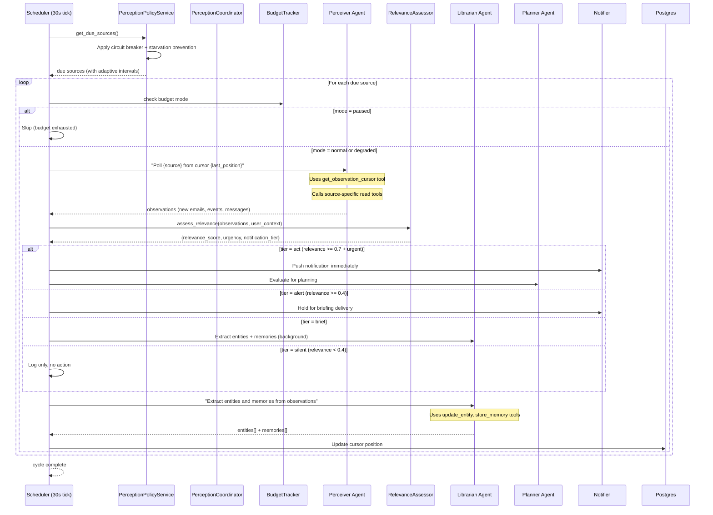
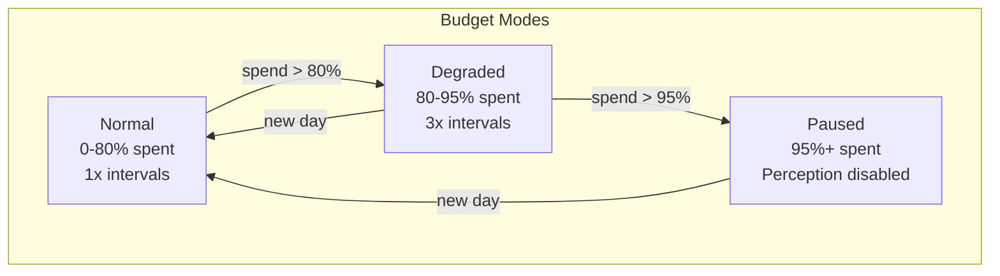

# Perception & Ambient Intelligence

## Signal-Driven Perception

Perception is signal-driven via `PerceptionPolicyService` (`src/services/perception_policy.py`). The scheduler calls the policy service to determine which sources are due, applying adaptive intervals with backoff, circuit breaking, and starvation prevention. `PerceptionCoordinator` (`src/orchestrator/perception.py`) is a thin wrapper that connects the policy service to the orchestrator.



## RelevanceAssessor

`RelevanceAssessor` (`src/services/relevance_assessor.py`) uses an LLM call to score signal relevance against the user's goals and context. Returns a structured assessment:

| Field | Type | Description |
|-------|------|-------------|
| `relevance_score` | 0.0-1.0 | How relevant to user's goals |
| `urgency` | immediate/today/this_week/whenever | Time sensitivity |
| `notification_tier` | push/briefing/silent | Routing tier |
| `relates_to_goals` | list[str] | Which goals this relates to |
| `suggested_actions` | list[SuggestedAction] | Capability-based actions |

### 4-Tier Routing

| Tier | Condition | Action |
|------|-----------|--------|
| **act** (push) | relevance >= 0.7 AND urgency in (immediate, today, this_week) | Push notification + evaluate for planning |
| **alert** (briefing) | relevance >= 0.4 | Hold for next briefing delivery |
| **brief** | relevance >= 0.4 (lower urgency) | Extract knowledge, background enrichment |
| **silent** | relevance < 0.4 | Log only, no notification |

## Notification Rate Limiting

The `Notifier` (`src/services/notifier.py`) enforces per-surface rate limits to prevent notification fatigue:

| Surface | Limit (per hour) |
|---------|-----------------|
| Web | 15 |
| Slack | 8 |
| Email | 3 |

Rate limits are tracked via Redis with atomic INCR + EXPIRE (1h window). When a surface is rate-limited, the notification is held for briefing delivery instead.

## Source Intervals

| Source | Default Interval | Degraded Interval (3x) |
|--------|-----------------|----------------------|
| Gmail | 5 minutes | 15 minutes |
| Calendar | 15 minutes | 45 minutes |
| Slack | 5 minutes | 15 minutes |
| GitHub | 10 minutes | 30 minutes |

## Circuit Breaker with Error Classification

`PerceptionPolicyService` implements an error-class-aware circuit breaker per source:

| Error Class | Threshold | Rationale |
|-------------|-----------|-----------|
| **Transient** (timeout, rate limit, 5xx) | 6 failures | Self-healing; more tolerance |
| **Permanent** (auth revoked, 403, invalid config) | 1 failure | Retrying will never help |
| **Unknown** | 3 failures | Default threshold |

Error classification uses regex pattern matching against error strings (`classify_error()` function).

Circuit states: `closed` → `open` (after threshold) → `half_open` (after 5-min cooldown) → `closed` (on success) or `open` (on failure).

### Starvation Prevention

If a source has not been polled for 30 minutes (`STARVATION_CEILING_S = 1800`), it is forced into the due list regardless of backoff state. This prevents sources from being permanently starved by repeated transient failures.

### Backoff with Jitter

Failed sources use exponential backoff capped at 8x (`BACKOFF_CAP = 8`). Jitter is applied to prevent thundering herd when multiple sources recover simultaneously.

## Cursor-Based Incremental Fetch

Each source maintains a cursor in the `perception_state` table:

| Field | Purpose |
|-------|---------|
| `source` | Source name (gmail, calendar, slack, github) |
| `cursor_value` | Last-seen position (timestamp, message ID, etc.) |
| `poll_interval_seconds` | Configured interval for this source |
| `user_id` | Owner |
| `consecutive_failures` | Failure counter for circuit breaker |
| `last_error` | Most recent error message (512 chars) |
| `circuit_state` | closed, open, half_open |
| `circuit_opened_at` | When circuit was opened |
| `last_run_at` | Last successful observation |
| `last_event_count` | Items discovered in last cycle |
| `total_runs` | Lifetime run count |

The Perceiver agent uses `get_observation_cursor` to retrieve the cursor, then fetches only new items since that position. After processing, it updates the cursor via `update_observation_cursor`.

## Budget-Aware Scheduling

The `BudgetTracker` controls perception behavior based on daily token spend:



| Mode | Interval Multiplier | Perception Active? |
|------|--------------------|--------------------|
| Normal | 1x | Yes |
| Degraded | 3x | Yes (reduced frequency) |
| Paused | N/A | No |

### Per-Cycle Budget Cap

Each perception cycle is capped at **50,000 input tokens**. The `BudgetTracker.check_cycle_budget()` method enforces this, preventing a single observation cycle from consuming excessive resources.

## Budget Tracking

### Cost Model

| Model | Input ($/1M tokens) | Output ($/1M tokens) |
|-------|---------------------|----------------------|
| Claude Opus 4 | $15.00 | $75.00 |
| Claude Sonnet 4 | $3.00 | $15.00 |
| Claude Haiku 4 | $0.80 | $4.00 |

### Cache & Thinking Token Pricing

`BudgetTracker.calculate_cost()` handles all token types with real cost calculation (not hardcoded `0.0`):

| Token Type | Pricing Rule |
|------------|-------------|
| **Cache write tokens** | 1.25x the model's input price per token |
| **Cache read tokens** | 0.1x the model's input price per token |
| **Thinking tokens** | Charged at the model's output price per token |
| **Standard input** | Model's input price per token |
| **Standard output** | Model's output price per token |

Per-agent cost breakdown is tracked via `AgentSpan` fields (`cost_usd`, `cache_creation_input_tokens`, `cache_read_input_tokens`, `thinking_tokens`) and aggregated per trace.

### Token Usage Persistence

Token usage is persisted to the `token_usage` table via the `async with db_factory()` pattern. Previously, usage was flushed without commit, causing rollback on session close and silent data loss. The fix ensures every recording site uses `async with db_factory() as db:` followed by `await db.commit()`.

### Daily Budget Lifecycle

1. Budget resets at UTC midnight
2. Every Claude API call records usage to `token_usage` table (including cache and thinking token columns added in migration 025)
3. `BudgetTracker.get_budget_status()` computes current spend using real `calculate_cost()` across all token types
4. Mode transitions trigger interval multiplier changes
5. Default daily limit: `$5.00` (configurable via `JARVIS_DAILY_TOKEN_BUDGET_USD`)

### BudgetStatus

```python
@dataclass
class BudgetStatus:
    daily_spend_usd: float
    daily_limit_usd: float
    budget_mode: str        # normal, degraded, paused
    remaining_usd: float
    percent_used: float
```

## Cross-Source Synthesis

When 2+ perception sources have 3+ total events in the same scheduler tick, the scheduler triggers a Planner synthesis call to identify cross-cutting insights (e.g., a Slack mention about a GitHub PR that relates to a calendar meeting). Throttled to once per 30 minutes, budget-aware.

## Persona Batching

Every 10th scheduler tick (~5 minutes), the Persona agent runs a batch preference extraction over recent interactions. Requirements:
- Minimum 5 interactions since last batch
- 24-hour lookback window
- Extracts patterns into preference memories

## Multi-Agent Perception

The perception cycle uses three agents in sequence:

1. **Perceiver** reads raw data from external sources (replaces former Observer + Researcher)
2. **Librarian** extracts structured knowledge (entities, relationships, memories)
3. **Planner** evaluates whether the observations warrant action

This three-agent chain ensures separation of concerns: reading, understanding, and deciding are handled by different specialized agents.

## DLQ Integration

Failed perception cycles enqueue errors to the Dead Letter Queue (`DeadLetterService`). The scheduler retries DLQ items every 5th tick (~150s). This ensures transient failures during perception do not permanently lose events.
