# Plan & Execution System: End-to-End Deep Dive

This document traces the complete lifecycle of goals, plans, and execution in Jarvis — from the moment a user sends a message to the final frontend update. It covers creation, data flow, execution, status tracking, frontend delivery, resumption, failure handling, and cross-system interactions.

---

## Table of Contents

1. [System Overview](#1-system-overview)
2. [Sources of Plan Creation](#2-sources-of-plan-creation)
3. [Data Flow: Message to Plan](#3-data-flow-message-to-plan)
4. [Plan Persistence & Data Model](#4-plan-persistence--data-model)
5. [Capability Resolution & Agent Routing](#5-capability-resolution--agent-routing)
6. [Plan Execution: GraphExecutor](#6-plan-execution-graphexecutor)
7. [Step-Level Execution: The Deep Runtime](#7-step-level-execution-the-deep-runtime)
8. [Execution State Machine](#8-execution-state-machine)
9. [Trust & Approval Gates](#9-trust--approval-gates)
10. [Frontend Status Updates](#10-frontend-status-updates)
11. [Resumption](#11-resumption)
12. [Failure Handling & Recovery](#12-failure-handling--recovery)
13. [Cross-System Interactions](#13-cross-system-interactions)
14. [Key File Reference](#14-key-file-reference)

---

## 1. System Overview

The plan-execution pipeline is the central nervous system of Jarvis. Every user request — whether a chat message, a perception-triggered insight, or a scheduled task — flows through the same pipeline:

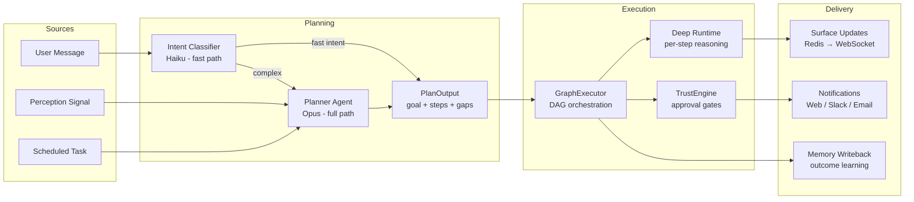
```mermaid
flowchart LR
    subgraph Sources
        A[User Message]
        B[Perception Signal]
        C[Scheduled Task]
    end

    subgraph Planning
        D[Intent Classifier<br/>Haiku - fast path]
        E[Planner Agent<br/>Opus - full path]
        F[PlanOutput<br/>goal + steps + gaps]
    end

    subgraph Execution
        G[GraphExecutor<br/>DAG orchestration]
        H[Deep Runtime<br/>per-step reasoning]
        I[TrustEngine<br/>approval gates]
    end

    subgraph Delivery
        J[Surface Updates<br/>Redis → WebSocket]
        K[Notifications<br/>Web / Slack / Email]
        L[Memory Writeback<br/>outcome learning]
    end

    A --> D
    B --> E
    C --> E
    D -->|fast intent| F
    D -->|complex| E
    E --> F
    F --> G
    G --> H
    G --> I
    H --> J
    I --> K
    G --> L
```

**Key principle:** All paths converge to a structured `PlanOutput` with capability-based steps. Whether the plan has 1 step (fast path) or 10 steps (Planner), the execution engine treats them identically.

---

## 2. Sources of Plan Creation

Plans originate from three distinct sources, each entering the system through a different path but converging at the same `PlanOutput` contract:

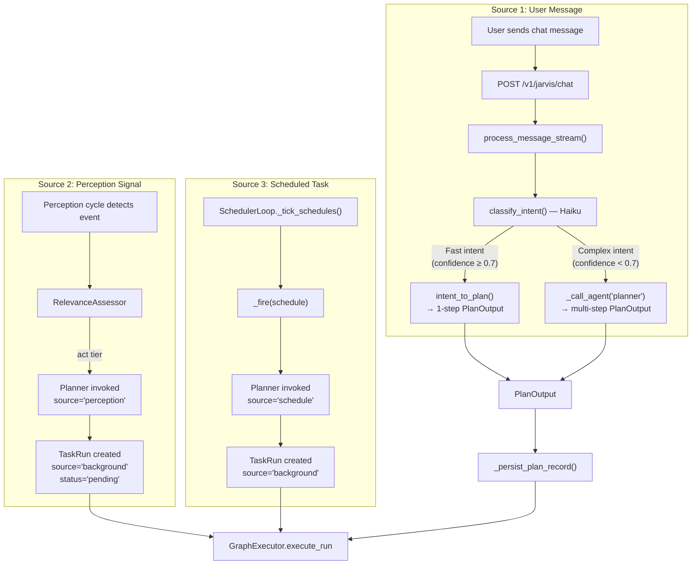
```mermaid
flowchart TD
    subgraph "Source 1: User Message"
        U[User sends chat message] --> API["POST /v1/jarvis/chat"]
        API --> PM["process_message_stream()"]
        PM --> IC["classify_intent() — Haiku"]
        IC -->|"Fast intent<br/>(confidence ≥ 0.7)"| ITP["intent_to_plan()<br/>→ 1-step PlanOutput"]
        IC -->|"Complex intent<br/>(confidence < 0.7)"| PL["_call_agent('planner')<br/>→ multi-step PlanOutput"]
    end

    subgraph "Source 2: Perception Signal"
        PS[Perception cycle detects event] --> RA[RelevanceAssessor]
        RA -->|"act tier"| PL2["Planner invoked<br/>source='perception'"]
        PL2 --> BG["TaskRun created<br/>source='background'<br/>status='pending'"]
    end

    subgraph "Source 3: Scheduled Task"
        SC["SchedulerLoop._tick_schedules()"] --> FIRE["_fire(schedule)"]
        FIRE --> PL3["Planner invoked<br/>source='schedule'"]
        PL3 --> BG2["TaskRun created<br/>source='background'"]
    end

    ITP --> PO[PlanOutput]
    PL --> PO
    BG --> EXEC[GraphExecutor.execute_run]
    BG2 --> EXEC
    PO --> PERSIST["_persist_plan_record()"]
    PERSIST --> EXEC
```

### 2.1 User Messages (Interactive)

The most common source. The orchestrator receives a message via `process_message()` or `process_message_stream()` in `src/orchestrator/jarvis.py`.

**Fast intent path** (10 intent types, ~200ms):
- `greeting`, `chitchat`, `acknowledgment` → `capability="respond"`, priority=low
- `simple_question`, `direct_answer` → `capability="reason"`
- `data_fetch`, `single_read` → `capability="perceive"`
- `status_query`, `memory_operation` → `capability="knowledge.search"`
- `approval_response` → `capability="respond"`

**Full Planner path** (~2-5s):
- Planner receives the user message + conversation history + capability summary (~200 tokens)
- Follows a 7-step decomposition: parse intent → identify capabilities → decompose → assign actors → assess risk → evaluate achievability → identify gaps
- Returns structured JSON parsed by `extract_plan()`

### 2.2 Perception Signals (Proactive)

The `SchedulerLoop` triggers perception cycles every 30 seconds. When the `Perceiver` agent detects relevant events (email, calendar, Slack, GitHub), the `RelevanceAssessor` routes them by tier:
- **act** → Planner creates an execution plan (background TaskRun)
- **alert** → Notification pushed to user
- **brief** → Held for daily briefing
- **silent** → Logged only

### 2.3 Scheduled Tasks (Recurring)

Schedules with cron expressions fire via `_tick_schedules()`. Each firing invokes the Planner to generate a fresh plan, which becomes a background TaskRun.

---

## 3. Data Flow: Message to Plan

Here is the complete data transformation pipeline from user message to executable plan:

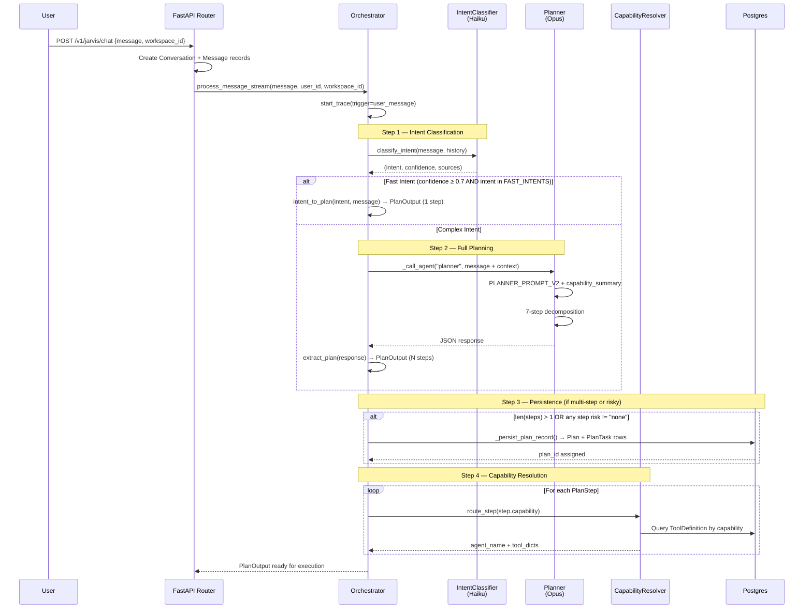
```mermaid
sequenceDiagram
    participant User
    participant API as FastAPI Router
    participant Orch as Orchestrator
    participant IC as IntentClassifier<br/>(Haiku)
    participant PL as Planner<br/>(Opus)
    participant CR as CapabilityResolver
    participant DB as Postgres

    User->>API: POST /v1/jarvis/chat {message, workspace_id}
    API->>API: Create Conversation + Message records
    API->>Orch: process_message_stream(message, user_id, workspace_id)
    Orch->>Orch: start_trace(trigger=user_message)

    Note over Orch,IC: Step 1 — Intent Classification
    Orch->>IC: classify_intent(message, history)
    IC-->>Orch: (intent, confidence, sources)

    alt Fast Intent (confidence ≥ 0.7 AND intent in FAST_INTENTS)
        Orch->>Orch: intent_to_plan(intent, message) → PlanOutput (1 step)
    else Complex Intent
        Note over Orch,PL: Step 2 — Full Planning
        Orch->>PL: _call_agent("planner", message + context)
        PL->>PL: PLANNER_PROMPT_V2 + capability_summary
        PL->>PL: 7-step decomposition
        PL-->>Orch: JSON response
        Orch->>Orch: extract_plan(response) → PlanOutput (N steps)
    end

    Note over Orch,DB: Step 3 — Persistence (if multi-step or risky)
    alt len(steps) > 1 OR any step risk != "none"
        Orch->>DB: _persist_plan_record() → Plan + PlanTask rows
        DB-->>Orch: plan_id assigned
    end

    Note over Orch,CR: Step 4 — Capability Resolution
    loop For each PlanStep
        Orch->>CR: route_step(step.capability)
        CR->>DB: Query ToolDefinition by capability
        CR-->>Orch: agent_name + tool_dicts
    end

    Orch-->>API: PlanOutput ready for execution
```

### Data Transformations

| Stage | Input | Output | Key Logic |
|-------|-------|--------|-----------|
| Intent Classification | User message + history | `(intent, confidence, sources)` | Haiku single-turn call, JSON parse |
| Fast Path | Intent string + message | `PlanOutput` (1 step) | Static mapping: intent → capability |
| Full Planning | Message + context + capabilities | `PlanOutput` (N steps) | Opus multi-turn with tool_use |
| Plan Extraction | Raw LLM text | Validated `PlanOutput` | JSON parse → Pydantic validation → fallback |
| Persistence | `PlanOutput` | `Plan` + `PlanTask[]` rows | Step→Task mapping, dependency resolution |
| Routing | `step.capability` | `(agent_name, tool_dicts)` | DB lookup: capability → tools → agent |

---

## 4. Plan Persistence & Data Model

Plans are persisted across three interconnected tables:

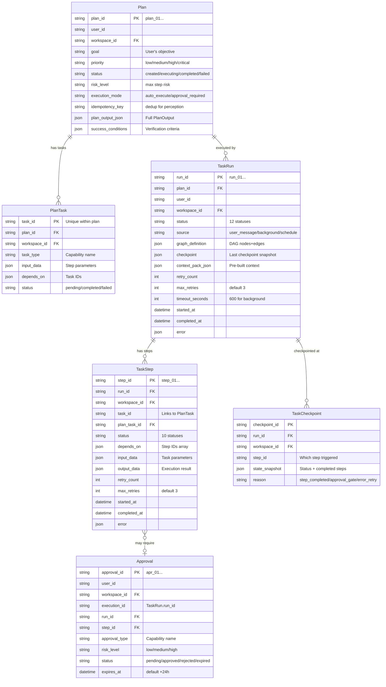
```mermaid
erDiagram
    Plan ||--o{ PlanTask : "has tasks"
    Plan ||--o{ TaskRun : "executed by"
    TaskRun ||--o{ TaskStep : "has steps"
    TaskRun ||--o{ TaskCheckpoint : "checkpointed at"
    TaskStep }o--o| Approval : "may require"

    Plan {
        string plan_id PK "plan_01..."
        string user_id
        string workspace_id FK
        string goal "User's objective"
        string priority "low/medium/high/critical"
        string status "created/executing/completed/failed"
        string risk_level "max step risk"
        string execution_mode "auto_execute/approval_required"
        string idempotency_key "dedup for perception"
        json plan_output_json "Full PlanOutput"
        json success_conditions "Verification criteria"
    }

    PlanTask {
        string task_id PK "Unique within plan"
        string plan_id FK
        string workspace_id FK
        string task_type "Capability name"
        json input_data "Step parameters"
        json depends_on "Task IDs"
        string status "pending/completed/failed"
    }

    TaskRun {
        string run_id PK "run_01..."
        string plan_id FK
        string user_id
        string workspace_id FK
        string status "12 statuses"
        string source "user_message/background/schedule"
        json graph_definition "DAG nodes+edges"
        json checkpoint "Last checkpoint snapshot"
        json context_pack_json "Pre-built context"
        int retry_count
        int max_retries "default 3"
        int timeout_seconds "600 for background"
        datetime started_at
        datetime completed_at
        json error
    }

    TaskStep {
        string step_id PK "step_01..."
        string run_id FK
        string workspace_id FK
        string task_id "Links to PlanTask"
        string plan_task_id FK
        string status "10 statuses"
        json depends_on "Step IDs array"
        json input_data "Task parameters"
        json output_data "Execution result"
        int retry_count
        int max_retries "default 3"
        datetime started_at
        datetime completed_at
        json error
    }

    TaskCheckpoint {
        string checkpoint_id PK
        string run_id FK
        string workspace_id FK
        string step_id "Which step triggered"
        json state_snapshot "Status + completed steps"
        string reason "step_completed/approval_gate/error_retry"
    }

    Approval {
        string approval_id PK "apr_01..."
        string user_id
        string workspace_id FK
        string execution_id "TaskRun.run_id"
        string run_id FK
        string step_id FK
        string approval_type "Capability name"
        string risk_level "low/medium/high"
        string status "pending/approved/rejected/expired"
        datetime expires_at "default +24h"
    }
```

### How Plan → TaskRun → TaskStep Mapping Works

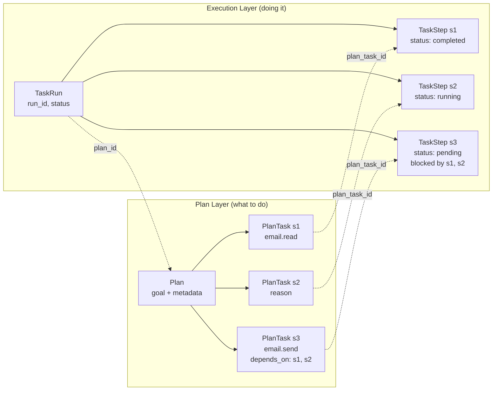
```mermaid
flowchart LR
    subgraph "Plan Layer (what to do)"
        P[Plan<br/>goal + metadata] --> PT1[PlanTask s1<br/>email.read]
        P --> PT2[PlanTask s2<br/>reason]
        P --> PT3[PlanTask s3<br/>email.send<br/>depends_on: s1, s2]
    end

    subgraph "Execution Layer (doing it)"
        TR[TaskRun<br/>run_id, status] --> TS1[TaskStep s1<br/>status: completed]
        TR --> TS2[TaskStep s2<br/>status: running]
        TR --> TS3[TaskStep s3<br/>status: pending<br/>blocked by s1, s2]
    end

    PT1 -.->|"plan_task_id"| TS1
    PT2 -.->|"plan_task_id"| TS2
    PT3 -.->|"plan_task_id"| TS3

    TR -.->|"plan_id"| P
```

The `Plan` + `PlanTask` represent the **blueprint**. The `TaskRun` + `TaskStep` represent the **execution instance**. A single Plan can be executed multiple times (retries), each creating a new TaskRun with fresh TaskSteps.

---

## 5. Capability Resolution & Agent Routing

After a `PlanOutput` is created, each step's `capability` field is resolved to a concrete agent and tool set:

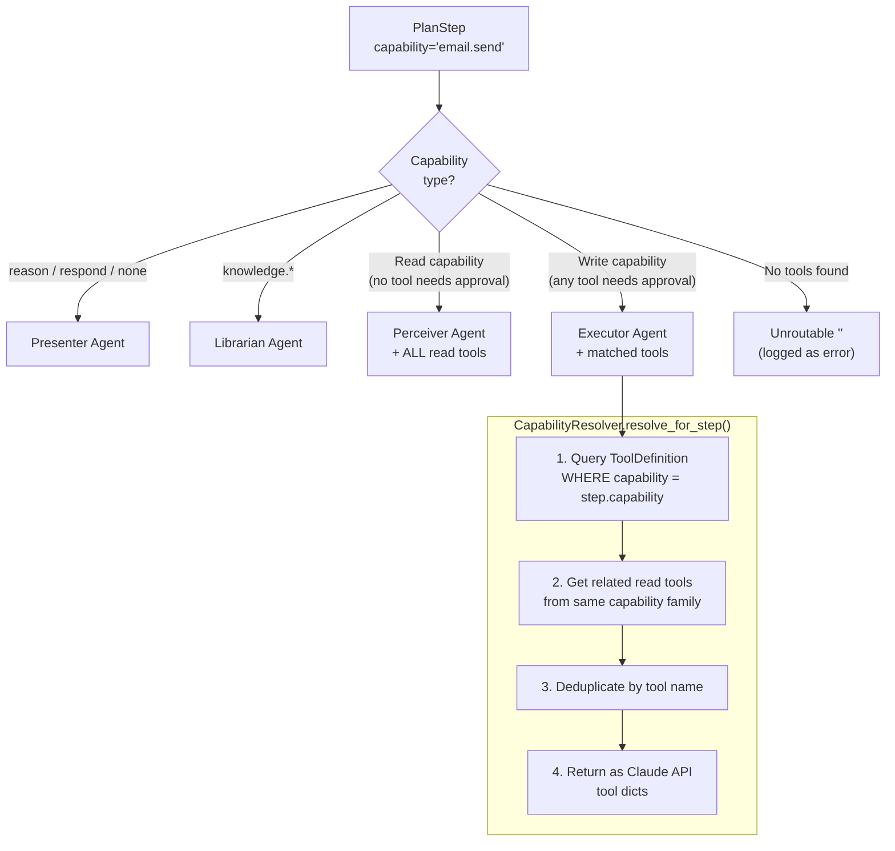
```mermaid
flowchart TD
    STEP["PlanStep<br/>capability='email.send'"]

    STEP --> CHECK{Capability<br/>type?}

    CHECK -->|"reason / respond / none"| PRES[Presenter Agent]
    CHECK -->|"knowledge.*"| LIB[Librarian Agent]
    CHECK -->|"Read capability<br/>(no tool needs approval)"| PERC[Perceiver Agent<br/>+ ALL read tools]
    CHECK -->|"Write capability<br/>(any tool needs approval)"| OP[Executor Agent<br/>+ matched tools]
    CHECK -->|"No tools found"| UNREACHABLE["Unroutable ''<br/>(logged as error)"]

    subgraph "CapabilityResolver.resolve_for_step()"
        R1["1. Query ToolDefinition<br/>WHERE capability = step.capability"]
        R2["2. Get related read tools<br/>from same capability family"]
        R3["3. Deduplicate by tool name"]
        R4["4. Return as Claude API<br/>tool dicts"]
        R1 --> R2 --> R3 --> R4
    end

    OP --> R1
```

**Key insight:** The routing is purely data-driven. No hardcoded agent-to-capability mappings exist. If you add a new tool with `capability="notion.create"` and `requires_approval=True`, it automatically routes to the Executor agent (per-step scope via `resolve_for_step`).

**Key files:**
- `src/services/capability_resolver.py` — `CapabilityResolver`, `route_step()`
- `src/orchestrator/capability_summary.py` — `generate_capability_summary()` (compact XML for Planner)

---

## 6. Plan Execution: GraphExecutor

The `GraphExecutor` (`src/services/graph_executor.py`) is the durable DAG execution engine. It manages the full lifecycle from run creation to completion.

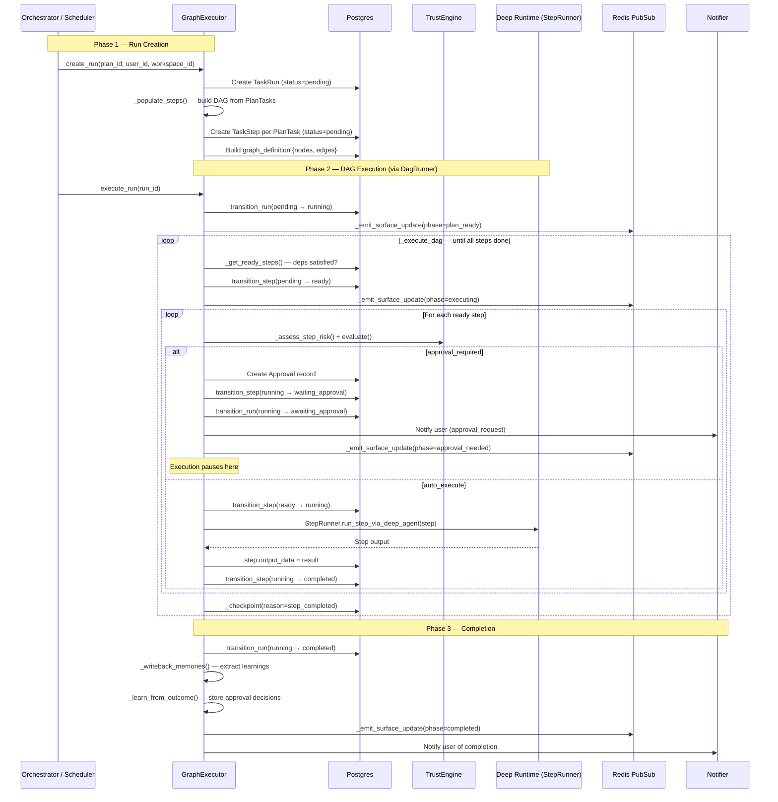
```mermaid
sequenceDiagram
    participant Caller as Orchestrator / Scheduler
    participant GE as GraphExecutor
    participant DB as Postgres
    participant TE as TrustEngine
    participant AL as Deep Runtime (StepRunner)
    participant Redis as Redis PubSub
    participant NT as Notifier

    Note over Caller,GE: Phase 1 — Run Creation
    Caller->>GE: create_run(plan_id, user_id, workspace_id)
    GE->>DB: Create TaskRun (status=pending)
    GE->>GE: _populate_steps() — build DAG from PlanTasks
    GE->>DB: Create TaskStep per PlanTask (status=pending)
    GE->>DB: Build graph_definition {nodes, edges}

    Note over GE,AL: Phase 2 — DAG Execution (via DagRunner)
    Caller->>GE: execute_run(run_id)
    GE->>DB: transition_run(pending → running)
    GE->>Redis: _emit_surface_update(phase=plan_ready)

    loop _execute_dag — until all steps done
        GE->>DB: _get_ready_steps() — deps satisfied?
        GE->>DB: transition_step(pending → ready)
        GE->>Redis: _emit_surface_update(phase=executing)

        loop For each ready step
            GE->>TE: _assess_step_risk() + evaluate()
            alt approval_required
                GE->>DB: Create Approval record
                GE->>DB: transition_step(running → waiting_approval)
                GE->>DB: transition_run(running → awaiting_approval)
                GE->>NT: Notify user (approval_request)
                GE->>Redis: _emit_surface_update(phase=approval_needed)
                Note over GE: Execution pauses here
            else auto_execute
                GE->>DB: transition_step(ready → running)
                GE->>AL: StepRunner.run_step_via_deep_agent(step)
                AL-->>GE: Step output
                GE->>DB: step.output_data = result
                GE->>DB: transition_step(running → completed)
            end
        end

        GE->>DB: _checkpoint(reason=step_completed)
    end

    Note over GE,NT: Phase 3 — Completion
    GE->>DB: transition_run(running → completed)
    GE->>GE: _writeback_memories() — extract learnings
    GE->>GE: _learn_from_outcome() — store approval decisions
    GE->>Redis: _emit_surface_update(phase=completed)
    GE->>NT: Notify user of completion
```

### DAG Resolution Algorithm

The GraphExecutor resolves dependencies using this algorithm in `_get_ready_steps()`:

```
1. Query all TaskSteps for this run_id
2. For each step with status="pending":
   a. Load step.depends_on (array of step_ids)
   b. Check: are ALL dependency steps in status="completed"?
   c. If yes → transition to "ready", add to ready_steps list
3. Return ready_steps (may be empty if blocked by approvals/failures)
```

Example DAG execution:
```
Plan: "Read my emails, analyze sentiment, send summary to Slack"

Step A: email.read (no deps)         → Ready immediately
Step B: reason.analyze (deps: [A])   → Ready after A completes
Step C: slack.send (deps: [B])       → Ready after B completes

Execution timeline:
  t0: [A running]
  t1: [A completed] → [B running]
  t2: [B completed] → [C running] → approval gate (write capability)
  t3: [User approves] → [C running]
  t4: [C completed] → Run completed
```

### Step Reference Resolution

Steps can reference outputs from upstream steps using the syntax `{task_id}.output.field`:

```python
# Step A outputs: {"account_id": "12345", "emails": [...]}
# Step B input: {"account": "{s1}.output.account_id"}
# After _resolve_step_references(): {"account": "12345"}
```

This enables declarative data wiring between DAG steps without hardcoding.

---

## 7. Step-Level Execution: The Deep Runtime

Each step within the DAG is executed through the **single deep runtime** — there is no separate step-level reasoning engine. `GraphExecutor` (via `DagRunner`) calls `StepRunner.run_step_via_deep_agent()` (`src/services/step_runner.py`), which invokes `AgentInvoker.run_autonomous_deep_step`. The agent for the step is a LangGraph/Deep-Agents graph built by `build_deep_agent` (`src/deep_runtime/`); it discovers the step's scoped tools and autonomously decides which to call. The legacy `agent_loop()` engine (`src/orchestrator/agent_loop.py`) is **deleted**.

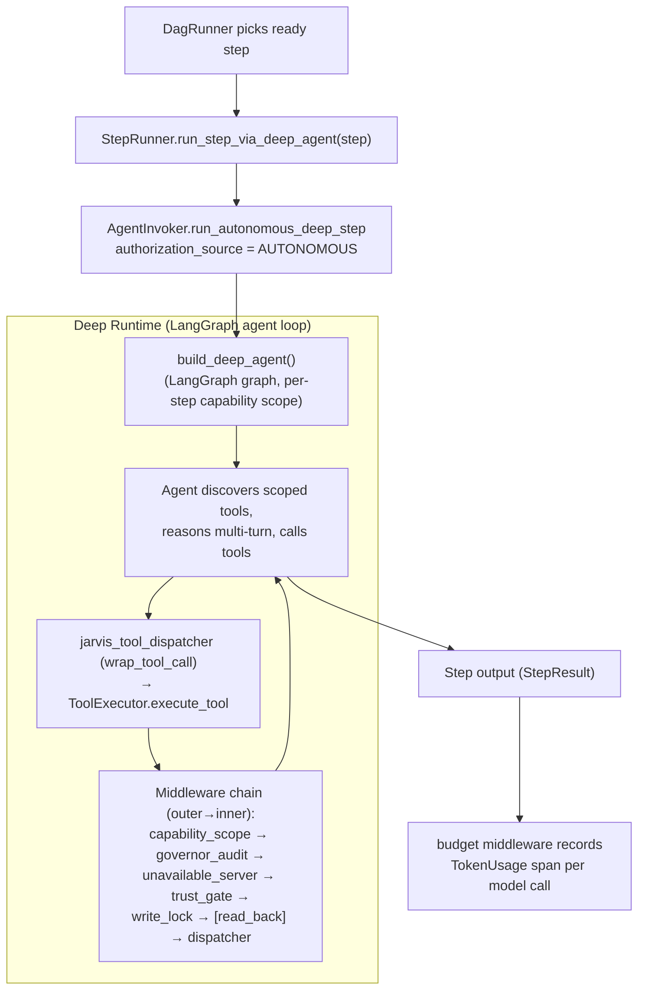
```mermaid
flowchart TD
    START["DagRunner picks ready step"] --> RUNNER["StepRunner.run_step_via_deep_agent(step)"]
    RUNNER --> INVOKE["AgentInvoker.run_autonomous_deep_step<br/>authorization_source = AUTONOMOUS"]
    INVOKE --> BUILD["build_deep_agent()<br/>(LangGraph graph, per-step capability scope)"]

    subgraph "Deep Runtime (LangGraph agent loop)"
        BUILD --> GRAPH["Agent discovers scoped tools,<br/>reasons multi-turn, calls tools"]
        GRAPH --> DISPATCH["jarvis_tool_dispatcher (wrap_tool_call)<br/>→ ToolExecutor.execute_tool"]
        DISPATCH --> MW["Middleware chain (outer→inner):<br/>capability_scope → governor_audit →<br/>unavailable_server → trust_gate →<br/>write_lock → [read_back] → dispatcher"]
        MW --> GRAPH
    end

    GRAPH --> RESULT["Step output (StepResult)"]
    RESULT --> BUDGET["budget middleware records<br/>TokenUsage span per model call"]
```

The deep runtime is streamed via `stream_adapter.py`, which maps tool/`status="error"` results to the frozen SSE frames the client consumes. Policy is enforced by the fixed middleware chain wrapping the central dispatcher, not by hand-rolled loop logic.

### Resilience Features

The deep runtime is a LangGraph graph over `langchain-anthropic`, so the behaviors the retired `agent_loop` hand-rolled are now provided by that stack or deliberately dropped:

- **API Retry:** delegated to `langchain-anthropic`'s client — there is **no** Jarvis-owned exponential-backoff loop on `RateLimitError`.
- **Thinking params:** built once per agent tier at model construction (`deep_runtime/model_factory.py` + `_thinking.py`). There is **no** mid-loop "disable thinking and retry" fallback.
- **Step Timeout:** there is **no** per-tool 60s timeout. Background runs are capped per-step by `step.timeout_seconds or 120s`; user-initiated chat runs are uncapped.
- **Circuit Breaker:** there is **no** Jarvis `AnthropicCircuitBreaker` in the deep path (the perception-side `PerceptionPolicyService` circuit breaker is separate).
- **Tool error signaling:** a failed tool returns a `ToolMessage(status="error")`, mapped by `stream_adapter.py` to the frozen `blocked` SSE frame so the client knows the call failed.

---

## 8. Execution State Machine

All status changes go through `transition_run()` / `transition_step()` in `src/services/execution_state.py`. Direct status mutation is forbidden.

### TaskRun States (12 statuses)

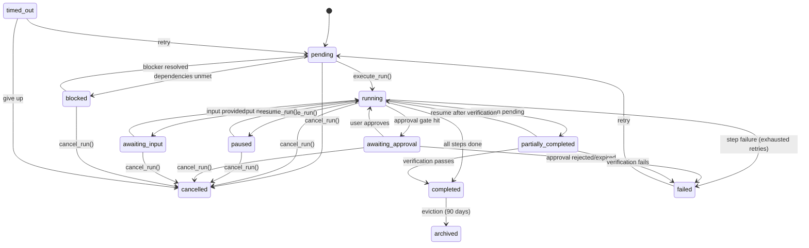
```mermaid
stateDiagram-v2
    [*] --> pending

    pending --> running : execute_run()
    pending --> cancelled : cancel_run()
    pending --> blocked : dependencies unmet

    running --> paused : pause_run()
    running --> awaiting_approval : approval gate hit
    running --> awaiting_input : user input needed
    running --> completed : all steps done
    running --> failed : step failure (exhausted retries)
    running --> cancelled : cancel_run()
    running --> partially_completed : verification pending

    paused --> running : resume_run()
    paused --> cancelled : cancel_run()

    awaiting_approval --> running : user approves
    awaiting_approval --> cancelled : cancel_run()
    awaiting_approval --> failed : approval rejected/expired

    awaiting_input --> running : input provided
    awaiting_input --> cancelled : cancel_run()

    blocked --> pending : blocker resolved
    blocked --> cancelled : cancel_run()

    partially_completed --> running : resume after verification
    partially_completed --> completed : verification passes
    partially_completed --> failed : verification fails

    completed --> archived : eviction (90 days)
    failed --> pending : retry

    timed_out --> pending : retry
    timed_out --> cancelled : give up
```

### TaskStep States (10 statuses)

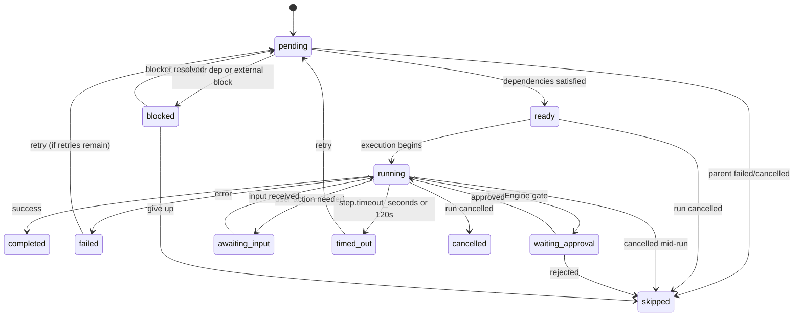
```mermaid
stateDiagram-v2
    [*] --> pending

    pending --> ready : dependencies satisfied
    pending --> skipped : parent failed/cancelled
    pending --> blocked : circular dep or external block

    ready --> running : execution begins
    ready --> skipped : run cancelled

    running --> completed : success
    running --> failed : error
    running --> waiting_approval : TrustEngine gate
    running --> awaiting_input : user action needed
    running --> skipped : cancelled mid-run
    running --> timed_out : step.timeout_seconds or 120s
    running --> cancelled : run cancelled

    waiting_approval --> running : approved
    waiting_approval --> skipped : rejected

    awaiting_input --> running : input received

    blocked --> pending : blocker resolved
    blocked --> skipped : give up

    failed --> pending : retry (if retries remain)
    timed_out --> pending : retry
```

### Checkpoint Strategy

Checkpoints are created at four moments:

| Reason | When | What's Saved |
|--------|------|-------------|
| `step_completed` | After each step finishes | run status, completed step IDs + outputs |
| `approval_gate` | When execution pauses for approval | step awaiting approval, all prior outputs |
| `error_retry` | When a step fails but retries remain | error details, retry count |
| `manual_pause` | User pauses execution | current state snapshot |

Checkpoints enable exact-point resumption. The `state_snapshot` contains:
```json
{
  "status": "awaiting_approval",
  "current_step_ids": ["step_03"],
  "completed_steps": {
    "step_01": {"output_data": {...}, "completed_at": "..."},
    "step_02": {"output_data": {...}, "completed_at": "..."}
  },
  "checkpoint_at": "2026-04-13T10:30:00Z"
}
```

---

## 9. Trust & Approval Gates

The `TrustEngine` (`src/services/trust_engine.py`) is the single deterministic approval gate, evaluated once per step inside GraphExecutor:

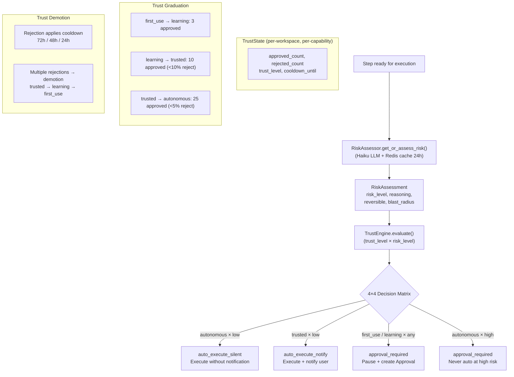
```mermaid
flowchart TD
    STEP[Step ready for execution] --> RISK["RiskAssessor.get_or_assess_risk()<br/>(Haiku LLM + Redis cache 24h)"]
    RISK --> RL["RiskAssessment<br/>risk_level, reasoning,<br/>reversible, blast_radius"]

    RL --> TE["TrustEngine.evaluate()<br/>(trust_level × risk_level)"]

    subgraph "TrustState (per-workspace, per-capability)"
        TS["approved_count, rejected_count<br/>trust_level, cooldown_until"]
    end

    TE --> MATRIX{"4×4 Decision Matrix"}

    MATRIX --> |"autonomous × low"| SILENT[auto_execute_silent<br/>Execute without notification]
    MATRIX --> |"trusted × low"| NOTIFY[auto_execute_notify<br/>Execute + notify user]
    MATRIX --> |"first_use / learning × any"| APPROVE[approval_required<br/>Pause + create Approval]
    MATRIX --> |"autonomous × high"| APPROVE2[approval_required<br/>Never auto at high risk]

    subgraph "Trust Graduation"
        G1["first_use → learning: 3 approved"]
        G2["learning → trusted: 10 approved (<10% reject)"]
        G3["trusted → autonomous: 25 approved (<5% reject)"]
    end

    subgraph "Trust Demotion"
        D1["Rejection applies cooldown<br/>72h / 48h / 24h"]
        D2["Multiple rejections → demotion<br/>trusted → learning → first_use"]
    end
```

### The 4×4 Matrix

Trust levels are `first_use`, `learning`, `trusted`, `autonomous`. Risk levels are `none`, `low`, `medium`, `high` (there is no `critical`).

| | **none risk** | **low risk** | **medium risk** | **high risk** |
|---|---|---|---|---|
| **first_use** | approval_required | approval_required | approval_required | approval_required |
| **learning** | approval_required | approval_required | approval_required | approval_required |
| **trusted** | auto_execute_notify | auto_execute_notify | approval_required | approval_required |
| **autonomous** | auto_execute_silent | auto_execute_silent | auto_execute_notify | approval_required |

### Approval Lifecycle

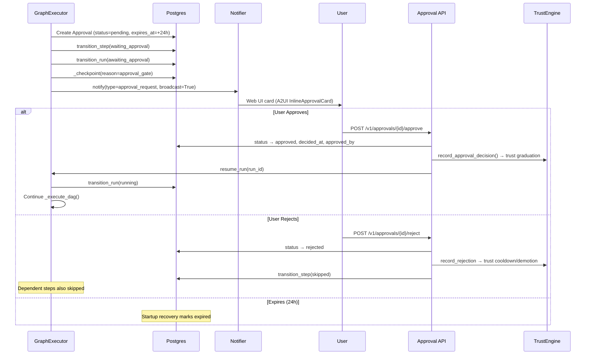
```mermaid
sequenceDiagram
    participant GE as GraphExecutor
    participant DB as Postgres
    participant NT as Notifier
    participant User
    participant API as Approval API
    participant TE as TrustEngine

    GE->>DB: Create Approval (status=pending, expires_at=+24h)
    GE->>DB: transition_step(waiting_approval)
    GE->>DB: transition_run(awaiting_approval)
    GE->>DB: _checkpoint(reason=approval_gate)
    GE->>NT: notify(type=approval_request, broadcast=True)
    NT->>User: Web UI card (A2UI InlineApprovalCard)

    alt User Approves
        User->>API: POST /v1/approvals/{id}/approve
        API->>DB: status → approved, decided_at, approved_by
        API->>TE: record_approval_decision() → trust graduation
        API->>GE: resume_run(run_id)
        GE->>DB: transition_run(running)
        GE->>GE: Continue _execute_dag()
    else User Rejects
        User->>API: POST /v1/approvals/{id}/reject
        API->>DB: status → rejected
        API->>TE: record_rejection → trust cooldown/demotion
        API->>DB: transition_step(skipped)
        Note over GE: Dependent steps also skipped
    else Expires (24h)
        Note over DB: Startup recovery marks expired
    end
```

---

## 10. Frontend Status Updates

Execution progress reaches the frontend through two complementary channels:

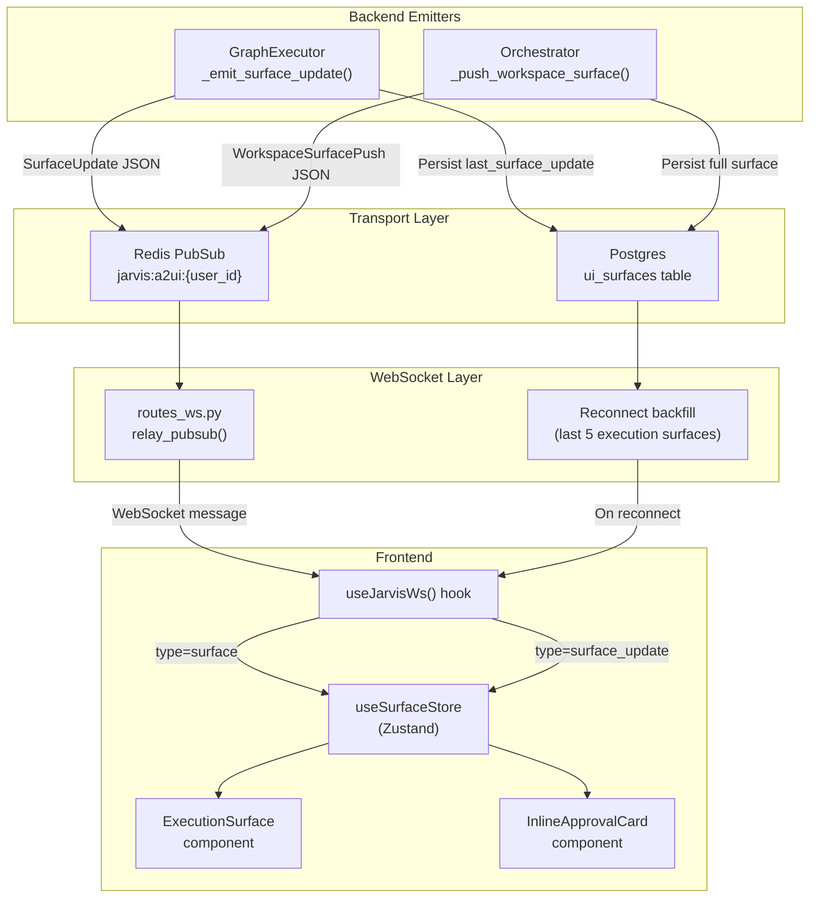
```mermaid
flowchart TD
    subgraph "Backend Emitters"
        GE["GraphExecutor<br/>_emit_surface_update()"]
        ORCH["Orchestrator<br/>_push_workspace_surface()"]
    end

    subgraph "Transport Layer"
        REDIS["Redis PubSub<br/>jarvis:a2ui:{user_id}"]
        DB_PERSIST["Postgres<br/>ui_surfaces table"]
    end

    subgraph "WebSocket Layer"
        WS_RELAY["routes_ws.py<br/>relay_pubsub()"]
        WS_BACKFILL["Reconnect backfill<br/>(last 5 execution surfaces)"]
    end

    subgraph "Frontend"
        HOOK["useJarvisWs() hook"]
        STORE["useSurfaceStore<br/>(Zustand)"]
        EXEC_SURF["ExecutionSurface<br/>component"]
        APPROVAL["InlineApprovalCard<br/>component"]
    end

    GE -->|"SurfaceUpdate JSON"| REDIS
    GE -->|"Persist last_surface_update"| DB_PERSIST
    ORCH -->|"WorkspaceSurfacePush JSON"| REDIS
    ORCH -->|"Persist full surface"| DB_PERSIST

    REDIS --> WS_RELAY
    DB_PERSIST --> WS_BACKFILL

    WS_RELAY -->|"WebSocket message"| HOOK
    WS_BACKFILL -->|"On reconnect"| HOOK

    HOOK -->|"type=surface"| STORE
    HOOK -->|"type=surface_update"| STORE

    STORE --> EXEC_SURF
    STORE --> APPROVAL
```

### Surface Update Emission Points (in GraphExecutor)

| Point | Phase | Trigger |
|-------|-------|---------|
| 1 | `plan_ready` | After run created, before execution |
| 2 | `executing` | When first step batch starts |
| 3 | `executing` | When next step batch starts |
| 4 | `executing` | Progress update during long steps |
| 5 | `approval_needed` | TrustEngine requires approval |
| 6 | `executing` | After approval resolved, resuming |
| 7 | `completed` | All steps done successfully |
| 8 | `failed` | Run failed |
| 9 | `partial` | Some steps completed, some failed |

### SurfaceUpdate Contract

```python
SurfaceUpdate(
    surface_id="surf_01ABC...",
    phase="executing",                          # plan_ready|executing|approval_needed|completed|failed|partial
    steps=[
        StepState(step_id="s1", description="Read emails", status="completed", duration_ms=1200),
        StepState(step_id="s2", description="Analyze content", status="executing"),
        StepState(step_id="s3", description="Send summary", status="pending"),
    ],
    current_step="s2",
    progress="1/3 steps",
    approval=None,                              # Populated when phase=approval_needed
    results=None,                               # Populated when phase=completed
)
```

### Frontend Rendering by Phase

| Phase | Visual | Component |
|-------|--------|-----------|
| `planning` | Spinning loader, "Analyzing..." | ExecutionSurface |
| `plan_ready` | Step list with hollow circles ○ | StepList |
| `executing` | Active step with spinner ◉, completed with ✓ | StepList |
| `approval_needed` | Warning card with Approve/Edit/Reject buttons | InlineApprovalCard |
| `completed` | All steps ✓, key findings + artifacts summary | ResultSummary |
| `failed` | Failed steps with ✗, error details | Error box |

### Reconnection Recovery

When a client reconnects after a network outage:

1. WebSocket connects → authenticates
2. Backend sends last 5 execution surfaces from `ui_surfaces` table
3. Each surface includes `last_surface_update` payload
4. Client reconstructs current execution state without re-fetching
5. Live relay resumes from that point forward

---

## 11. Resumption

Resumption handles three scenarios: approval resolution, manual resume, and scheduler pickup.

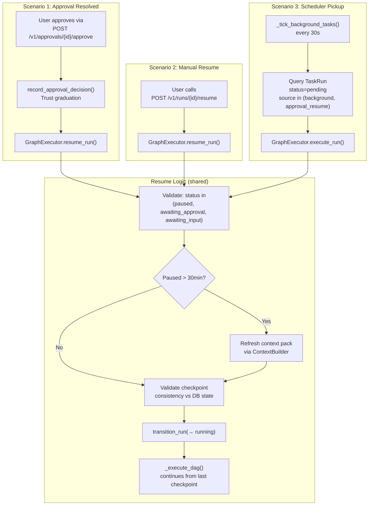
```mermaid
flowchart TD
    subgraph "Scenario 1: Approval Resolved"
        APPROVE["User approves via<br/>POST /v1/approvals/{id}/approve"]
        APPROVE --> TRUST_UPDATE["record_approval_decision()<br/>Trust graduation"]
        TRUST_UPDATE --> RESUME1["GraphExecutor.resume_run()"]
    end

    subgraph "Scenario 2: Manual Resume"
        USER_RESUME["User calls<br/>POST /v1/runs/{id}/resume"]
        USER_RESUME --> RESUME2["GraphExecutor.resume_run()"]
    end

    subgraph "Scenario 3: Scheduler Pickup"
        SCHED["_tick_background_tasks()<br/>every 30s"]
        SCHED --> QUERY["Query TaskRun<br/>status=pending<br/>source in (background, approval_resume)"]
        QUERY --> RESUME3["GraphExecutor.execute_run()"]
    end

    subgraph "Resume Logic (shared)"
        RESUME1 --> VALIDATE
        RESUME2 --> VALIDATE
        RESUME3 --> VALIDATE

        VALIDATE["Validate: status in<br/>(paused, awaiting_approval, awaiting_input)"]
        VALIDATE --> STALE{"Paused > 30min?"}
        STALE -->|Yes| REFRESH["Refresh context pack<br/>via ContextBuilder"]
        STALE -->|No| CHECKPOINT_CHECK
        REFRESH --> CHECKPOINT_CHECK

        CHECKPOINT_CHECK["Validate checkpoint<br/>consistency vs DB state"]
        CHECKPOINT_CHECK --> TRANSITION["transition_run(→ running)"]
        TRANSITION --> DAG["_execute_dag()<br/>continues from last checkpoint"]
    end
```

### Context Refresh on Stale Resumption

If a run has been paused for more than 30 minutes, the context pack may be stale (new emails arrived, entities changed, etc.). The resumption logic:

1. Detects pause duration > 1800 seconds
2. Calls `ContextBuilder.build()` with fresh data
3. Updates `run.context_pack_json` with new pack
4. Validates checkpoint: do completed step IDs in checkpoint match actual DB state?
5. Logs warning if mismatch detected (but continues — checkpoint is informational)

---

## 12. Failure Handling & Recovery

Failures are handled at four levels with increasing escalation:

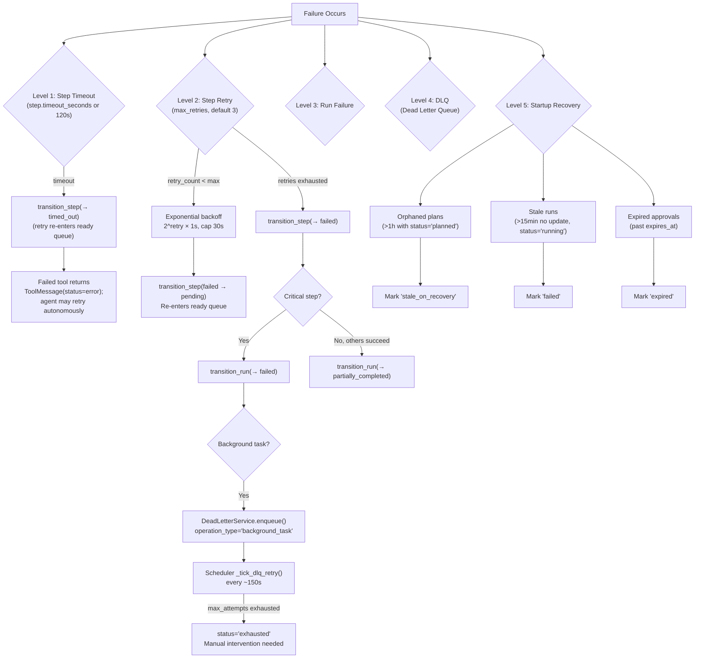
```mermaid
flowchart TD
    FAILURE[Failure Occurs]

    FAILURE --> LEVEL1{"Level 1: Step Timeout<br/>(step.timeout_seconds or 120s)"}
    LEVEL1 -->|"timeout"| TOOL_ERROR["transition_step(→ timed_out)<br/>(retry re-enters ready queue)"]
    TOOL_ERROR --> AGENT_SEES["Failed tool returns<br/>ToolMessage(status=error);<br/>agent may retry autonomously"]

    FAILURE --> LEVEL2{"Level 2: Step Retry<br/>(max_retries, default 3)"}
    LEVEL2 -->|"retry_count < max"| BACKOFF["Exponential backoff<br/>2^retry × 1s, cap 30s"]
    BACKOFF --> RETRY_STEP["transition_step(failed → pending)<br/>Re-enters ready queue"]
    LEVEL2 -->|"retries exhausted"| STEP_FAIL["transition_step(→ failed)"]

    FAILURE --> LEVEL3{"Level 3: Run Failure"}
    STEP_FAIL --> RUN_DECISION{"Critical step?"}
    RUN_DECISION -->|"Yes"| RUN_FAIL["transition_run(→ failed)"]
    RUN_DECISION -->|"No, others succeed"| PARTIAL["transition_run(→ partially_completed)"]

    FAILURE --> LEVEL4{"Level 4: DLQ<br/>(Dead Letter Queue)"}
    RUN_FAIL --> DLQ_CHECK{"Background task?"}
    DLQ_CHECK -->|"Yes"| DLQ_ENQUEUE["DeadLetterService.enqueue()<br/>operation_type='background_task'"]
    DLQ_ENQUEUE --> DLQ_RETRY["Scheduler _tick_dlq_retry()<br/>every ~150s"]
    DLQ_RETRY -->|"max_attempts exhausted"| EXHAUSTED["status='exhausted'<br/>Manual intervention needed"]

    FAILURE --> LEVEL5{"Level 5: Startup Recovery"}
    LEVEL5 --> ORPHANED["Orphaned plans<br/>(>1h with status='planned')"]
    LEVEL5 --> STALE["Stale runs<br/>(>15min no update, status='running')"]
    LEVEL5 --> EXPIRED["Expired approvals<br/>(past expires_at)"]
    ORPHANED --> MARK1["Mark 'stale_on_recovery'"]
    STALE --> MARK2["Mark 'failed'"]
    EXPIRED --> MARK3["Mark 'expired'"]
```

### Retry Backoff Schedule

| Attempt | Delay | Cumulative Wait |
|---------|-------|----------------|
| 1st retry | 2s | 2s |
| 2nd retry | 4s | 6s |
| 3rd retry | 8s | 14s |
| (cap) | 30s max | — |

### Dead Letter Queue Lifecycle

```
Operation fails → DeadLetterService.enqueue()
  → status="pending", attempt_count=1
  → Scheduler _tick_dlq_retry() (every ~150s)
    → mark_retrying() → attempt_count++
    → If attempt_count >= max_attempts:
        → status="exhausted" (manual intervention)
    → Else: retry the operation
      → If succeeds: status="resolved"
      → If fails again: stays "pending" for next tick
```

### Startup Recovery

`run_startup_recovery()` runs on every application restart:

| Check | Cutoff | Action |
|-------|--------|--------|
| Orphaned plans | Created >1 hour ago, status="planned" | Mark "stale_on_recovery" |
| Stale runs | Updated >15 min ago, status="running" | Mark "failed" with error |
| Expired approvals | Past `expires_at` | Mark "expired" |

---

## 13. Cross-System Interactions

### 13.1 Notification Delivery

The `Notifier` (`src/services/notifier.py`) delivers execution events to users with priority-based routing:

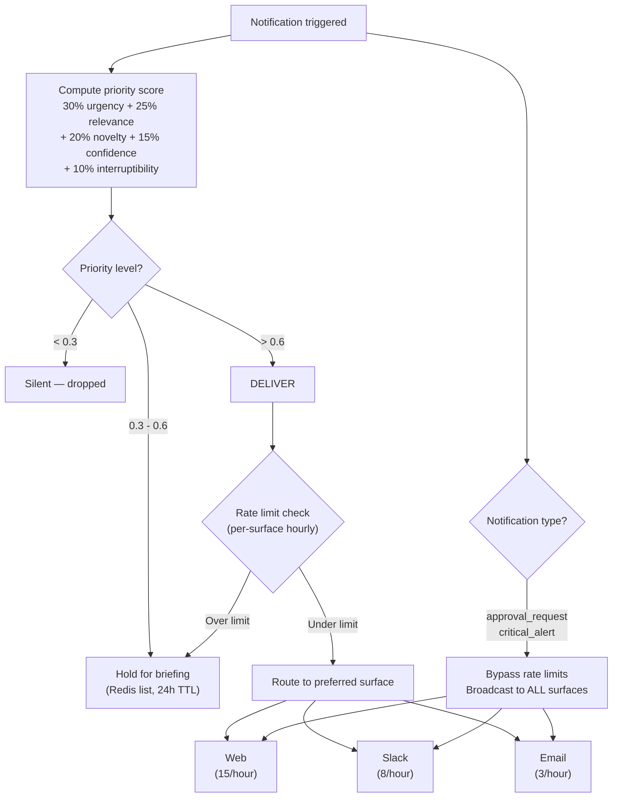
```mermaid
flowchart TD
    EVENT["Notification triggered"] --> SCORE["Compute priority score<br/>30% urgency + 25% relevance<br/>+ 20% novelty + 15% confidence<br/>+ 10% interruptibility"]

    SCORE --> PRIORITY{"Priority level?"}
    PRIORITY -->|"< 0.3"| SILENT["Silent — dropped"]
    PRIORITY -->|"0.3 - 0.6"| HOLD["Hold for briefing<br/>(Redis list, 24h TTL)"]
    PRIORITY -->|"> 0.6"| DELIVER

    EVENT --> TYPE{"Notification type?"}
    TYPE -->|"approval_request<br/>critical_alert"| BYPASS["Bypass rate limits<br/>Broadcast to ALL surfaces"]

    DELIVER --> RATE{"Rate limit check<br/>(per-surface hourly)"}
    RATE -->|"Under limit"| ROUTE["Route to preferred surface"]
    RATE -->|"Over limit"| HOLD

    ROUTE --> WEB["Web<br/>(15/hour)"]
    ROUTE --> SLACK["Slack<br/>(8/hour)"]
    ROUTE --> EMAIL["Email<br/>(3/hour)"]

    BYPASS --> WEB
    BYPASS --> SLACK
    BYPASS --> EMAIL
```

### 13.2 Outcome Learning

After every execution completes, the system learns from the outcome:

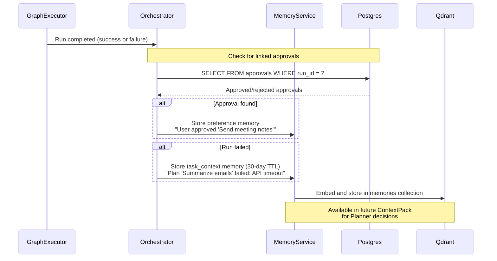
```mermaid
sequenceDiagram
    participant GE as GraphExecutor
    participant Orch as Orchestrator
    participant MS as MemoryService
    participant DB as Postgres
    participant QD as Qdrant

    GE->>Orch: Run completed (success or failure)

    Note over Orch,DB: Check for linked approvals
    Orch->>DB: SELECT FROM approvals WHERE run_id = ?
    DB-->>Orch: Approved/rejected approvals

    alt Approval found
        Orch->>MS: Store preference memory<br/>"User approved 'Send meeting notes'"
    end

    alt Run failed
        Orch->>MS: Store task_context memory (30-day TTL)<br/>"Plan 'Summarize emails' failed: API timeout"
    end

    MS->>QD: Embed and store in memories collection
    Note over MS,QD: Available in future ContextPack<br/>for Planner decisions
```

### 13.3 Memory Writeback

After run completion, `_writeback_memories()` extracts facts from step outputs:

1. Collect `output_data` from all completed steps
2. Call `MemoryService.extract_and_store()` with output text
3. Claude extracts structured facts (memory_type, fact_text, confidence)
4. Deduplication check against existing memories
5. Embed and store in Qdrant + Postgres
6. Link to relevant entity_ids from the context pack

### 13.4 Goal Tracking

Goals are stored as memories with `memory_type="goal"`:
- Created by `store_goal_memory()` when Planner identifies a user objective
- Retrieved by `ContextBuilder.build()` for every future Planner invocation
- Injected into the system prompt so the Planner considers ongoing goals
- Stability decays at 0.02/day, boosted by 0.1 on access
- No TTL (permanent by default) — evicted only by explicit user action

### 13.5 Scheduler Integration

```
SchedulerLoop (every 30s)
  ├── _tick_perception()           — trigger perception cycles
  ├── _tick_background_tasks()     — execute pending background TaskRuns (max 3)
  ├── _tick_run_health_check()     — detect stuck runs
  ├── Every 5th tick (~150s):
  │   ├── _tick_eviction()         — hard-delete expired records (90-day retention)
  │   ├── _tick_dlq_retry()        — retry dead-letter entries
  │   └── _tick_memory_expiration() — expire stale memories
  ├── Every 10th tick (~300s):
  │   └── _tick_persona_batch()    — Persona agent learns preferences
  └── Due schedules                 — fire cron-based schedules → create background runs
```

---

## 14. Key File Reference

| Component | File | Purpose |
|-----------|------|---------|
| **Orchestrator** | `src/orchestrator/jarvis.py` | Entry points, plan creation, surface push |
| **Intent Classifier** | `src/orchestrator/intent_classifier.py` | Fast intents, `classify_intent()`, `extract_plan()` |
| **Planner Prompt** | `src/orchestrator/prompts.py` | `PLANNER_PROMPT_V2`, all agent prompts |
| **Deep Runtime** | `src/deep_runtime/` (`build_deep_agent`) | Single execution engine (LangGraph agent loop, middleware chain) |
| **Step Runner** | `src/services/step_runner.py` | `run_step_via_deep_agent()` → `AgentInvoker.run_autonomous_deep_step` |
| **DAG Runner** | `src/services/dag_runner.py` | Per-step DAG execution GraphExecutor delegates to |
| **Hooks** | `src/orchestrator/hooks.py` | Pre/post tool hooks, Governor audit |
| **Recovery** | `src/orchestrator/recovery.py` | Startup reconciliation |
| **Contracts** | `src/contracts/` | PlanOutput, PlanStep, SurfaceUpdate |
| **GraphExecutor** | `src/services/graph_executor.py` | DAG execution, checkpoints, approval gates |
| **Execution State** | `src/services/execution_state.py` | State machine, transition validation |
| **Capability Resolver** | `src/services/capability_resolver.py` | Capability → agent + tools routing |
| **Trust Engine** | `src/services/trust_engine.py` | 4×4 matrix, trust graduation/demotion |
| **Risk Assessor** | `src/services/risk_assessor.py` | Haiku-based risk assessment, Redis cache |
| **Approval Service** | `src/services/approval_service.py` | Create/query approvals |
| **Notifier** | `src/services/notifier.py` | Priority scoring, rate limiting, delivery |
| **Scheduler** | `src/services/scheduler.py` | Background tasks, perception, DLQ |
| **Dead Letter** | `src/services/dead_letter.py` | DLQ enqueue/retry/stats |
| **Memory Service** | `src/services/memory_service.py` | Store/retrieve/expire memories |
| **Surface Builder** | `src/services/surface_builder.py` | Build workspace surfaces from DB |
| **Plan Model** | `src/models/plans.py` | Plan + PlanTask SQLAlchemy models |
| **TaskGraph Model** | `src/models/task_graph.py` | TaskRun + TaskStep + TaskCheckpoint |
| **Approval Model** | `src/models/approvals.py` | Approval SQLAlchemy model |
| **Approval Routes** | `src/api/routes_approvals.py` | Approve/reject/list endpoints |
| **WebSocket Routes** | `src/api/routes_ws.py` | WS auth, relay, action dispatch |
| **UI Routes** | `src/api/routes_ui.py` | GET /v1/workspace/surfaces |
| **Frontend WS Hook** | `frontend/src/hooks/use-jarvis-ws.ts` | WebSocket connection, message routing |
| **Surface Store** | `frontend/src/stores/surface-store.ts` | Zustand store for surfaces |
| **Execution Surface** | `frontend/src/components/a2ui/components/execution-surface.tsx` | Phase-aware rendering |
| **Inline Approval** | `frontend/src/components/a2ui/components/inline-approval.tsx` | Approval UI with risk context |

---

## Summary: The Complete Lifecycle

```
┌─────────────────────────────────────────────────────────────────────────────┐
│ 1. CREATION          User message / Perception / Schedule                   │
│                       ↓                                                      │
│ 2. CLASSIFICATION    classify_intent() — fast or full Planner              │
│                       ↓                                                      │
│ 3. PLANNING          PlanOutput (goal + steps + capabilities + gaps)        │
│                       ↓                                                      │
│ 4. PERSISTENCE       Plan + PlanTask rows in Postgres                      │
│                       ↓                                                      │
│ 5. ROUTING           CapabilityResolver → agent + tools per step           │
│                       ↓                                                      │
│ 6. EXECUTION         GraphExecutor → DagRunner → deep runtime per step      │
│                       ↓                                                      │
│ 7. TRUST GATES       TrustEngine 4×4 matrix → approve/auto/block          │
│                       ↓                                                      │
│ 8. LIVE UPDATES      Redis PubSub → WebSocket → Zustand → React           │
│                       ↓                                                      │
│ 9. COMPLETION        Memory writeback + outcome learning + notification     │
│                       ↓                                                      │
│ 10. RECOVERY         Checkpoints + DLQ + startup reconciliation            │
└─────────────────────────────────────────────────────────────────────────────┘
```
