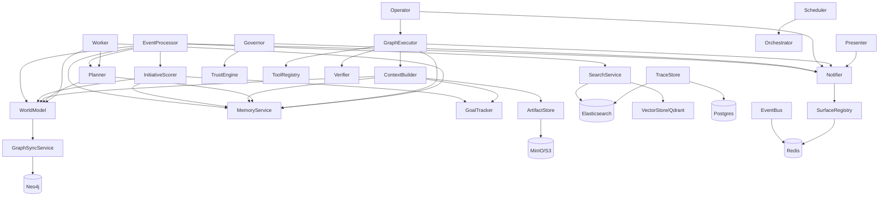

# Services Reference

> **Multi-tenant scoping:** All services accept a `workspace_id` parameter for multi-tenant isolation. Data queries and writes are scoped by workspace to prevent cross-tenant data leakage.

## Layered Architecture

Services are organized in dependency layers. Higher layers depend on lower layers, never the reverse.

| Layer | Services | Role |
|-------|----------|------|
| **L0 Infrastructure** | Postgres, Redis, Elasticsearch, Qdrant, Neo4j, MinIO/S3 | Storage, search, caching, streaming |
| **L1 Data** | SQLAlchemy models, VectorStore, SearchService, GraphEngine, ArtifactStore, EventBus, Cache, Locking | Data access layer |
| **L2 Perception** | EventProcessor | Event normalization, scoring, dedup |
| **L3 Knowledge** | WorldModel, MemoryService | Entity graph, long-term memory |
| **L4 Planning** | Planner, InitiativeScorer, ContextBuilder, ProcedureLibrary | Structured task graphs, proactive scoring, context assembly |
| **L5 Governance** | Governor, TrustEngine, AuditService | Policy evaluation, approval gates, trust scoring, audit logging |
| **L6 Execution** | Operator, GraphExecutor, ExecutionState | DAG execution, state machine |
| **L7 Output** | Presenter, Notifier | Briefings, multi-surface notifications |
| **L8 Observability** | TraceStore, MetricsService, BudgetTracker | Traces, Prometheus metrics, per-agent cost tracking |
| **L9 Coordination** | Scheduler, Worker, RouteResolver, AgentRegistry, WatcherService, ScheduleSeeder | Background jobs, routing, agent config |

## Service Details

### EventProcessor (L2)

**File:** `src/services/event_processor.py`

**Purpose:** Normalizes raw events, scores via Claude, deduplicates, triggers downstream processing.

**Constructor:**
- `settings`, `db`, `world_model?`, `memory_service?`, `dead_letter?`, `event_bus?`, `notifier?`, `planner?`, `goal_tracker?`

**Key Methods:**
| Method | Description |
|--------|-------------|
| `process(raw, user_id)` | Core method: normalize, score, dedup, trigger evaluation, initiative scoring |

**Calls:** WorldModel, MemoryService, Planner, Notifier, TriggerEngine, InitiativeScorer, EventBus

---

### WorldModel (L3)

**File:** `src/services/world_model.py`

**Purpose:** Maintains entity graph with 15 entity types and 17 relation types.

**Constructor:**
- `settings`, `db`, `event_bus?`, `embedding_service?`

**Key Methods:**
| Method | Description |
|--------|-------------|
| `extract_from_event(event_id, user_id)` | Claude extraction of entities + relationships from events |
| `upsert_entity(...)` | Create/update entity with temporal tracking + fuzzy dedup |
| `add_relationship(from_id, type, to_id)` | Create entity relationship |
| `find_entity(user_id, query)` | Search entities by name/alias, ordered by importance |

**Calls:** EmbeddingService (pgvector), Claude API, EventBus

---

### MemoryService (L3)

**File:** `src/services/memory_service.py`

**Purpose:** Long-term memory with 5 types (episodic, semantic, preference, relationship, task_context).

**Constructor:**
- `settings`, `db`, `event_bus?`

**Key Methods:**
| Method | Description |
|--------|-------------|
| `extract_and_store(user_id, source_text, source_event_ids, entity_ids)` | Claude extraction + embedding + dedup + store |
| `retrieve(user_id, query, memory_types, entity_refs, max_results)` | Composite-ranked retrieval |
| `extract_preferences(user_id, source_text, source_event_ids)` | Preference-specific extraction |
| `check_contradictions(user_id, new_fact, new_memory_id)` | Contradiction detection via Claude |
| `consolidate_memories(user_id)` | Merge similar memories (>0.95 similarity) |
| `refresh_stability(memory_id)` | Increment stability on access |

**Composite Ranking Formula:**
```
score = 0.40 * cosine_similarity   (relevance)
      + 0.25 * recency_decay       (30-day window)
      + 0.15 * confidence
      + 0.10 * stability_score
      + 0.10 * entity_overlap       (memory.entity_ids ∩ query entity_refs)
```

**Calls:** Claude API, EmbeddingService (pgvector), EventBus

---

### Planner (L4)

**File:** `src/services/planner.py`

**Purpose:** Decision engine producing structured task graphs from events or user commands.

**Constructor:**
- `settings`, `db`, `world_model?`, `memory_service?`

**Key Methods:**
| Method | Description |
|--------|-------------|
| `plan_for_command(command, user_id, context?)` | Create plan from user input |
| `plan_for_event(event_id, user_id)` | Create plan from event (skips if importance < 0.4) |

**Output:** `PlannerOutput` with 9 decision types, validated via Pydantic with text fallback.

**Calls:** Claude API (tool_use structured output), WorldModel, MemoryService

---

### InitiativeScorer (L4)

**File:** `src/services/initiative_scorer.py`

**Purpose:** Decides when Jarvis should proactively act without user request.

**Constructor:**
- `db`, `world_model?`, `memory_service?`, `goal_tracker?`, `auto_plan_threshold=0.70`, `notify_threshold=0.50`

**Key Methods:**
| Method | Description |
|--------|-------------|
| `score(event, user_id)` | Composite initiative score with plan/notify recommendations |

**Calls:** WorldModel, MemoryService, GoalTracker

---

### ContextBuilder (L4)

**File:** `src/services/context_builder.py`

**Purpose:** Assembles rich context packs for agent prompts.

**Constructor:**
- `world_model?`, `memory_service?`, `goal_tracker?`, `procedure_library?`, `artifact_store?`

**Key Methods:**
| Method | Description |
|--------|-------------|
| `build(user_id, query, task_type)` | Gather entities, memories, goals, procedures into ContextPack. Populates `related_runs`, `tool_options`, `constraints`, and `risks`. |
| `to_prompt(pack, max_tokens?)` | Convert ContextPack to markdown for system prompt injection. Accepts optional `max_tokens` for priority-based truncation (higher-priority sections preserved first). |

**Calls:** WorldModel, MemoryService, GoalTracker, ProcedureLibrary, ArtifactStore

---

### Governor (L5)

**File:** `src/services/governor.py`

**Purpose:** Trust & safety policy evaluator; approval gatekeeper.

**Constructor:**
- `db`, `notifier?`, `trust_engine?`, `settings_service?`, `event_bus?`

**Key Methods:**
| Method | Description |
|--------|-------------|
| `evaluate_plan(plan_id, user_id)` | Evaluate plan against policies, return PolicyDecision |

**Policy Modes:** `lockdown`, `approval_required` (default), `suggest_only`, `full_auto`

**Always Requires Approval:** payment, deploy, delete_data, modify_permissions, security_change

**Calls:** Notifier, TrustEngine, AuditService, EventBus

---

### Operator (L6)

**File:** `src/services/operator.py`

**Purpose:** Thin wrapper delegating execution to GraphExecutor.

**Constructor:**
- `settings`, `db`, `notifier?`, `graph_executor?`

**Key Methods:**
| Method | Description |
|--------|-------------|
| `execute_plan(plan_id, user_id)` | Fetch plan, delegate to GraphExecutor for TaskRun creation and execution |

**Calls:** GraphExecutor, Notifier

---

### GraphExecutor (L6)

**File:** `src/services/graph_executor.py`

**Purpose:** DAG-based execution engine with parallel steps, checkpoints, approval gates, verification.

**Constructor:**
- `settings`, `db`, `event_bus?`, `notifier?`, `tool_registry?`, `verifier?`, `context_builder?`, `connector_credentials_fn?`, `memory_service?`

**Key Methods:**
| Method | Description |
|--------|-------------|
| `create_run(plan_id, user_id)` | Build TaskRun + TaskSteps from plan |
| `execute_run(run_id, trace_id?)` | Main DAG execution loop |
| `resume_run(run_id)` | Resume paused/awaiting run |
| `pause_run(run_id, reason)` | Pause mid-execution |
| `cancel_run(run_id)` | Cancel with step cleanup |

**Calls:** ContextBuilder, ToolRegistry, MCP Bridge, Verifier, MemoryService, Notifier, EventBus, Redis pubsub

---

### Presenter (L7)

**File:** `src/services/presenter.py`

**Purpose:** Transforms internal state into user-facing output. Only service producing visible output.

**Constructor:**
- `settings`, `db`, `notifier?`

**Key Methods:**
| Method | Description |
|--------|-------------|
| `generate_briefing(user_id, briefing_date)` | Daily briefing via Claude |
| `generate_meeting_prep(meeting_id, user_id, next_meeting)` | Meeting preparation doc |
| `select_view(task_type, output)` | Map task type to A2UI view |

**Calls:** Claude API, Notifier

---

### Notifier (L7)

**File:** `src/services/notifier.py`

**Purpose:** Multi-surface notification coordinator with dedup and priority scoring.

**Constructor:**
- `surface_registry`, `redis?`, `telegram_sender?`, `websocket_sender?`, `db?`

**Key Methods:**
| Method | Description |
|--------|-------------|
| `notify(user_id, type, title, body, data)` | Route notification to appropriate surfaces |
| `on_action_taken(user_id, notification_id, surface)` | Cross-surface sync when user acts |

**Notification Types:** `approval_request`, `info_update`, `critical_alert`, `briefing`, `proactive_insight`

**Priority Score:** `0.30*urgency + 0.25*goal_relevance + 0.20*novelty + 0.15*confidence + 0.10*interruptibility`

**Routing:** approval_request/critical_alert -> ALL surfaces; info_update -> preferred surface only

---

### TraceStore (L8)

**File:** `src/services/trace_store.py`

**Purpose:** Persists orchestrator traces for search and replay.

**Constructor:**
- `elasticsearch_url=""`, `db_factory?`

**Key Methods:**
| Method | Description |
|--------|-------------|
| `store_trace(trace_dict, user_id)` | Write to Postgres (primary) + ES (secondary) + memory (fallback) |
| `get_trace(trace_id)` | Retrieve single trace |
| `search_traces(user_id, trigger, agent_name, time_range_hours, limit)` | Filter traces |
| `get_aggregate_metrics(user_id, time_range_hours)` | Success/failure rates |

---

### MetricsService (L8)

**File:** `src/services/metrics_service.py`

**Purpose:** Prometheus metrics collection.

**Counters:** EVENTS_INGESTED, PLANS_CREATED, EXECUTIONS_COMPLETED, APPROVALS_DECIDED, AGENT_CALLS, TOOL_CALLS, NOTIFICATIONS_SENT, TRIGGERS_FIRED, MEMORY_WRITES

**Gauges:** ACTIVE_RUNS, PENDING_APPROVALS, BUDGET_REMAINING, ACTIVE_CONNECTORS

**Histograms:** EVENT_PROCESSING_LATENCY, AGENT_CALL_LATENCY, EXECUTION_DURATION

---

### Scheduler (L9)

**File:** `src/services/scheduler.py`

**Purpose:** Backend-owned scheduler polling every 30 seconds for due schedules.

**Constructor:**
- `settings`, `orchestrator?`

**Key Methods:**
| Method | Description |
|--------|-------------|
| `run()` | Main loop: poll due schedules, fire actions, advance next_run_at |
| `stop()` | Graceful shutdown |

**Actions:** `observe_source`, `generate_briefing`, `meeting_prep`, `heartbeat`, `consolidate_memories`, `check_slos`

---

### Worker (L9)

**File:** `src/services/worker.py`

**Purpose:** Redis stream consumers for async event processing.

**Consumer Groups:** entity_extractor, memory_extractor, planner, trigger_evaluator

---

### RouteResolver (L9)

**File:** `src/services/route_resolver.py`

**Purpose:** DB-backed intent routing (decision -> agent pipeline).

**Constructor:** `db`

**Key Methods:**
| Method | Description |
|--------|-------------|
| `seed_defaults()` | Seed 10 default routes |
| `resolve(decision)` | Map decision to agent pipeline |
| CRUD | `list_routes`, `get_route`, `create_route`, `update_route`, `delete_route` |

---

### AgentRegistry (L9)

**File:** `src/services/agent_registry.py`

**Purpose:** DB-backed agent configuration (replaces hardcoded AGENTS dict).

**Constructor:** `db`

**Key Methods:**
| Method | Description |
|--------|-------------|
| `seed_defaults()` | Seed 8 default agents |
| `load_as_sub_agents()` | Convert DB agents to SubAgent instances |
| CRUD | `list_agents`, `get_agent`, `create_agent`, `update_agent`, `toggle_agent` |

---

### WatcherService (L9)

**File:** `src/services/watcher_service.py`

**Purpose:** Monitor patterns, generate proactive insights.

**Constructor:** `db`, `notifier?`

**Key Methods:**
| Method | Description |
|--------|-------------|
| `create_watcher(user_id, name, conditions, action_type)` | Create trigger-based watcher |
| `run_all_watchers(user_id)` | Execute stale thread + anomaly checks |
| `disable_watcher(trigger_id)` | Disable a watcher |
| `snooze_watcher(trigger_id, until)` | Temporarily silence |

---

### ScheduleSeeder (L9)

**File:** `src/services/schedule_seeder.py`

**Purpose:** Seeds 7 default schedules on first startup.

**Default Schedules:**
1. `morning_briefing` - 7 AM daily
2. `observe_gmail` - Every 5 minutes
3. `observe_calendar` - Every 15 minutes
4. `observe_slack` - Every 5 minutes
5. `observe_github` - Every 10 minutes
6. `memory_consolidation` - 2 AM daily
7. `slo_health_check` - Every 6 hours

### ExecutionState (L6)

**File:** `src/services/execution_state.py`

**Purpose:** State machine transition guards for TaskRun and TaskStep status changes.

**Key Methods:**
| Method | Description |
|--------|-------------|
| `transition_run(run, new_status)` | Validate and apply TaskRun status transition (11 statuses) |
| `transition_step(step, new_status)` | Validate and apply TaskStep status transition (9 statuses) |

Invalid transitions raise `InvalidTransitionError`. All status changes in GraphExecutor and Operator go through these functions — no direct status mutation is permitted.

---

### BudgetTracker (L8)

**File:** `src/orchestrator/budget.py`

**Purpose:** Per-agent cost tracking with daily limits and 3-mode degradation (normal, degraded, paused).

**Key Methods:**
| Method | Description |
|--------|-------------|
| `calculate_cost(usage)` | Calculate cost from input/output/cache/thinking tokens (cache write=1.25x, cache read=0.1x, thinking=output price) |
| `record_usage(agent, tokens, cost)` | Track per-agent spend |
| `check_budget()` | Return current budget status and mode |

---

### TrustEngine

**File:** `src/services/trust_engine.py`

**Purpose:** Graduated autonomy scoring. Tracks user trust level to determine approval thresholds.

---

### AuditService

**File:** `src/services/audit_service.py`

**Purpose:** Audit log writer. Records all external writes with correlation IDs for compliance and debugging.

---

### ProcedureLibrary

**File:** `src/services/procedure_library.py`

**Purpose:** Stored procedures for context assembly. Provides reusable instruction templates that ContextBuilder injects into agent prompts.

---

## Infrastructure Services (L0)

### VectorStore (Qdrant)

**File:** `src/services/vector_store.py`

**Purpose:** Semantic vector search across 4 collections (memories, entities, events, artifacts).

**Constructor:**
- `qdrant_url`, `qdrant_api_key`

**Key Methods:**
| Method | Description |
|--------|-------------|
| `upsert(collection, id, vector, payload)` | Store/update vector with metadata |
| `search(collection, query_vector, filter, limit)` | Cosine similarity search |
| `hybrid_search(collections, query_vector, filters)` | Cross-collection retrieval, merge by score |
| `delete(collection, id)` | Remove vector |

**Collections:** `memories` (1024-dim), `entities`, `events`, `artifacts`

**Fallback:** Silent no-op if Qdrant unavailable; pgvector used for dedup operations.

---

### SearchService (Hybrid Search)

**File:** `src/services/search_service.py`

**Purpose:** Hybrid search combining Elasticsearch BM25 + Qdrant semantic via Reciprocal Rank Fusion.

**Constructor:**
- `elasticsearch_url`, `vector_store`, `embedding_service`

**Key Methods:**
| Method | Description |
|--------|-------------|
| `search(user_id, query, types, limit)` | Hybrid search: ES BM25 + Qdrant semantic + RRF merge |
| `index_event(event)` | Index to ES + Qdrant in parallel |
| `index_entity(entity)` | Index to ES + Qdrant in parallel |
| `index_memory(memory)` | Index to ES + Qdrant in parallel |
| `index_artifact(artifact)` | Index to ES + Qdrant in parallel |

**ES Indexes:** `jarvis-events`, `jarvis-entities`, `jarvis-memories`, `jarvis-artifacts`

**Qdrant Collections:** Mirrors ES indexes with vector embeddings

---

### GraphEngine (Neo4j)

**File:** `src/services/graph_engine.py`

**Purpose:** Knowledge graph queries: multi-hop traversal, shortest-path, community detection.

**Key Methods:**
| Method | Description |
|--------|-------------|
| `traverse(entity_id, depth)` | N-hop reachability from entity |
| `find_path(from_id, to_id)` | Shortest path between entities |
| `get_related_people(entity_id)` | People connected within 2 hops |
| `find_central_entities(user_id)` | Degree centrality ranking |
| `detect_communities(user_id)` | Connected component clustering |
| `get_subgraph(entity_ids)` | Extract subgraph |

**Fallback:** No-op if Neo4j unavailable; Postgres entity tables still provide flat queries.

---

### GraphSyncService (Postgres -> Neo4j)

**File:** `src/services/graph_sync.py`

**Purpose:** Keeps Neo4j in sync with Postgres entity/relationship tables.

**Key Methods:**
| Method | Description |
|--------|-------------|
| `on_entity_change(entity)` | Event-driven sync on entity create/update |
| `on_relationship_change(relationship)` | Event-driven sync on relationship create/update |
| `full_reconciliation()` | Periodic batch sync of all entities + relationships |

---

### ArtifactStore (MinIO / S3)

**File:** `src/services/artifact_store.py`

**Purpose:** Document and media storage with S3-compatible backend.

**Key Methods:**
| Method | Description |
|--------|-------------|
| `store(user_id, artifact_type, content, mime_type, metadata)` | Upload to S3, return Artifact record |
| `retrieve(s3_key)` | Download by key |
| `get_presigned_url(s3_key, ttl=3600)` | Time-limited download URL |
| `list_artifacts(user_id, type, limit, offset)` | Paginated listing |

**Storage path:** `s3://{bucket}/artifacts/{user_id}/{artifact_type}/{artifact_id}`

**Artifact types:** document, email, screenshot, output, attachment

---

### EventBus (Redis Streams)

**File:** `src/services/event_bus.py`

**Purpose:** Event streaming via Redis Streams with consumer group semantics.

**Key Methods:**
| Method | Description |
|--------|-------------|
| `publish(stream, event_type, payload, user_id)` | XADD to stream |
| `create_consumer_group(stream, group)` | XGROUP CREATE |
| `subscribe(stream, group, consumer, handler)` | XREADGROUP + handler + XACK |
| `replay(stream, handler, start_id, end_id)` | XRANGE for event replay |

**Streams:** `jarvis:events:{user_id}`, `jarvis:agent_events:{user_id}`, `jarvis:system_events`, `jarvis:notifications`

**Consumer groups:** entity_extractor, memory_extractor, planner, notifier, briefing_collector

---

### RedisCache

**File:** `src/services/cache.py`

**Purpose:** TTL-based caching for frequently accessed data.

**Cached Data:**
| Key Pattern | TTL | Content |
|-------------|-----|---------|
| `brief:{user_id}:{date}` | 1 hour | Briefing cache |
| `entity:{user_id}:{query}` | 5 min | Entity lookup results |
| `prefs:{user_id}` | 10 min | User preferences |
| `dedup:{idempotency_key}` | 24 hours | Event dedup window |

---

### RedisLock (Distributed Locking)

**File:** `src/services/locking.py`

**Purpose:** Distributed mutex via Redis SET NX EX.

**Key Methods:**
| Method | Description |
|--------|-------------|
| `acquire(key, ttl=30)` | SET NX EX (atomic set-if-not-exists) |
| `release(key)` | DEL key |
| `distributed_lock(key)` | Async context manager with auto-release |

**Fallback:** PostgreSQL advisory locks (`pg_advisory_lock`) when Redis unavailable.

---

### SurfaceRegistry (Redis Hash)

**File:** `src/services/surface_registry.py`

**Purpose:** Track active user connections for notification routing.

**Key Methods:**
| Method | Description |
|--------|-------------|
| `register(user_id, surface, metadata)` | HSET + EXPIRE |
| `heartbeat(user_id, surface)` | Update last_heartbeat + refresh TTL |
| `get_active_surfaces(user_id)` | HGETALL |
| `get_preferred_surface(user_id)` | Most recently active surface |

**TTLs:** Web: 120s (WebSocket heartbeat), Telegram: 86400s (always active)

---

## Cross-Service Dependency Map


