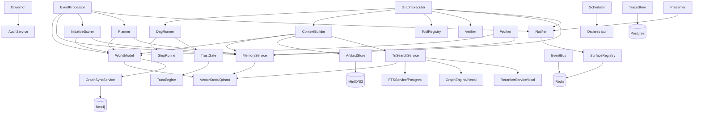

# Services Reference

> **Multi-tenant scoping:** All services accept a `workspace_id` parameter for multi-tenant isolation. Data queries and writes are scoped by workspace to prevent cross-tenant data leakage.

## Layered Architecture

Services are organized in dependency layers. Higher layers depend on lower layers, never the reverse.

| Layer | Services | Role |
|-------|----------|------|
| **L0 Infrastructure** | Postgres, Redis, Qdrant, Neo4j, MinIO/S3 | Storage, search, caching, streaming |
| **L1 Data** | SQLAlchemy models, VectorStore, FTSService, TriSearchService, RerankerService, GraphEngine, ArtifactStore, EventBus, Cache, Locking, DeadLetterService | Data access layer |
| **L2 Perception** | EventProcessor | Event normalization, scoring, dedup |
| **L3 Knowledge** | WorldModel, MemoryService | Entity graph, long-term memory |
| **L4 Planning** | Planner, InitiativeScorer, ContextBuilder, CapabilityResolver, ProcedureLibrary, RelevanceAssessor | Structured task graphs, proactive scoring, context assembly, capability routing |
| **L5 Governance** | Governor (edge-case audit only), TrustEngine (4x4 matrix), RiskAssessor, AuditService | Trust-based approval gates, risk assessment, audit logging |
| **L6 Execution** | GraphExecutor, DagRunner, StepRunner, ExecutionState, EvictionService | DAG execution, state machine, data retention |
| **L7 Output** | Presenter, Notifier, BriefingReadModel, SurfaceDetailBuilders, EngagementService | Briefings, multi-surface notifications, engagement tracking |
| **L8 Observability** | TraceStore, MetricsService, BudgetTracker | Traces, Prometheus metrics, per-agent cost tracking |
| **L9 Coordination** | Scheduler, Worker, AgentRegistry, WatcherService, ScheduleSeeder | Background jobs, agent config |

## Service Details

### EventProcessor (L2)

**File:** `src/services/event_processor.py`

**Purpose:** Normalizes raw events, scores via the model layer, deduplicates, triggers downstream processing.

**Constructor:**
- `settings`, `db`, `world_model?`, `memory_service?`, `dead_letter?`, `event_bus?`, `notifier?`, `planner?`

**Key Methods:**
| Method | Description |
|--------|-------------|
| `process(raw, user_id)` | Core method: normalize, score, dedup, trigger evaluation, initiative scoring |

**Calls:** WorldModel, MemoryService, Planner, Notifier, TriggerEngine, InitiativeScorer, EventBus

---

### WorldModel (L3)

**File:** `src/services/world_model.py`

**Purpose:** Maintains entity graph with 15 entity types and 17 relation types.

**Constructor:**
- `settings`, `db`, `event_bus?`, `embedding_service?`, `vector_store?`

**Key Methods:**
| Method | Description |
|--------|-------------|
| `extract_from_event(event_id, user_id)` | LLM extraction of entities + relationships from events |
| `upsert_entity(...)` | Create/update entity with temporal tracking + fuzzy dedup + Qdrant upsert |
| `add_relationship(from_id, type, to_id)` | Create entity relationship |
| `find_entity(user_id, query)` | Search entities by name/alias, ordered by importance |

**Calls:** EmbeddingService, VectorStore (Qdrant), the model layer, EventBus

---

### MemoryService (L3)

**File:** `src/services/memory_service/` (package)

**Purpose:** Long-term memory with 7 types (episodic, semantic, preference, relationship, task_context, goal, briefing_item). Stability decays at 0.02/day with +0.1 boost on access.

**Constructor:**
- `settings`, `db`, `event_bus?`, `vector_store?`

**Key Methods:**
| Method | Description |
|--------|-------------|
| `extract_and_store(user_id, source_text, source_event_ids, entity_ids)` | LLM extraction + embedding + Qdrant upsert + dedup + store |
| `retrieve(user_id, query, memory_types, entity_refs, max_results)` | Composite-ranked retrieval via Qdrant |
| `extract_preferences(user_id, source_text, source_event_ids)` | Preference-specific extraction |
| `check_contradictions(user_id, new_fact, new_memory_id)` | Contradiction detection via the model layer |
| `consolidate_memories(user_id)` | Merge similar memories (>0.95 similarity) |
| `refresh_stability(memory_id)` | Increment stability on access |

**Composite Ranking Formula:**
```
score = 0.40 * cosine_similarity   (relevance)
      + 0.25 * recency_decay       (30-day window)
      + 0.15 * confidence
      + 0.10 * stability_score
      + 0.10 * entity_overlap       (memory.entity_ids ∩ query entity_refs)
```

**Calls:** the model layer, EmbeddingService, VectorStore (Qdrant), EventBus

---

### Planner (L4)

**File:** `src/services/planner.py`

**Purpose:** Decision engine producing structured task graphs from events or user commands.

**Constructor:**
- `settings`, `db`, `world_model?`, `memory_service?`

**Key Methods:**
| Method | Description |
|--------|-------------|
| `plan_for_command(command, user_id, context?)` | Create plan from user input |
| `plan_for_event(event_id, user_id)` | Create plan from event (skips if importance < 0.4) |

**Output:** `PlanOutput` with steps and capability_gaps, validated via Pydantic with text fallback. CapabilityResolver maps step capabilities to agents.

**Calls:** the model layer (tool_use structured output), WorldModel, MemoryService

---

### InitiativeScorer (L4)

**File:** `src/services/initiative_scorer.py`

**Purpose:** Decides when Muldro should proactively act without user request.

**Constructor:**
- `db`, `world_model?`, `memory_service?`, `auto_plan_threshold=0.70`, `notify_threshold=0.50`

**Key Methods:**
| Method | Description |
|--------|-------------|
| `score(event, user_id)` | Composite initiative score with plan/notify recommendations |

**Calls:** WorldModel, MemoryService

---

### ContextBuilder (L4)

**File:** `src/services/context_builder.py`

**Purpose:** Assembles rich context packs for agent prompts.

**Constructor:**
- `world_model?`, `memory_service?`, `procedure_library?`, `artifact_store?`, `db?`, `graph_engine?`, `vector_store?`, `tri_search?`, `reranker?`

**Key Methods:**
| Method | Description |
|--------|-------------|
| `build(user_id, query, task_type)` | Gather entities, memories, goals, procedures into ContextPack. Uses TriSearch for unified retrieval when available. Populates `related_runs`, `tool_options`, `constraints`, and `risks`. |
| `to_prompt(pack, max_tokens?)` | Convert ContextPack to markdown for system prompt injection. Accepts optional `max_tokens` for priority-based truncation (higher-priority sections preserved first). |

**Calls:** TriSearchService (preferred), WorldModel, MemoryService, ProcedureLibrary, ArtifactStore, GraphEngine, VectorStore

---

### Governor (L5) — Edge-Case Audit Only

**File:** `src/services/governor.py`

**Purpose:** Audit-only hooks for edge cases. The primary approval gate is now TrustEngine in GraphExecutor. Governor hooks run post-execution for audit logging only.

**Constructor:**
- `db`, `notifier?`, `trust_engine?`, `settings_service?`, `event_bus?`

**Calls:** AuditService, EventBus

---

### TrustEngine (L5)

**File:** `src/services/trust_engine.py`

**Purpose:** The autonomous path's approval gate. Implements a 4x4 matrix of (trust_level x risk_level) to produce a PolicyDecision. Trust graduates over time based on successful executions.

**Composes with `permission_gate` — but only where that gate is installed.** `trust_gate` is **outer** of `permission_gate`, and an `auto_execute_*` verdict is a pass-through (`await handler(request)`), so on any turn carrying a `permission_mode` (chat, and the `process_message` batch entry) the call still reaches `permission_gate`, which never reads trust — graduation there silences only reversible, self-scoped, not-high-risk writes. **GraphExecutor DAG steps carry no `permission_mode`**, and pass `pre_approved_capabilities={step.capability}` which short-circuits the deep `trust_gate` before its irreversible override; the DAG-level gate has no override either. Graduation to `autonomous` is genuinely silencing on that path.

**4x4 Matrix:** trust_level (first_use, learning, trusted, autonomous) x risk_level (none, low, medium, high)

**PolicyDecision outcomes:** `auto_execute_silent`, `auto_execute_notify`, `approval_required`, `blocked`

**Models:** TrustState (per-workspace, per-capability trust, keyed workspace_id + capability + risk_level), TrustCeiling (per-capability max trust)

**Invoked via:** the DAG-step `TrustGate` (`trust_gate.py`) and the deep `trust_gate` middleware; GraphExecutor delegates to DagRunner/StepRunner rather than calling TrustEngine directly.

---

### RiskAssessor (L5)

**File:** `src/services/risk_assessor.py`

**Purpose:** Evaluates risk level for tool calls and plan steps. Provides the risk_level input to the TrustEngine 4x4 matrix.

**Invoked via:** the DAG-step `TrustGate` / deep `trust_gate` middleware (feeds into TrustEngine evaluation)

---

### DagRunner (L6)

**File:** `src/services/dag_runner.py`

**Purpose:** Drives the per-run DAG loop that GraphExecutor delegates to — ready-step detection, sequential batch execution, checkpointing, and the DAG-step `TrustGate` approval gate. Runs each step through the deep runtime via StepRunner.

**Calls:** StepRunner, TrustGate, ExecutionState, ContextBuilder, ExecutionSurfaceEmitter

---

### StepRunner (L6)

**File:** `src/services/step_runner.py`

**Purpose:** Executes a single step through the deep runtime. `run_step_via_deep_agent()` builds and invokes the deep agent (via `AgentInvoker`) scoped to the step's capability.

**Calls:** deep runtime (`build_deep_agent` / `AgentInvoker`), ToolRegistry

---

### TrustGate (L6)

**File:** `src/services/trust_gate.py`

**Purpose:** DAG-step approval gate. Invokes TrustEngine + RiskAssessor per step and pauses the run when `approval_required`. Emits approval SurfaceUpdates via `execution_surface_emitter.py`.

**Calls:** TrustEngine, RiskAssessor, ExecutionSurfaceEmitter

---

### GraphExecutor (L6)

**File:** `src/services/graph_executor.py`

**Purpose:** DAG-based execution engine with checkpoints, approval gates, and verification. Owns TaskRun creation and lifecycle; delegates the per-step DAG loop to DagRunner (which runs each step via StepRunner on the deep runtime).

**Constructor:**
- `settings`, `db`, `event_bus?`, `notifier?`, `tool_registry?`, `verifier?`, `context_builder?`, `connector_credentials_fn?`, `memory_service?`

**Key Methods:**
| Method | Description |
|--------|-------------|
| `create_run(plan_id, user_id)` | Build TaskRun + TaskSteps from plan |
| `execute_run(run_id, trace_id?)` | Main DAG execution loop |
| `resume_run(run_id)` | Resume paused/awaiting run |
| `pause_run(run_id, reason)` | Pause mid-execution |
| `cancel_run(run_id)` | Cancel with step cleanup |

**Calls:** DagRunner, StepRunner, ContextBuilder, ToolRegistry, Verifier, MemoryService, Notifier, EventBus, Redis pubsub

---

### Presenter (L7)

**File:** `src/services/presenter.py`

**Purpose:** Transforms internal state into user-facing output. Only service producing visible output.

**Constructor:**
- `settings`, `db`, `notifier?`

**Key Methods:**
| Method | Description |
|--------|-------------|
| `generate_briefing(user_id, briefing_date)` | Daily briefing via the model layer |
| `generate_meeting_prep(meeting_id, user_id, next_meeting)` | Meeting preparation doc |
| `select_view(task_type, output)` | Map task type to A2UI view |

**Calls:** the model layer, Notifier

---

### Notifier (L7)

**File:** `src/services/notifier.py`

**Purpose:** Multi-surface notification coordinator with dedup and priority scoring.

**Constructor:**
- `surface_registry`, `redis?`, `websocket_sender?`, `db?`

**Key Methods:**
| Method | Description |
|--------|-------------|
| `notify(user_id, type, title, body, data)` | Route notification to appropriate surfaces |
| `on_action_taken(user_id, notification_id, surface)` | Cross-surface sync when user acts |

**Notification Types:** `approval_request`, `info_update`, `critical_alert`, `briefing`, `proactive_insight`

**Priority Score:** `0.30*urgency + 0.25*goal_relevance + 0.20*novelty + 0.15*confidence + 0.10*interruptibility`

**Rate Limits (per hour):** web: 15, slack: 8, email: 3

**Hold-for-Briefing:** Low-priority notifications below threshold are held and batched into the next briefing instead of immediate delivery.

**Routing:** approval_request/critical_alert -> ALL surfaces; info_update -> preferred surface only

---

### TraceStore (L8)

**File:** `src/services/trace_store.py`

**Purpose:** Persists orchestrator traces for search and replay.

**Constructor:**
- `db_factory?`

**Key Methods:**
| Method | Description |
|--------|-------------|
| `store_trace(trace_dict, user_id)` | Write to Postgres |
| `get_trace(trace_id)` | Retrieve single trace |
| `search_traces(user_id, trigger, agent_name, time_range_hours, limit)` | Filter traces |
| `get_aggregate_metrics(user_id, time_range_hours)` | Success/failure rates |

---

### MetricsService (L8)

**File:** `src/services/metrics_service.py`

**Purpose:** Prometheus metrics collection.

**Counters:** EVENTS_INGESTED, PLANS_CREATED, EXECUTIONS_COMPLETED, APPROVALS_DECIDED, AGENT_CALLS, TOOL_CALLS, NOTIFICATIONS_SENT, TRIGGERS_FIRED, MEMORY_WRITES

**Gauges:** ACTIVE_RUNS, PENDING_APPROVALS, BUDGET_REMAINING, ACTIVE_CONNECTORS

**Histograms:** EVENT_PROCESSING_LATENCY, AGENT_CALL_LATENCY, EXECUTION_DURATION

---

### Scheduler (L9)

**File:** `src/services/scheduler/` (package)

**Purpose:** Backend-owned scheduler polling every 30 seconds for due schedules.

**Constructor:**
- `settings`, `orchestrator?`

**Key Methods:**
| Method | Description |
|--------|-------------|
| `run()` | Main loop: poll due schedules, fire actions, advance next_run_at |
| `stop()` | Graceful shutdown |

**Actions:** `observe_source`, `generate_briefing`, `meeting_prep`, `heartbeat`, `consolidate_memories`, `check_slos`

**Additional Ticks:**
| Tick | Frequency | Purpose |
|------|-----------|---------|
| `_tick_background_tasks()` | Every 30s | Execute pending background TaskRuns |
| `_tick_dlq_retry()` | Every 5th tick (~150s) | Retry dead-letter queue entries |
| `_tick_memory_expiration()` | Every 5th tick (~150s) | Expire memories past TTL |
| `_tick_eviction()` | Every 5th tick (~150s) | Evict data older than 90-day retention |
| `_tick_persona_batch()` | Every 10th tick (~5 min) | Batch persona preference extraction |
| Cross-source synthesis | 30-min cooldown | Planner synthesis when 2+ perception sources have events |

---

### Worker (L9)

**File:** `src/services/worker.py`

**Purpose:** Redis stream consumers for async event processing.

**Consumer Groups:** entity_extractor, memory_extractor, trigger_evaluator

> Note: The `event_indexer` consumer group was removed when Elasticsearch was dropped. Entity extraction now syncs directly to Qdrant.

---

### AgentRegistry (L9)

**File:** `src/services/agent_registry.py`

**Purpose:** DB-backed agent configuration. Seeds 6 agents: perceiver, librarian, planner, executor, presenter, persona. No agent_routes table — routing is handled by CapabilityResolver.

**Constructor:** `db`

**Key Methods:**
| Method | Description |
|--------|-------------|
| `seed_defaults()` | Seed 6 default agents (syncs capability_scope + system_prompt on restart) |
| `load_as_sub_agents()` | Convert DB agents to SubAgent instances |
| CRUD | `list_agents`, `get_agent`, `create_agent`, `update_agent`, `toggle_agent` |

---

### WatcherService (L9)

**File:** `src/services/watcher_service.py`

**Purpose:** Monitor patterns, generate proactive insights.

**Constructor:** `db`, `notifier?`

**Key Methods:**
| Method | Description |
|--------|-------------|
| `create_watcher(user_id, name, conditions, action_type)` | Create trigger-based watcher |
| `run_all_watchers(user_id)` | Execute stale thread + anomaly checks |
| `disable_watcher(trigger_id)` | Disable a watcher |
| `snooze_watcher(trigger_id, until)` | Temporarily silence |

---

### ScheduleSeeder (L9)

**File:** `src/services/schedule_seeder.py`

**Purpose:** Seeds 7 default schedules on first startup.

**Default Schedules:**
1. `morning_briefing` - 7 AM daily
2. `observe_gmail` - Every 5 minutes
3. `observe_calendar` - Every 15 minutes
4. `observe_slack` - Every 5 minutes
5. `observe_github` - Every 10 minutes
6. `memory_consolidation` - 2 AM daily
7. `slo_health_check` - Every 6 hours

### ExecutionState (L6)

**File:** `src/services/execution_state.py`

**Purpose:** State machine transition guards for TaskRun and TaskStep status changes.

**Key Methods:**
| Method | Description |
|--------|-------------|
| `transition_run(run, new_status)` | Validate and apply TaskRun status transition (12 statuses, including awaiting_input) |
| `transition_step(step, new_status)` | Validate and apply TaskStep status transition (10 statuses, including ready and awaiting_input) |

Invalid transitions raise `InvalidTransitionError`. All status changes in GraphExecutor, DagRunner, and StepRunner go through these functions — no direct status mutation is permitted.

---

### BudgetTracker (L8)

**File:** `src/orchestrator/budget.py`

**Purpose:** Per-agent cost tracking with daily limits and 3-mode degradation (normal, degraded, paused).

**Key Methods:**
| Method | Description |
|--------|-------------|
| `calculate_cost(usage)` | Calculate cost from input/output/cache/thinking tokens (cache write=1.25x, cache read=0.1x, thinking=output price) |
| `record_usage(agent, tokens, cost)` | Track per-agent spend |
| `check_budget()` | Return current budget status and mode |

---

### TrustEngine

**File:** `src/services/trust_engine.py`

**Purpose:** Graduated autonomy scoring. Tracks per-workspace, per-capability trust level to determine approval thresholds.

---

### AuditService

**File:** `src/services/audit_service.py`

**Purpose:** Audit log writer. Records all external writes with correlation IDs for compliance and debugging.

---

### ProcedureLibrary

**File:** `src/services/procedure_library.py`

**Purpose:** Stored procedures for context assembly. Provides reusable instruction templates that ContextBuilder injects into agent prompts.

---

### CapabilityResolver (L4)

**File:** `src/services/capability_resolver.py`

**Purpose:** Maps capability strings (e.g., `"email.search"`) to concrete tool definitions. Replaces the deleted RouteResolver — authority is capability-based, not decision-type-based.

**Two consumers, two questions.** `resolve_for_step` answers *which tools does this autonomous step get offered* and is called by `StepRunner`. `capabilities_for_step` answers *what authority does this capability imply* and feeds `lead_builder.derive_lead_scope`, which unions a chat plan's steps into the single lead's `capability_scope`. The module-level `classify_capability_agent` (capability → owning agent) survives for `runtime_projection` only — no live path routes a chat turn by agent identity.

---

### PreparedActions (L6)

**File:** `src/services/prepared_actions.py`

**Purpose:** Deterministically replay an action that a write gate staged for review. Executes the exact `tool_input` recorded on the `Approval` (`approval_type="prepared_action"`) — **not** through `GraphExecutor`, because an agent would re-derive the action rather than run the one the founder reviewed.

**Authority:** checked against the `capability_scope` **snapshot** taken when the action was prepared, so a scope widened since then cannot retroactively authorise it.

**Fail-closed on:** missing tool name, unknown tool, no capability, registry drift, out-of-scope capability, missing snapshot, truncated payload, unreadable payload.

**Exactly-once:** via the idempotency ledger keyed on the approval id (backed by a Postgres UNIQUE index). A *sequential* double-confirm executes once and the second reports `already_executed`; a *concurrent* one returns `transient` (`in_flight_conflict`) — retryable, not a success.

**Entry points:** `POST /v1/approvals/{id}/approve` and the `prepared_work` queue card. The chat-resume endpoint explicitly refuses prepared rows — they have no thread to resume.

---

### RelevanceAssessor (L4)

**File:** `src/services/relevance_assessor.py`

**Purpose:** Scores relevance of perception signals and context items. Provides signal scoring for the perception pipeline.

---

### EvictionService (L6)

**File:** `src/services/eviction_service.py`

**Purpose:** Enforces 90-day data retention. Evicts completed runs, expired approvals, and resolved dead-letter entries. Triggered by scheduler `_tick_eviction()`.

---

### BriefingReadModel (L7)

**File:** `src/services/briefing_read_model.py`

**Purpose:** Pre-computed read model for briefing data. Optimizes briefing surface rendering without querying the full event/memory pipeline.

---

### SurfaceDetailBuilders (L7)

**File:** `src/services/surface_detail_builders/` (package)

**Purpose:** Builds detailed A2UI component trees for specific surface types. Extracted from inline surface construction logic for reuse across surface kinds.

---

### EngagementService (L7)

**File:** `src/services/engagement_service.py`

**Purpose:** Tracks user engagement patterns (EngagementHistory model). Informs notification timing, priority scoring, and persona learning.

---

### DeadLetterService (L1)

**File:** `src/services/dead_letter.py`

**Purpose:** Dead-letter queue for failed event processing. Failed messages are stored for retry via scheduler `_tick_dlq_retry()`.

---

## Infrastructure Services (L0)

### VectorStore (Qdrant)

**File:** `src/services/vector_store.py`

**Purpose:** Semantic vector search across the Qdrant collections (memories, entities, events, artifacts, conversations, approvals).

**Constructor:**
- `qdrant_url`, `qdrant_api_key`

**Key Methods:**
| Method | Description |
|--------|-------------|
| `upsert(collection, id, vector, payload)` | Store/update vector with metadata |
| `search(collection, query_vector, filter, limit)` | Cosine similarity search |
| `hybrid_search(collections, query_vector, filters)` | Cross-collection retrieval, merge by score |
| `delete(collection, id)` | Remove vector |

**Collections:** `memories` (768-dim), `entities`, `events`, `artifacts`, `conversations`, `approvals`

**Fallback:** Silent no-op if Qdrant unavailable; Postgres FTS provides keyword search.

---

### TriSearchService (Unified Search)

**File:** `src/services/tri_search.py`

**Purpose:** Unified search across Qdrant (vector) + Postgres FTS (keyword) + Neo4j (graph) with local cross-encoder reranking.

**Constructor:**
- `settings`, `vector_store?`, `graph_engine?`, `reranker?`, `embedder?`

**Key Methods:**
| Method | Description |
|--------|-------------|
| `search(query, user_id, workspace_id, db, types?, limit)` | Parallel search across all 3 backends + rerank |
| `search_for_context(query, user_id, workspace_id, db, limit)` | Context-optimized search returning results grouped by type |
| `search_with_graph_boost(query, user_id, workspace_id, db, limit)` | Search with graph-relationship boosting for connected entities |

**Backends:** Qdrant (semantic), Postgres tsvector/GIN (keyword), Neo4j CONTAINS (graph entity)

**Boosts:** Graph relationship boost for connected entities; preference strength boost for preference-type results.

---

### FTSService (Postgres Full-Text Search)

**File:** `src/services/fts_service.py`

**Purpose:** Keyword search using Postgres native tsvector columns with GIN indexes.

**Indexed Tables:** memories, entities, events, conversations, briefings, approvals, artifacts

---

### RerankerService

**File:** `src/services/reranker_service.py`

**Purpose:** Reranks merged search results using a local fastembed cross-encoder (`Xenova/ms-marco-MiniLM-L-12-v2`, ONNX, no external API).

**Constructor:**
- `settings`

**Key Methods:**
| Method | Description |
|--------|-------------|
| `rerank(query, documents, limit)` | Rerank document list by relevance to query |

---

### GraphEngine (Neo4j)

**File:** `src/services/graph_engine.py`

**Purpose:** Knowledge graph queries: multi-hop traversal, shortest-path, community detection.

**Key Methods:**
| Method | Description |
|--------|-------------|
| `traverse(entity_id, depth)` | N-hop reachability from entity |
| `traverse_weighted(entity_id, depth, min_weight)` | Weighted traversal using typed edge weights |
| `traverse_temporal(entity_id, depth, since, until)` | Time-bounded traversal filtering edges by timestamp |
| `find_path(from_id, to_id)` | Shortest path between entities |
| `get_related_people(entity_id)` | People connected within 2 hops |
| `find_central_entities(user_id)` | Degree centrality ranking |
| `detect_communities(user_id)` | Connected component clustering |
| `get_subgraph(entity_ids)` | Extract subgraph |
| `search_entities(user_id, query, entity_type?, limit)` | Name-based entity search via Neo4j CONTAINS matching (used by TriSearch) |

**Edge Types:** Typed edges with weight and timestamp metadata, enabling weighted and temporal traversal queries.

**Fallback:** No-op if Neo4j unavailable; Postgres entity tables still provide flat queries.

---

### GraphSyncService (Postgres -> Neo4j)

**File:** `src/services/graph_sync.py`

**Purpose:** Keeps Neo4j in sync with Postgres entity/relationship tables.

**Key Methods:**
| Method | Description |
|--------|-------------|
| `on_entity_change(entity)` | Event-driven sync on entity create/update |
| `on_relationship_change(relationship)` | Event-driven sync on relationship create/update |
| `full_reconciliation()` | Periodic batch sync of all entities + relationships |

---

### ArtifactStore (MinIO / S3)

**File:** `src/services/artifact_store.py`

**Purpose:** Document and media storage with S3-compatible backend.

**Key Methods:**
| Method | Description |
|--------|-------------|
| `store(user_id, artifact_type, content, mime_type, metadata)` | Upload to S3, return Artifact record |
| `retrieve(s3_key)` | Download by key |
| `get_presigned_url(s3_key, ttl=3600)` | Time-limited download URL |
| `list_artifacts(user_id, type, limit, offset)` | Paginated listing |

**Storage path:** `s3://{bucket}/artifacts/{user_id}/{artifact_type}/{artifact_id}`

**Artifact types:** document, email, screenshot, output, attachment

---

### EventBus (Redis Streams)

**File:** `src/services/event_bus.py`

**Purpose:** Event streaming via Redis Streams with consumer group semantics.

**Key Methods:**
| Method | Description |
|--------|-------------|
| `publish(stream, event_type, payload, user_id)` | XADD to stream |
| `create_consumer_group(stream, group)` | XGROUP CREATE |
| `subscribe(stream, group, consumer, handler)` | XREADGROUP + handler + XACK |
| `replay(stream, handler, start_id, end_id)` | XRANGE for event replay |

**Streams:** `muldro:events:{user_id}`, `muldro:agent_events:{user_id}`, `muldro:system_events`, `muldro:notifications`

**Consumer groups:** entity_extractor, memory_extractor, planner, notifier, briefing_collector

---

### RedisCache

**File:** `src/services/cache.py`

**Purpose:** TTL-based caching for frequently accessed data.

**Cached Data:**
| Key Pattern | TTL | Content |
|-------------|-----|---------|
| `brief:{user_id}:{date}` | 1 hour | Briefing cache |
| `entity:{user_id}:{query}` | 5 min | Entity lookup results |
| `prefs:{user_id}` | 10 min | User preferences |
| `dedup:{idempotency_key}` | 24 hours | Event dedup window |

---

### RedisLock (Distributed Locking)

**File:** `src/services/locking.py`

**Purpose:** Distributed mutex via Redis SET NX EX.

**Key Methods:**
| Method | Description |
|--------|-------------|
| `acquire(key, ttl=30)` | SET NX EX (atomic set-if-not-exists) |
| `release(key)` | DEL key |
| `distributed_lock(key)` | Async context manager with auto-release |

**Fallback:** PostgreSQL advisory locks (`pg_advisory_lock`) when Redis unavailable.

---

### SurfaceRegistry (Redis Hash)

**File:** `src/services/surface_registry.py`

**Purpose:** Track active user connections for notification routing.

**Key Methods:**
| Method | Description |
|--------|-------------|
| `register(user_id, surface, metadata)` | HSET + EXPIRE |
| `heartbeat(user_id, surface)` | Update last_heartbeat + refresh TTL |
| `get_active_surfaces(user_id)` | HGETALL |
| `get_preferred_surface(user_id)` | Most recently active surface |

**TTLs:** Web: 120s (WebSocket heartbeat)

---

## Cross-Service Dependency Map


