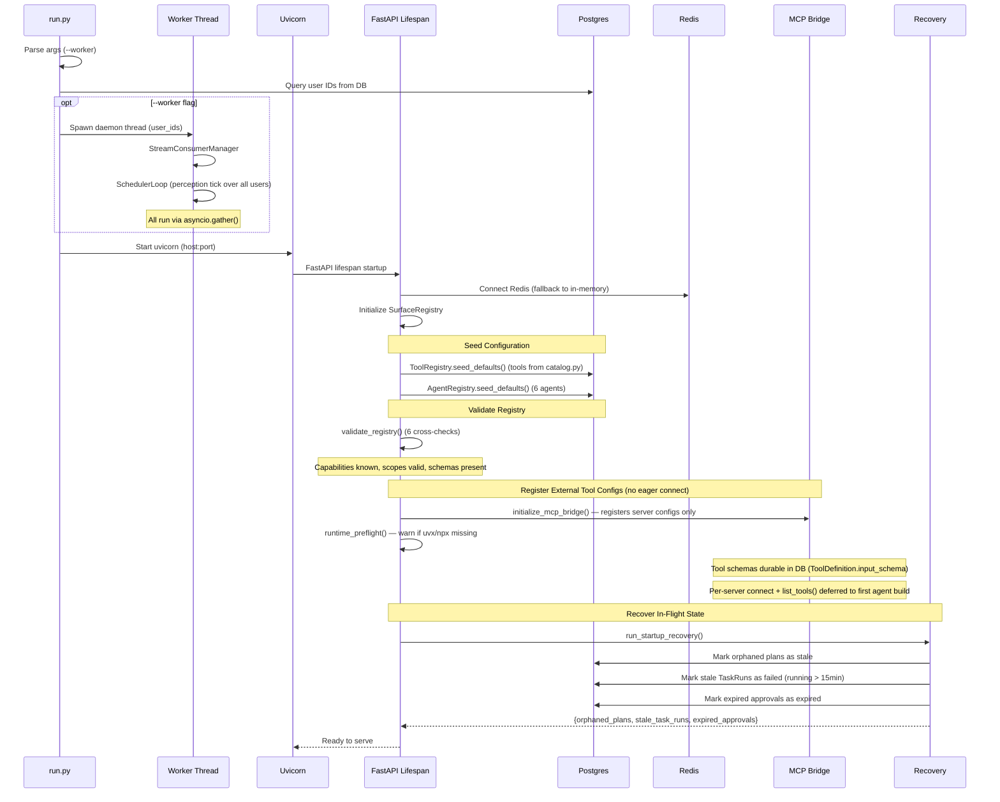
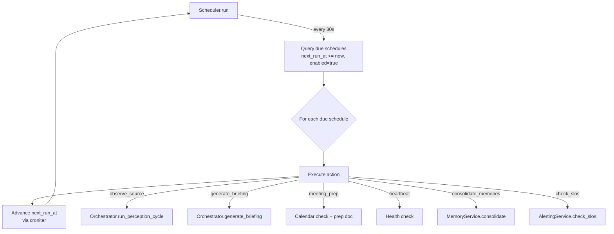
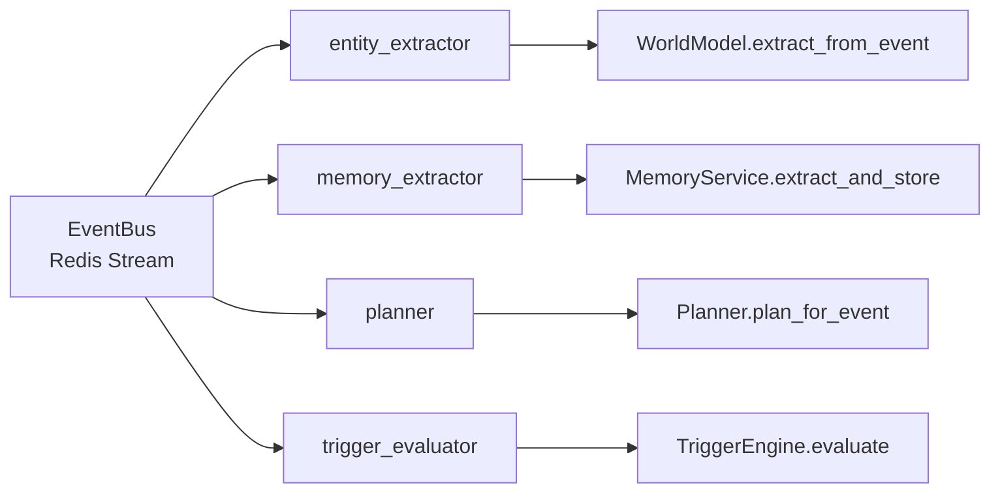

# Startup, Scheduling & Recovery

## Startup Sequence



## Entry Point (run.py)

```
python run.py                # API only
python run.py --worker       # API + background workers
```

| Flag | Components Started |
|------|-------------------|
| (none) | FastAPI/Uvicorn only |
| `--worker` | + StreamConsumerManager + SchedulerLoop (requires user_ids from DB) |

## Scheduling System

### Scheduler Loop

The scheduler polls every **30 seconds**, querying for due schedules:



### Default Schedules

| Name | Cron | Action | Purpose |
|------|------|--------|---------|
| `morning_briefing` | `0 7 * * *` | generate_briefing | Daily briefing at 7 AM |
| `observe_gmail` | `*/5 * * * *` | observe_source | Poll Gmail every 5 min |
| `observe_calendar` | `*/15 * * * *` | observe_source | Poll Calendar every 15 min |
| `observe_slack` | `*/5 * * * *` | observe_source | Poll Slack every 5 min |
| `observe_github` | `*/10 * * * *` | observe_source | Poll GitHub every 10 min |
| `memory_consolidation` | `0 2 * * *` | consolidate_memories | Merge duplicates at 2 AM |
| `slo_health_check` | `0 */6 * * *` | check_slos | SLO evaluation every 6 hours |
| `system_heartbeat` | `0 * * * *` | heartbeat | Hourly maintenance sweep (stale-plan reaper, approval expiry, observation health) |

### Background Task Execution

The scheduler also runs additional ticks every 30 seconds:

| Tick | Purpose |
|------|---------|
| `_tick_background_tasks()` | Execute pending background TaskRuns via GraphExecutor |
| `_tick_dlq_retry()` | Retry dead-letter queue entries |
| `_tick_memory_expiration()` | Expire memories past their TTL |
| `_tick_eviction()` | Evict data older than 90-day retention window |
| `_tick_persona_batch()` | Batch persona preference extraction (every 10th tick, ~5 min) |

Cross-source synthesis triggers when 2+ perception sources have new events in the same tick (30-minute cooldown).

### Budget Hydration

The `BudgetTracker` in-memory counter hydrates from the database on calendar day change (survives restarts). If hydration fails, it falls back to 0.

### Follow-Up Notifications

The scheduler also checks for notifications with `follow_up_at` in the past and re-queues them for delivery.

## Worker System

The worker's `run()` function requires a `user_ids: list[str]` parameter -- there is no default user. At startup, `run.py` queries all user IDs from the database and passes them to the worker.

### Redis Stream Consumer Groups

Background workers consume events from per-user Redis streams:



| Consumer Group | Handler | Triggers On |
|---------------|---------|-------------|
| `entity_extractor` | WorldModel.extract_from_event() | All events |
| `memory_extractor` | MemoryService.extract_and_store() | All events (with entity linking) |
| `planner` | Planner.plan_for_event() | Events with importance >= 0.7 |
| `trigger_evaluator` | TriggerEngine.evaluate() | All events |

### Stream Architecture

- Stream name: `muldro:events:{user_id}`
- Each consumer group reads independently
- Consumer groups enable exactly-once processing per handler
- Failed messages go to DLQ (Dead Letter Queue)

## Startup Recovery

On every boot, `run_startup_recovery()` reconciles in-flight state:

### Recovery Operations

| Operation | Condition | Action |
|-----------|-----------|--------|
| **Orphaned Plans** | status=planned, created > 1 hour ago | Mark as `stale_on_recovery` |
| **Stale TaskRuns** | status=running, updated > 15 min ago | Mark as `failed` |
| **Expired Approvals** | status=pending, expires_at < now | Mark as `expired` |

### Recovery Rationale

- The 15-minute stale threshold assumes no legitimate operation takes that long without a heartbeat
- Recovery runs before accepting any requests, ensuring clean state
- Individual operation failures don't cascade (logged but don't block startup)
- The final DB commit includes all successful recoveries

## Perception Tick Initialization

The scheduler holds no per-user perception objects. Its perception tick
(`src/services/scheduler/perception_tick.py`) queries `perception_state` for
every due source across all users each tick, claims them, and runs the cycles:

1. **Budget pre-check** sets the interval multiplier for the tick
2. **Claim** due rows (`FOR UPDATE SKIP LOCKED` → lease → commit) so locks are
   never held across a cycle
3. **Run cycles** grouped by user, each group inside one MCP `TurnScope`
4. **Record each outcome** in its own fresh transaction

Cursors live in `observation_cursors` and are read per poll, so perception
resumes from where it left off with no observation gaps. Observation state is
per `(workspace, user, source)` row, so users remain independent.

## Lazy Service Initialization

Services are initialized lazily on first chat request (not at startup):

```
First POST /v1/muldro/chat
    → _build_orchestrator()
    → Create long-lived DB session
    → Build: EventProcessor, WorldModel, MemoryService, Planner,
             Governor, Presenter, Audit, VectorStore, GraphEngine,
             RerankerService, TriSearchService, TrustEngine,
             RiskAssessor, RelevanceAssessor, EngagementService,
             EvictionService
    → Configure intelligence server with services
    → load_agents_from_db()
    → Cache orchestrator for subsequent requests
```

This avoids startup overhead when only serving health checks or API endpoints that don't need the full orchestrator.

## Infrastructure Dependencies

| Component | Version | Required | Fallback if Unavailable |
|-----------|---------|----------|------------------------|
| **PostgreSQL** | 17 | Yes | None (system won't start) |
| **Redis** | 7 | Yes* | In-memory cache/locks, no event streaming, no surface tracking |
| **Qdrant** | 1.12 | No | Postgres FTS only; no semantic vector search |
| **Neo4j** | 5 Community | No | No graph traversal; Postgres entity tables still provide flat queries |
| **MinIO / S3** | - | No | No artifact file storage (metadata still tracked in Postgres) |
| **MCP servers** | - | No | External tools unavailable; internal tools still work |

*Redis is technically optional but strongly recommended. Without it, event streaming, distributed locking, task queuing, and real-time features are degraded or disabled.

### Docker Compose Services

```yaml
# docker-compose.yml provides all 5 infrastructure services:
postgres:      pgvector/pgvector:pg17  (port 5432)  # pgvector image but vector search uses Qdrant
redis:         redis:7-alpine          (port 6379)
qdrant:        qdrant/qdrant:v1.12.0   (ports 6333, 6334)
neo4j:         neo4j:5-community       (ports 7474, 7687)
minio:         minio/minio             (ports 9000, 9001)
```
