# ToolHive + OpenConnector Integration — Architecture Assessment

> **Status:** Investigation complete. No production code changed. This document is the assessment of record for connecting Muldro to multiple MCP servers and SaaS applications via **ToolHive** (MCP gateway) + **OpenConnector** (outbound SaaS connection layer), authenticated by Muldro's existing identity provider.
>
> **Research date:** 2026-08-16. All external claims cite primary sources with versions/commits/dates (see §4). All Muldro claims cite `backend/…` paths verified in code.

---

## 1. Executive verdict

**Proceed — but with an adapter *and* tenant-isolated OpenConnector deployments. Both are required; neither alone is safe.**

The hypothesised topology is viable in shape, and two of its three legs are stronger than expected:

- **ToolHive is a genuine fit.** It is a mature (Apache-2.0, v0.43.0), containerised MCP gateway with virtual-MCP tool aggregation, Cedar default-deny policy, OTel audit, Redis-backed HA, and — critically — **first-class RFC 8693 token exchange** that mints a per-authenticated-principal, audience-scoped token for each downstream call. It closes the exact identity-propagation gap the MCP spec leaves open.
- **Muldro fits behind it with almost no runtime change.** Every outbound MCP call is built in one place (`session_pool.py:207`), fed by one config builder (`mcp_pool.py:347`). The deep runtime, central dispatch, `capability_scope`/`trust_gate`/`permission_gate` middleware, TrustEngine, and audit all stay intact.
- **OpenConnector is the constraint.** It is mature and huge (~4.7k stars, 1,376 providers, commit today, v1.3.5) but **single-tenant by deliberate design**: its `connections` table has **no tenant/user/org column**, the account is chosen by an **LLM-supplied `connectionName` string argument** to `execute_action`, `list_connections` **enumerates every stored account**, and **credentials are plaintext unless an encryption key is set**. Its JWT verifier authenticates the *request* but does **not** map a subject to a connection.

The decisive reconciliation: **ToolHive's `tokenExchange` cannot fix OpenConnector's connection selection**, because OpenConnector picks the account from a *tool argument*, not from a header or token audience. A gateway that injects headers/tokens does not rewrite tool arguments. Therefore a **Connection Context Adapter** must sit between ToolHive and OpenConnector to bind `principal → allowed connection` server-side (forcing the `connectionName`, suppressing enumeration), and OpenConnector must be **partitioned per tenant** because it has no row-level isolation to lean on.

### Decision gate outcome

> **Proceed with an adapter — combined with tenant-isolated OpenConnector deployments.** (Gates 2 and 3 from the brief, together.) Not "proceed directly" (OpenConnector's trust model forbids it); not "blocked" (no unfixable limitation — the fixes are well-understood and bounded).

## 2. Confidence and the largest unresolved question

**Confidence: High on the architecture shape and the security verdict. Medium on operational specifics.**

- *High:* the current Muldro path (code-verified), OpenConnector's single-tenant model (schema + call-path verified in the repo), ToolHive's token-exchange capability (documented, with a working third-party demo), and the MCP spec's silence on gateway identity (spec-quoted).
- *Medium:* ToolHive's aggregated tool-list **cache-invalidation** behaviour (docs are silent; needs code review), ToolHive's SSE-at-scale maturity (open issues #4974/#3329), and OpenConnector's behaviour under a per-tenant fleet at scale (single-process SQLite; refresh single-flight is in-memory, not distributed).

**Largest unresolved question — a build-vs-adopt fork, not a blocker:**

> **Who is the credential system-of-record — OpenConnector or Muldro's existing `OAuthManager`?** Muldro *already* has per-`(user, provider)` Fernet-encrypted token storage with automatic refresh (`oauth_manager.py`), and it is **more tenant-safe than OpenConnector's connection store**. OpenConnector's differentiated value is its **1,376-provider action catalog**, not its credential vault. If Muldro keeps credential ownership, the adapter injects credentials per call and OpenConnector becomes a stateless action-executor — but that fights OpenConnector's "the connection owns the credential" model. This choice changes the threat model, the refresh design, and the per-tenant deployment count. It is called out as **ADR-OPEN-1** (§18) and **P0** (§15).

## 3. Current-system request-flow map (code-grounded)

ToolHive and OpenConnector have **zero references** in the codebase today — this is a greenfield insertion behind a stable seam.

### 3.1 Identity and tenancy

| Concern | Mechanism | Path |
|---|---|---|
| Login IdP | **Magic link only** (`token_urlsafe(48)`, SHA-256 hashed, SES email) | `auth_service.py:26-70`, `routes_auth_magic_link.py:27-106` |
| Request auth | Bearer **session token** in `Authorization` header (no cookie, no query fallback) | `deps.py:17-41` |
| Session → workspace | `validate_session` stamps transient `user._workspace_id`; `get_current_workspace_id` is zero-query | `auth_service.py:104`, `deps.py:58-69` |
| Background → workspace | `resolve_workspace_id` queries `WorkspaceMember` (role `owner`) | `workspace_resolver.py:16-31` |
| SaaS OAuth | **Integration-linking, not login**; `OAuthToken` identity = `(user_id, provider)`, **user-level, cross-workspace** | `routes_auth_oauth.py:161-273`, `oauth_token.py:6-14,40` |
| Tenant isolation | **Manual per-query `workspace_id ==` filtering**; NOT NULL FK CASCADE; **no RLS, no scoping mixin, no compensating control** | `models/base.py:1-17`, ~40 service files |

**Invariant that everything leans on:** one user = exactly one `owner` workspace, so the session-derived and `WorkspaceMember`-queried workspace paths normally agree. If that invariant ever breaks (a user in multiple workspaces), the two paths can diverge.

### 3.2 Execution paths and the tool seam

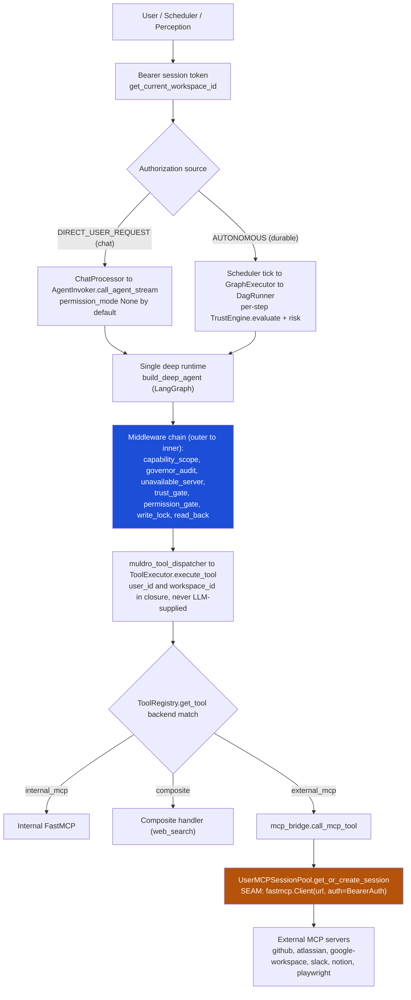

**Sync vs durable:** the **chat path** runs one lead per turn with `authorization_source=DIRECT_USER_REQUEST`, which keeps `trust_gate` dormant — the user's message is the turn's authorization. `permission_gate` **is** active there: it is installed whenever the turn's effective `permission_mode` is `ask` or `auto`, and `auto` is the default. Chat safety therefore rests on always-on `capability_scope` (fail-closed) + `write_lock` **plus** action-time confirmation. The **autonomous path** persists `TaskRun`s and gates **every step** through `TrustEngine.evaluate` at the DAG level and the `trust_gate` middleware; `permission_gate` is **not** installed there (`run_autonomous_deep_step` passes no `permission_mode`), so a step's own pre-approved capability is gated by trust alone. The inner-`permission_gate` fall-through — which stages a risky write at every trust level because that gate never consults trust — applies to turns carrying a `permission_mode`: chat, and the `process_message` batch entry. When no human is on the turn, a gate that must stop a write **prepares** it rather than interrupting or executing.

### 3.3 Secrets and per-server outbound auth (today)

Credentials at rest: `oauth_tokens` table, Fernet-encrypted with a single key `MULDRO_OAUTH_ENCRYPTION_KEY` (**prod startup hard-fails if unset**, `settings.py:256-262`), auto-refresh with a 5-min buffer (`oauth_manager.py:151-176`). Outbound auth is resolved per server (`session_pool._resolve_auth:796-853`):

| Server | Transport | Auth at connect | Token exposure |
|---|---|---|---|
| google-workspace | streamable-http, managed local `uvx` | **runs its own OAuth 2.1** | own consent |
| github | remote streamable-http | OAuth → `BearerAuth` header | header |
| atlassian | remote streamable-http | OAuth → `BearerAuth` + `cloudId` merged into tool input | header |
| slack | stdio (`npx`) | static token → **env var** | `ps aux` visible |
| notion | stdio (`npx`) | OAuth → env `NOTION_TOKEN` | `ps aux` visible |
| playwright | stdio (`npx`) | none | — |

**Key gaps a gateway would fix:** stdio env-var token exposure (`ps aux`), single symmetric key with no per-tenant boundary or rotation, and no custom-header outbound path.

### 3.4 Approvals (unchanged by this work)

`TrustEngine.evaluate` (4×4 trust × risk matrix, `trust_engine.py:105-157`) + `RiskAssessor` (fast tier, Redis 24h cache, **fail-closed to `high`** at three sites) + `Approval` model with a partial-unique idempotency fence (`approvals.py:47-54`). This stays exactly as-is: the gateway/connector operate **below** the approval boundary — a call only reaches the outbound seam *after* TrustEngine/permission_gate has cleared it.

## 4. Verified capability matrix (primary sources)

### ToolHive — Stacklok

*Sources: `docs.stacklok.com/toolhive/*` (pages stamped 2026-08-10/08-14), `github.com/stacklok/toolhive` release v0.43.0 (2026-08-14), Apache-2.0.*

| Capability | Verdict | Evidence |
|---|---|---|
| **Per-principal outbound credential** | ✅ **RFC 8693 `tokenExchange`** (also `awsSts`); static `headerInjection`/`passthroughHeaders` too | [token-exchange guide](https://docs.stacklok.com/toolhive/guides-cli/token-exchange); *"identity preserved, permissions transformed for the target service"* |
| Inbound auth | ✅ OIDC/JWT (`iss`/`aud`/`exp`, JWKS auto-discovery), embedded OAuth server, K8s SA tokens; extracts group/role claims | [vMCP auth](https://docs.stacklok.com/toolhive/guides-vmcp/authentication), [K8s auth](https://docs.stacklok.com/toolhive/guides-k8s/auth-k8s) |
| Transports | ✅ stdio, SSE, streamable-HTTP; streamable-HTTP default since CLI v0.6.0; remote = HTTP-only | [run-mcp-servers](https://docs.stacklok.com/toolhive/guides-cli/run-mcp-servers) |
| Tool filtering / vMCP | ✅ allowlist `filter`, rename/`overrides`, annotation overrides; virtual endpoints aggregate many backends | [tool-aggregation](https://docs.stacklok.com/toolhive/guides-vmcp/tool-aggregation) |
| Namespacing / collisions | ✅ prefix (default `{workload}_`), priority, or manual | same |
| Policy | ✅ **Cedar** (not OPA), **default-deny**, tool-level, claim-aware | [authz-policy-reference](https://docs.stacklok.com/toolhive/reference/authz-policy-reference) |
| Audit / observability | ✅ OpenTelemetry traces + metrics, Prometheus/OTLP, structured audit logs | [observability.md](https://github.com/stacklok/toolhive/blob/main/docs/observability.md) |
| HA / sessions | ⚠️ holds sessions; **Redis required** for multi-replica; ClientIP sticky fallback (unreliable behind shared egress); 1000-session/pod LRU | [scaling-and-performance](https://docs.stacklok.com/toolhive/guides-vmcp/scaling-and-performance) |
| Deployment | ✅ K8s Helm operator (OCI charts); version-pin for prod; `network` profile "not recommended for prod" | [deploy-operator-helm](https://docs.stacklok.com/toolhive/guides-k8s/deploy-operator-helm) |
| Tool-list cache invalidation | ❔ **undocumented** — needs code review | docs silent; issue #3636 |

### OpenConnector — oomol-lab

*Sources: repo at HEAD `e618241` (2026-08-16), v1.3.5, Apache-2.0, container `ghcr.io/oomol-lab/open-connector:latest`.*

| Capability | Verdict | Evidence |
|---|---|---|
| MCP endpoint | ✅ Streamable-HTTP `POST /mcp`, **stateless server per request**; 5 tools: `list_apps`, `list_connections`, `search_actions`, `get_action_guide`, `execute_action` | `src/server/connect-server.ts:210`, `src/mcp.ts` |
| Provider catalog | ✅ **1,376 provider dirs**, "10,000+ actions"; actions addressed by `actionId` (`service.action`) | `src/providers/` |
| **Multi-tenancy** | ❌ **No tenant/user/org column**; PK `(service, connection_name)` global to deployment | `migrations/0001_runtime.sql`, `0006_connection_identity.sql` |
| **Connection selection** | ❌ **LLM-supplied `connectionName` string arg**; `list_connections` enumerates all; only guardrail is an advisory prompt string | `src/mcp.ts:185`, `connection-service.ts:211` |
| Runtime-token scope | ⚠️ scopes by **action** (`allowedActions`/`blockedActions`), **never by connection**; JWT verifier returns bare `boolean` | `runtime-token-service.ts`, `runtime-jwt.ts` |
| Endpoint auth | ⚠️ **optional** — unconfigured `/mcp` is fully open (pass-through middleware) | `src/server/api/auth.ts:44-51` |
| Credential encryption | ⚠️ **plaintext by default**; AES-256-GCM + scrypt (static salt) only if `OOMOL_CONNECT_ENCRYPTION_KEY` set; **not** KMS/Vault/envelope | `secret-codec.ts:54` |
| OAuth + refresh | ✅ consent + callback (`/oauth/callback`), refresh-token rotation, **in-memory single-flight** (not distributed), `invalid_grant` → `ConnectionError` "Reconnect" | `connection-service.ts:505-533`, `oauth-credential-refresh-service.ts:58` |
| Secret leakage to model | ✅ MCP results return connection **summaries** (labels), not tokens; `/v1/proxy` injects creds server-side; pino redaction | `README`, `src/mcp.ts`, `logger.ts` |
| Deployment | ⚠️ container + `docker-compose`; **SQLite single-process** (or Cloudflare D1/R2); horizontal scale "requires separate shared storage design" | `docker-compose.yml`, `docs/fly-io.md:184` |

### MCP authorization spec

*Current revision **2026-07-28**; OAuth 2.1 model introduced 2025-06-18.*

| Requirement | Level | Note |
|---|---|---|
| MCP server = OAuth 2.1 Resource Server; client obtains audience-bound token | — | [authorization](https://modelcontextprotocol.io/specification/2026-07-28/basic/authorization) |
| PKCE (S256) | **MUST** | client must verify AS advertises it |
| Resource Indicators (RFC 8707) | **MUST** | `resource` = canonical MCP server URI |
| Protected-Resource Metadata (RFC 9728) + AS Metadata (RFC 8414) discovery | **MUST** | `WWW-Authenticate` on 401 or well-known |
| Token in `Authorization` header, never URL | **MUST** | — |
| Server audience validation | **MUST** | reject tokens not in `aud` |
| **No token passthrough** | **MUST NOT** | *"MUST NOT pass through the token it received from the MCP client"* — upstream needs its own token |
| **Gateway → downstream end-user identity propagation** | **UNDEFINED** | no RFC 8693, no on-behalf-of, no actor claim anywhere in core or `ext-auth` |
| DCR (RFC 7591) | MAY (deprecated) | superseded by Client-ID Metadata Documents |
| URL-mode elicitation for downstream cred acquisition | supported (2025-11-25+) | the spec-blessed pattern for a *server* to acquire user-bound creds |

**Implication:** the "trusted downstream identity/connection context" arrow has **zero protocol cover** and the naive shortcut is forbidden. Any identity bridge is bespoke and security-critical — which is exactly what the adapter is, and why ToolHive's `tokenExchange` (an out-of-band RFC 8693 implementation) is the right tool for the *credential* half while the adapter handles the *connection-selection* half.

## 5. Keep / replace / add matrix

| Component | Disposition | Rationale (path) |
|---|---|---|
| Magic-link login, `Session`, `get_current_workspace_id`, `resolve_workspace_id` | **KEEP** | Platform identity is unaffected (`deps.py`, `auth_service.py`) |
| Deep runtime + central dispatch (`build_deep_agent`, `muldro_tool_dispatcher`, `ToolExecutor`, `ToolRegistry`) | **KEEP** | Gateway inserts below dispatch |
| Policy middleware + TrustEngine/RiskAssessor/Approval | **KEEP** | Approval is above the outbound seam |
| `IntegrationAuditLogger` | **KEEP** (augment) | Correlate with ToolHive OTel trace IDs |
| `LocalMCPProcessManager` + `uvx`/`npx` spawning (`local_process_manager.py`, `local_servers.py`) | **REPLACE** | ToolHive fronts these as HTTP; removes host `uvx`/`npx` dependency |
| stdio env-var token injection (`session_pool.py:911-933`) | **REPLACE** | Gateway header auth removes `ps aux` exposure |
| Per-server auth resolution + `BearerAuth` (`session_pool._resolve_auth`) | **REPLACE** | OpenConnector owns SaaS OAuth/refresh; Muldro authenticates to the gateway |
| `_installation_to_config` (`mcp_pool.py:347`) + `IntegrationInstallation` | **ADAPT** — seam #1 | add gateway URL/headers/upstream fields |
| `get_or_create_session` (`session_pool.py:207/235`) | **ADAPT** — seam #2 | collapse transport branch to one gateway HTTP client; **add `headers=` path** (bearer-only today) |
| Lazy discovery (`lazy_discovery.py`, `discover_and_persist`) | **ADAPT** | repoint `list_tools` at the gateway's aggregated catalog; **fix non-destructive backfill** so gateway schema changes invalidate cached schemas (`session_pool.py:339-340`) |
| `OAuthManager` + `oauth_tokens` | **KEEP or REPLACE** | **ADR-OPEN-1** — depends on credential system-of-record decision |
| **Connection Context Adapter** | **ADD** | new — binds principal → connection, forces `connectionName`, suppresses enumeration |
| **ToolHive gateway (vMCP + operator)** | **ADD** | new — registry, policy, filtering, isolation, audit |
| **Per-tenant OpenConnector instances** | **ADD** | new — credential/action layer, isolated because no row-level tenancy |
| **Platform JWT minting** (Muldro → ToolHive OIDC) | **ADD** | new — Muldro issues a short-lived JWT ToolHive validates |

## 6. Proposed component architecture

```mermaid
flowchart TD
    subgraph MULDRO["Muldro platform (unchanged core)"]
        AGENT["Deep runtime agent<br/>capability_scope, trust_gate, permission_gate"]
        DISP["ToolExecutor to mcp_bridge to session_pool<br/>seam: gateway HTTP client + headers"]
        JWT["Platform JWT minter<br/>sub=principal, tenant, workspace, aud=toolhive"]
        AGENT --> DISP --> JWT
    end

    JWT -->|"Bearer platform JWT"| THV

    subgraph THV["ToolHive vMCP gateway"]
        OIDC["Inbound OIDC/JWT validation"]
        CEDAR["Cedar default-deny policy<br/>tool-level, claim-aware"]
        FILTER["Virtual MCP endpoints<br/>purpose-specific tool allowlists"]
        TE["tokenExchange (RFC 8693)<br/>mints per-principal downstream token"]
        OIDC --> CEDAR --> FILTER --> TE
    end

    TE -->|"per-principal token + trusted identity headers"| ADAPTER

    subgraph ADAPTER["Connection Context Adapter (NEW, MCP server)"]
        VERIFY["Verify ToolHive identity (token/headers)"]
        MAP["Lookup allowed connection<br/>(tenant, principal, provider) to connection_id"]
        FORCE["Force connectionName arg server-side<br/>strip/sccope list_connections"]
        ROUTE["Route to tenant's OpenConnector instance"]
        VERIFY --> MAP --> FORCE --> ROUTE
    end

    ROUTE -->|"POST /mcp, runtime token, forced connectionName"| OC

    subgraph OC["Per-tenant OpenConnector instances"]
        OCA["tenant A: connections + encryption key"]
        OCB["tenant B: connections + encryption key"]
    end

    OC --> SAAS["Google, Slack, GitHub, Notion, Microsoft, ..."]

    style ADAPTER fill:#7c3aed,color:#fff
    style THV fill:#1d4ed8,color:#fff
    style OC fill:#047857,color:#fff
```

**Why all three layers earn their place:** ToolHive provides inbound identity validation, Cedar tool-level policy, tool-catalog filtering (essential given OpenConnector's 10,000+ actions — §8), namespacing, OTel audit, container isolation, and HA. The adapter provides the one thing ToolHive cannot: **rewriting the `connectionName` tool argument** from server-side policy so neither the model nor prompt-injected content selects an account. Per-tenant OpenConnector provides the credential-store isolation its schema lacks.

## 7. Trust-boundary diagram and threat model

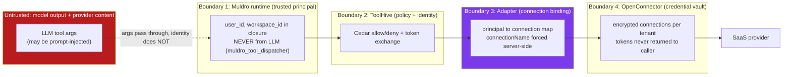

### Concise threat model (STRIDE-flavoured)

| Threat | Vector | Control | Owner |
|---|---|---|---|
| **Cross-tenant credential access** | LLM/prompt-injection names another tenant's `connectionName`; `list_connections` enumeration | Adapter forces `connectionName` from `principal→connection` map; suppresses/scopes `list_connections`; per-tenant OpenConnector so cross-tenant names are unreachable | Adapter + deployment |
| **Confused deputy** | Background job inherits broader authority than initiating user | `authorization_source=AUTONOMOUS` + `pre_approved_capabilities` per step; adapter binds to the *initiating* principal's connection only | Muldro + adapter |
| **Token passthrough / wrong audience** | Forwarding Muldro JWT to SaaS | ToolHive `tokenExchange` mints audience-scoped tokens; OpenConnector holds SaaS creds; spec MUST-NOT honoured | ToolHive |
| **Secret exfiltration to model** | Raw token in tool result/log | OpenConnector returns summaries only; `/v1/proxy` server-side injection; pino + `IntegrationAuditLogger` redaction; **no secret in Cedar/OTel attributes** | OpenConnector + all |
| **Plaintext credentials at rest** | `OOMOL_CONNECT_ENCRYPTION_KEY` unset | **Mandatory** key per instance, validated at startup (mirror Muldro's `settings.py:256-262` hard-fail) | Deployment |
| **SSRF / egress abuse** | Provider action hits internal URL | Egress allowlist per OpenConnector instance; ToolHive `network` profile off; K8s NetworkPolicy | Deployment |
| **Callback/redirect forgery** | OAuth state/redirect tampering | Exact redirect-URI allowlist, single-use `state` with persisted nonce (fixes Muldro TODO `auth_service.py:77`), issuer pinning | Adapter/OpenConnector |
| **Admin credential access** | Operator reads connections DB | Per-tenant encryption boundary; KMS-managed keys (envelope) rather than env passphrase; audited admin access | Deployment |

## 8. Tool discovery and context-size control

OpenConnector already solves half of this: it exposes **5 stable meta-tools**, not 10,000 actions. But a naked search-and-invoke meta-tool (`execute_action` with a free `actionId`) is a **policy-bypass risk** — the model can invoke *any* action through one generic tool, defeating tool-level Cedar/`capability_scope` rules. Design:

- **ToolHive virtual MCP endpoints** carve OpenConnector's action surface into **purpose-specific, workspace-scoped allowlists** (e.g. an `email` vMCP exposing only Gmail read/send actions). This keeps model context small and makes Cedar policy meaningful per virtual endpoint.
- **Constrain `execute_action`**: the adapter validates `actionId` against the vMCP's allowlist before forwarding, so the generic executor cannot reach un-allowlisted actions. `search_actions`/`get_action_guide` remain for discovery but return only allowlisted actions.
- **Stable identifiers**: `actionId` = `service.action_name` is stable; map it to Muldro capabilities in `ToolRegistry` so `capability_scope` still applies.
- **Cache invalidation (must-fix):** Muldro's discovery backfill is **non-destructive** (`session_pool.py:339-340`) — a live upstream schema change won't overwrite a stale persisted schema. Behind a gateway whose catalog changes when connections change, add explicit invalidation keyed on the gateway's catalog version / connection revision. ToolHive's own tool-list cache behaviour is undocumented (§4) — verify in code before relying on it.

## 9. Responsibility ownership (no ambiguous double-ownership)

| Responsibility | Owner | Notes |
|---|---|---|
| User authentication | **Muldro** (magic link) | unchanged |
| Tenant/workspace authorization | **Muldro** + enforced at **Adapter** | Muldro stamps principal; adapter binds to connection |
| MCP client authentication (Muldro → gateway) | **Muldro** mints platform JWT → **ToolHive** validates | new JWT minter |
| Remote MCP authorization (tool-level) | **ToolHive Cedar** (+ Muldro `capability_scope`/TrustEngine) | defence in depth |
| SaaS OAuth consent + callbacks | **OpenConnector** (or Muldro — ADR-OPEN-1) | |
| Credential encryption at rest | **OpenConnector** per-tenant (mandatory key) or **Muldro** Fernet | one of, not both |
| Refresh-token rotation | **OpenConnector** (in-memory single-flight → needs distributed lock at scale) | see §12 |
| **Provider account selection** | **Adapter** (server-side map) — **never the LLM** | the core new control |
| Tool-level permissions | **ToolHive Cedar** + **Muldro capability_scope** | |
| Human approval | **Muldro TrustEngine / permission_gate** | above the seam, unchanged |
| Rate limits | **ToolHive** + Muldro notifier caps + provider | |
| Retry / idempotency | **Muldro** per-step ledger + **Adapter** idempotency keys | |
| Audit events | **ToolHive OTel** + **Muldro IntegrationAuditLogger** | correlate by trace id |
| Revocation / disconnection | **OpenConnector** connection delete + **Muldro/Adapter** map delete + cache invalidation | |
| Reauthorization | **OpenConnector** (URL-mode elicitation) surfaced via **Muldro** | |
| Tool discovery / context size | **ToolHive vMCP** allowlists | §8 |

## 10. Proposed internal APIs and identity-propagation contract

**Platform JWT (Muldro → ToolHive)** — short-lived (≤5 min), audience-bound:

```
{
  "iss": "https://auth.muldro.internal",
  "sub": "<principal_id>",          // Muldro user_id
  "aud": "toolhive-vmcp",           // unique per gateway, prevents replay
  "tenant_id": "<tenant>",
  "workspace_id": "<workspace>",
  "authorization_source": "direct_user_request | autonomous",
  "capabilities": ["email.send", ...],  // pre-authorized capability scope for this turn
  "exp": <now+300>, "iat": <now>, "jti": "<nonce>"
}
```

**Adapter contract (ToolHive → Adapter → OpenConnector).** ToolHive forwards the exchanged token plus trusted identity headers; the adapter resolves the connection and never trusts the LLM's `connectionName`:

```
Inbound to adapter:  Authorization: Bearer <exchanged token>
                     X-Muldro-Principal, X-Muldro-Tenant, X-Muldro-Workspace   (signed)
Adapter lookup:      (tenant_id, principal_id, provider_id[, requested_account_alias])
                       -> connection_ref { openconnector_instance, connectionName, granted_scopes, status }
Adapter action:      reject if status != active or alias not owned by principal
                     rewrite tool input.connectionName := connection_ref.connectionName
                     forward to connection_ref.openconnector_instance /mcp with its runtime token
Outbound to caller:  action result with secrets stripped; on auth failure -> structured reauth challenge
```

**Canonical connection mapping (Muldro-owned control table):**

```
tenant_id | workspace_id | principal_id | provider_id | provider_account_id
          | connection_id | credential_reference | granted_scopes
          | connection_status | account_alias (user-facing) | scope (user | org)
```

The LLM may pass an **`account_alias`** ("work", "personal") — a *hint* the adapter validates against connections **owned by this principal**; it never passes a raw `connection_id`. Org-level connections are marked `scope=org` and resolved only for principals with the granting role.

## 11. Authentication and tool-call sequence diagrams

### 11.1 Connect a new SaaS account

```mermaid
sequenceDiagram
    participant U as User (browser)
    participant J as Muldro
    participant A as Adapter
    participant OC as OpenConnector (tenant)
    participant P as SaaS Provider
    U->>J: Connect Gmail (account alias work)
    J->>A: begin_connection(principal, tenant, provider, alias)
    A->>OC: POST /api/oauth/authorizations
    OC-->>A: authorize_url (redirect_uri allowlisted)
    A-->>J: authorize_url
    J-->>U: redirect to provider consent
    U->>P: consent + scopes (PKCE)
    P-->>OC: callback /oauth/callback (code, state)
    OC->>P: exchange code for tokens
    OC->>OC: encrypt + store connection (key required)
    OC-->>A: connection ready (summary only)
    A->>J: upsert mapping principal to connection_id
    J-->>U: Gmail connected (alias work)
```

### 11.2 Read-only tool call

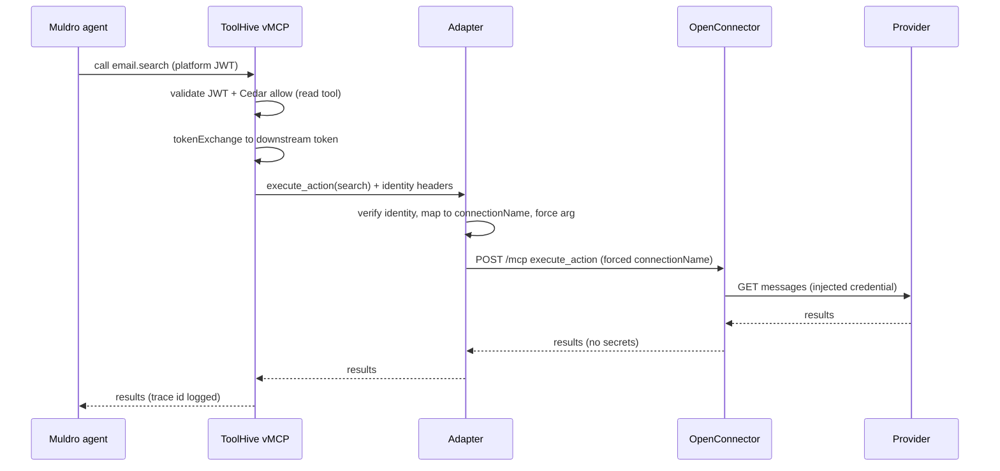

### 11.3 Destructive tool requiring approval

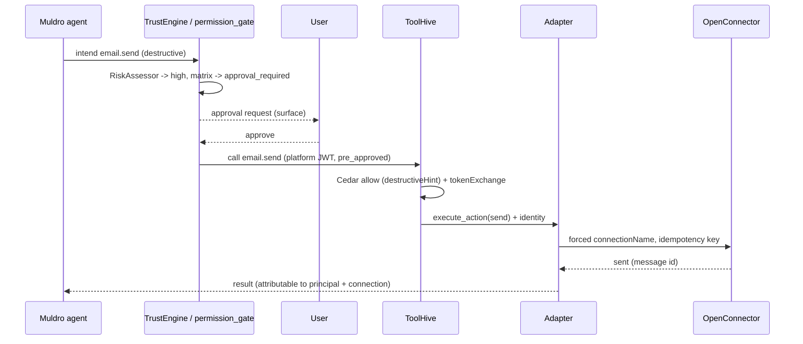

### 11.4 Refreshing an expired access token

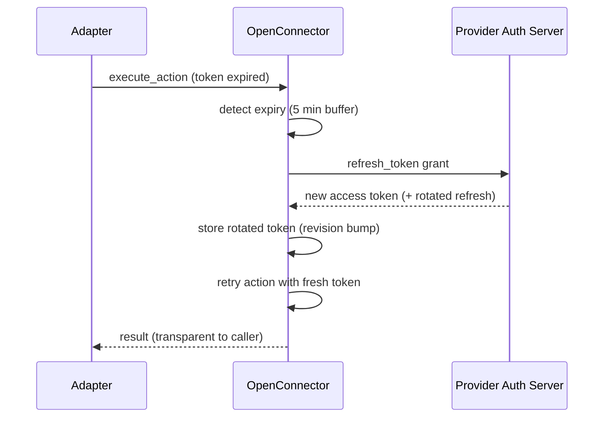

### 11.5 Refresh-token rotation with concurrent requests

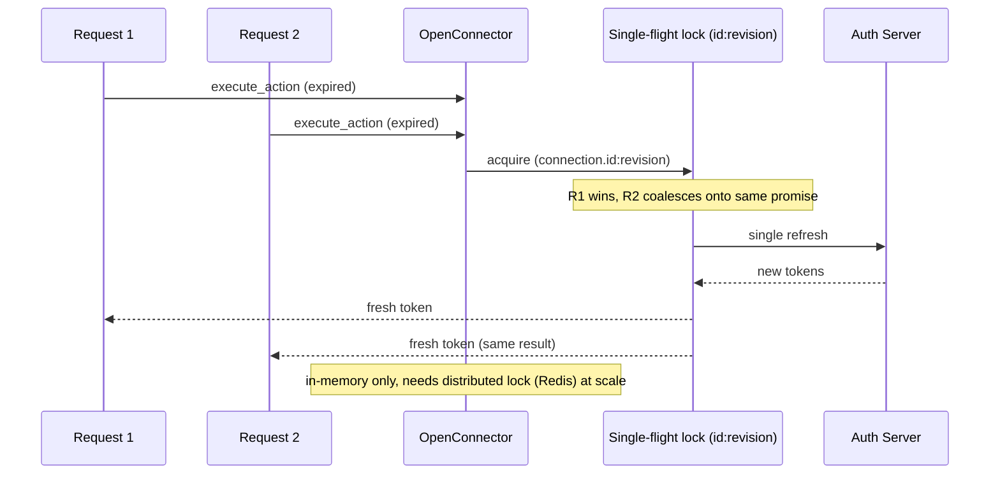

### 11.6 Incremental / step-up scope authorization

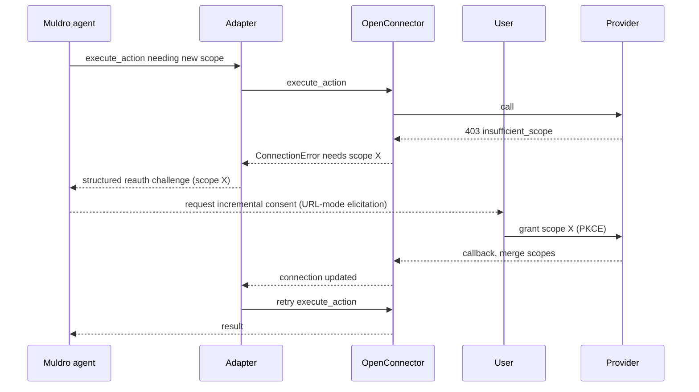

### 11.7 Revoke / disconnect an account

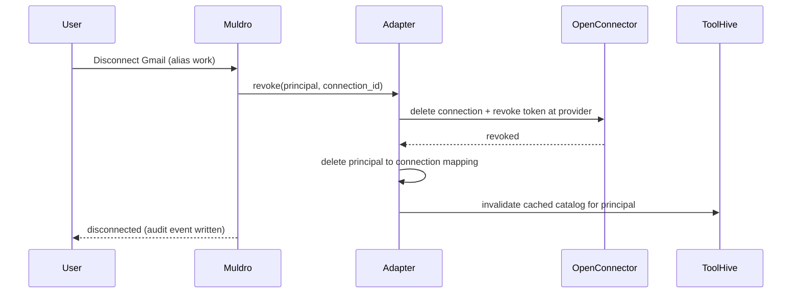

### 11.8 Recovering from invalid_grant / revoked consent

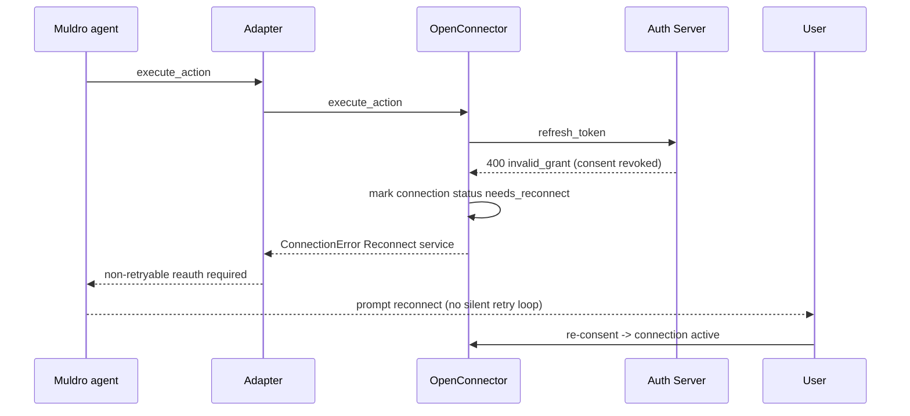

### 11.9 Background job after the initiating user is offline

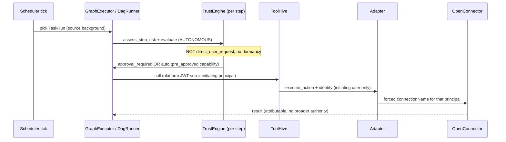

### 11.10 Protocol-native remote MCP with its own OAuth server

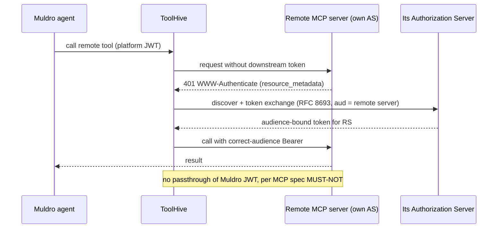

## 12. Failure-mode and recovery matrix

| Failure | Behaviour | Recovery control |
|---|---|---|
| OpenConnector (a tenant) unavailable | tool call fails → `ToolMessage(status=error)` → `blocked` SSE frame | circuit breaker per server (exists, `session_pool` breaker); health check; retry with backoff (langchain-anthropic owns backoff on deep path) |
| ToolHive unavailable | all external tools down for all tenants (blast radius ↑) | HA replicas + Redis session store; readiness gate; graceful degradation to read-only |
| Provider rate limiting (429) | surfaced as retryable error | ToolHive/provider-aware backoff; Muldro notifier caps; per-tenant quota |
| Expired credential | transparent refresh (§11.4) | 5-min buffer refresh; single-flight |
| Revoked consent (`invalid_grant`) | **non-retryable**, mark `needs_reconnect` | reauth prompt; **no silent retry loop** |
| OAuth provider outage | connect/refresh fails | backoff; keep existing valid tokens; alert |
| Duplicate tool call (at-least-once replay) | idempotency ledger fences re-execution | per-step ledger on `execute_tool` (exists, `agent_invoker.py:1308-1329`) + adapter idempotency key |
| Timeout after side effect succeeded | ambiguous outcome | idempotency key + read-back verification (`read_back` middleware exists, currently off) |
| Concurrent token refresh | coalesced | in-memory single-flight (§11.5) → **must become distributed (Redis) under a scaled fleet** |
| Schema change upstream | stale cached schema (current backfill non-destructive) | **fix:** version-keyed invalidation (§8) |
| Long-running call | run-level timeout (autonomous 600s cap; chat uncapped) | `asyncio.wait_for` in `graph_executor.py`; no per-tool timeout on deep path (gap) |
| Streaming responses | streamable-HTTP supported end-to-end | ToolHive streamable-HTTP default; verify session affinity |
| Deployment rollback | version-pinned images | pin ToolHive + OpenConnector tags (no `latest` in prod); migration compatibility |
| Audit-pipeline failure | must not fail-open silently | OTel export buffered; `IntegrationAuditLogger` write is best-effort — add alert on audit gaps |

## 13. Deployment topology

**Never use `latest` tags in staging/production.** Pin ToolHive (e.g. `v0.43.0`) and OpenConnector (`v1.3.5` image digest).

| Environment | Topology |
|---|---|
| **Dev** | `docker-compose`: 1 ToolHive, 1 adapter, 1 OpenConnector (SQLite), Muldro local. Encryption key set even in dev. No `latest`. |
| **Staging** | K8s: ToolHive operator (Helm, pinned) + 1 replica, adapter (2 replicas), OpenConnector **per test-tenant** (small), Redis for ToolHive sessions, Postgres for Muldro/adapter control DB. NetworkPolicy + egress allowlist. |
| **Production** | K8s HA: ToolHive ≥2 replicas + **Redis session store** (Sentinel), adapter ≥2 replicas (stateless), **OpenConnector per tenant** (or per user for high-isolation tenants) with per-instance KMS-managed encryption key + PVC/managed DB, TLS at ingress, mTLS ToolHive↔adapter↔OpenConnector, KMS/Vault for keys, automated backups (encrypted), data-residency-pinned regions per tenant. |

**Tenant-isolation options (pick per tenant tier):** (a) **per-user OpenConnector** — strongest, highest ops cost, best for regulated tenants; (b) **per-org OpenConnector** — adapter enforces user→connection within the org (still needed because OpenConnector has no user column); (c) shared — **rejected** (cross-tenant credential access). State backends: **Redis** (ToolHive HA sessions + distributed refresh lock), **Postgres** (Muldro + adapter control/mapping tables), **per-tenant OpenConnector store** (SQLite PVC or managed DB).

## 14. Proof-of-concept plan (specified, not executed)

Per decision, the PoC is a **runnable follow-up**, isolated from production, using fake/test credentials only. No credentials in source control. Ten assertions with reproducible commands:

```bash
# 0. Isolated workspace (throwaway)
mkdir -p /tmp/thv-oc-spike && cd /tmp/thv-oc-spike
export OOMOL_CONNECT_ENCRYPTION_KEY=$(openssl rand -hex 32)   # assertion 10 depends on this
export OOMOL_CONNECT_RUNTIME_TOKEN=$(openssl rand -hex 24)

# 1. OpenConnector starts with persistent storage
docker run -d --name oc -p 3000:3000 \
  -e OOMOL_CONNECT_ENCRYPTION_KEY -e OOMOL_CONNECT_RUNTIME_TOKEN \
  -v $PWD/data:/app/data ghcr.io/oomol-lab/open-connector:v1.3.5   # PIN, never :latest
# verify: sqlite file created, /mcp returns 401 without token

# 2-3. A no-auth/test provider executes; MCP endpoint works
curl -sX POST localhost:3000/mcp -H "Authorization: Bearer $OOMOL_CONNECT_RUNTIME_TOKEN" \
  -H 'Content-Type: application/json' \
  -d '{"jsonrpc":"2.0","id":1,"method":"tools/list"}'   # expect 5 meta-tools

# 4-5. ToolHive registers the endpoint; client lists/invokes a FILTERED tool through it
thv run --name oc-remote --transport streamable-http --url http://localhost:3000/mcp \
  --version v0.43.0
# vMCP config: filter to a single execute_action allowlist; connect MCP client, list_tools

# 6. Names/schemas stable across two discovery passes (diff tools/list output)
# 7. Auth headers NOT exposed to model/tool result (inspect tool_result for Authorization/token)
# 8. Two simulated principals cannot cross connections
#    -> stand up the adapter stub; principal A token maps only to connection "A-default";
#       assert principal B naming "A-default" is rejected by the adapter (NOT by OpenConnector)
# 9. Revocation/invalid creds -> recoverable state (delete connection, expect needs_reconnect)
# 10. Logs/traces do not leak secrets (grep OTel + container logs for the fake token value)
```

**What the PoC proves vs mocks:** assertions 1-7 and 9-10 exercise real ToolHive + OpenConnector. Assertion 8 (the security crux) **requires the adapter stub** — because unmodified OpenConnector *cannot* isolate principals; that is the finding, and the PoC's job is to prove the adapter closes it. Anything mocked (the adapter, the platform JWT minter) is clearly marked as spike-only.

## 15. Risk register

| ID | Risk | Sev | Mitigation |
|---|---|---|---|
| **P0-1** | Shared OpenConnector → cross-tenant credential access via `connectionName`/`list_connections` | **P0** | Adapter forces connection + suppresses enumeration; **per-tenant deployment** |
| **P0-2** | OpenConnector plaintext creds if key unset | **P0** | Mandatory `OOMOL_CONNECT_ENCRYPTION_KEY` validated at startup; KMS-managed keys |
| **P0-3** | Credential system-of-record ambiguity (OpenConnector vs Muldro OAuthManager) | **P0** | Resolve **ADR-OPEN-1** before build; avoid dual-ownership |
| **P0-4** | Generic `execute_action` bypasses tool-level policy | **P0** | vMCP allowlists + adapter `actionId` validation; map to Muldro capabilities |
| **P1-1** | ToolHive is single blast-radius for all tenants' tools | P1 | HA replicas + Redis sessions; readiness gates; per-tenant vMCP |
| **P1-2** | Refresh single-flight is in-memory, not distributed | P1 | Redis distributed lock across OpenConnector/adapter at scale |
| **P1-3** | Tool-catalog cache invalidation on connection change (ToolHive + Muldro backfill both suspect) | P1 | Version-keyed invalidation; verify ToolHive cache in code |
| **P1-4** | No custom-header outbound path in Muldro today | P1 | Thread `headers=` through `_installation_to_config → session_pool` |
| **P1-5** | OAuth `state` has no persisted CSRF nonce (`auth_service.py:77` TODO) | P1 | Persist single-use `state`; exact redirect-URI allowlist |
| **P2-1** | ToolHive SSE-at-scale + operator replica handling maturing (issues #4974/#3329) | P2 | Prefer streamable-HTTP; vertical scale first; pin versions |
| **P2-2** | Pre-1.0 velocity (ToolHive v0.39→v0.43 in ~30 days) | P2 | Pin + upgrade-test in staging; watch changelogs |
| **P2-3** | `refresh_session` skips `expires_at` (`auth_service.py:113-123`) | P2 | Add expiry check (pre-existing Muldro bug, unrelated but surfaced) |
| **P2-4** | No per-tool timeout on deep path | P2 | Add adapter-side timeout; run-level cap exists |

## 16. Phased implementation and cutover plan

1. **Phase 0 — Decide & spike (1–2 wk).** Resolve ADR-OPEN-1 (credential owner). Run the §14 PoC in staging. Confirm ToolHive cache-invalidation + tool-list behaviour in code. **Gate:** PoC assertions 8 & 10 pass.
2. **Phase 1 — Adapter + JWT minter (2–3 wk).** Build the Connection Context Adapter (principal→connection map in Muldro control DB, forced `connectionName`, suppressed enumeration, per-tenant routing) and the platform-JWT minter. TDD with two-principal isolation tests. Not wired to prod.
3. **Phase 2 — Seam plumbing (1–2 wk).** Add the `headers=` path to `session_pool.get_or_create_session`; extend `_installation_to_config` + `IntegrationInstallation` with gateway fields. Behind a feature flag. One provider (Gmail) end-to-end via ToolHive→adapter→OpenConnector.
4. **Phase 3 — Provider migration (rolling).** Move providers one at a time: GitHub/Slack/Notion/Atlassian → gateway-fronted; retire `uvx`/`npx` spawning + stdio env-var injection. Keep Muldro native path as fallback per provider until parity verified.
5. **Phase 4 — Tenant fleet + HA (2 wk).** Per-tenant OpenConnector provisioning automation, Redis session store, distributed refresh lock, KMS keys, NetworkPolicies. Load/HA test.
6. **Phase 5 — Cutover & decommission.** Flip flag per tenant tier; monitor audit parity; decommission the replaced `LocalMCPProcessManager`/stdio path once all providers migrated.

**Rollback:** each phase is flag-gated per provider/tenant; the native `session_pool` path remains until a provider reaches parity, so any phase reverts by clearing the flag.

## 17. Testing and observability strategy

- **Unit/integration (Muldro harness):** adapter mapping logic (principal→connection, alias ownership, org-scope), forced-`connectionName` rewrite, enumeration suppression. Use the real-DB regression pattern (self-contained `_db_reachable`, NullPool, seeded User→Workspace FK chain).
- **Security tests (must-have):** two-principal isolation (P0-1), key-unset refusal (P0-2), generic-`execute_action` allowlist enforcement (P0-4), secret-in-log/trace scans (grep for fake token). These are the PoC assertions promoted to CI.
- **Contract tests:** platform-JWT claims + audience; adapter idempotency-key behaviour; reauth-challenge shape.
- **Observability:** propagate a single trace id across Muldro `IntegrationAuditLogger` → ToolHive OTel → adapter → OpenConnector run-audit. **Every external side effect attributable to `(tenant, principal, connection, tool, execution)`** (contract §10). Metrics: per-tenant call volume, refresh rate, `needs_reconnect` count, Cedar denials, adapter rejections. Alerts: audit-gap, refresh-failure spike, cross-tenant rejection spike (attack signal), OpenConnector-per-tenant health.

## 18. Draft ADR

> **ADR: Adopt ToolHive + per-tenant OpenConnector with a Connection Context Adapter for outbound SaaS tools.**
> **Status:** Proposed. **Context:** Muldro needs multi-provider, multi-account SaaS actions without raw tokens reaching the model, with server-side tenant/principal enforcement. The MCP spec defines no gateway identity propagation and forbids token passthrough. **Decision:** Insert ToolHive as the MCP gateway (inbound OIDC, Cedar policy, vMCP tool filtering, RFC 8693 token exchange, OTel audit, Redis HA) behind Muldro's existing outbound seam (`session_pool.py:207` / `mcp_pool.py:347`); adopt OpenConnector for its provider/action catalog **deployed per tenant** (no row-level tenancy, plaintext-by-default); add a **Connection Context Adapter** that binds `principal→connection` server-side and forces the `connectionName` argument. **Consequences:** (+) core runtime/dispatch/policy unchanged; per-principal audience-bound downstream tokens; small model context via vMCP allowlists. (−) new adapter to build and secure; per-tenant OpenConnector ops cost; ToolHive is single blast-radius (mitigated by HA). **Rejected:** shared OpenConnector (cross-tenant credential access); relying on ToolHive alone (cannot rewrite the `connectionName` tool argument); proceeding without an adapter (LLM/prompt-injection selects accounts).
>
> **ADR-OPEN-1 (unresolved):** credential system-of-record — OpenConnector connections vs Muldro `OAuthManager`. Muldro's store is *more* tenant-safe (per-user, mandatory encryption). Options: (a) OpenConnector owns creds (adopt its refresh, accept per-tenant deployment); (b) Muldro `OAuthManager` owns creds, OpenConnector executes actions with per-call injected credentials (fights OpenConnector's model, but reuses a hardened store). **Decide in Phase 0.**

## 19. Open questions requiring product / infra decisions

1. **ADR-OPEN-1:** OpenConnector or Muldro `OAuthManager` as credential system-of-record? (Changes refresh design, per-tenant count, threat model.)
2. **Isolation granularity:** per-user vs per-org OpenConnector instances, per tenant tier — a cost/isolation trade-off product must price.
3. **Org-level shared connections:** which roles may use a `scope=org` connection, and does that need its own approval path?
4. **KMS/Vault choice** for per-tenant encryption keys and rotation cadence (envelope encryption vs the env-passphrase OpenConnector ships with).
5. **Data residency:** are per-tenant OpenConnector instances region-pinned? Affects deployment automation.
6. **Multi-workspace users:** the current one-owner-workspace invariant is load-bearing (§3.1). If product allows a user in multiple workspaces, the identity-propagation contract needs a workspace selector, not just a principal.
7. **Autonomous authority ceiling:** should background jobs be *further* restricted vs the initiating user's interactive scope (e.g. read-only unless pre-approved)? Aligns with the latent perception-sourced-write enhancement noted in CLAUDE.md.

---

*Every major claim above cites either a `backend/…` code path (verified 2026-08-16) or a primary external source with its version/date (§4). Facts, inferences, and gaps are distinguished throughout; unresolved items are consolidated in §19.*
