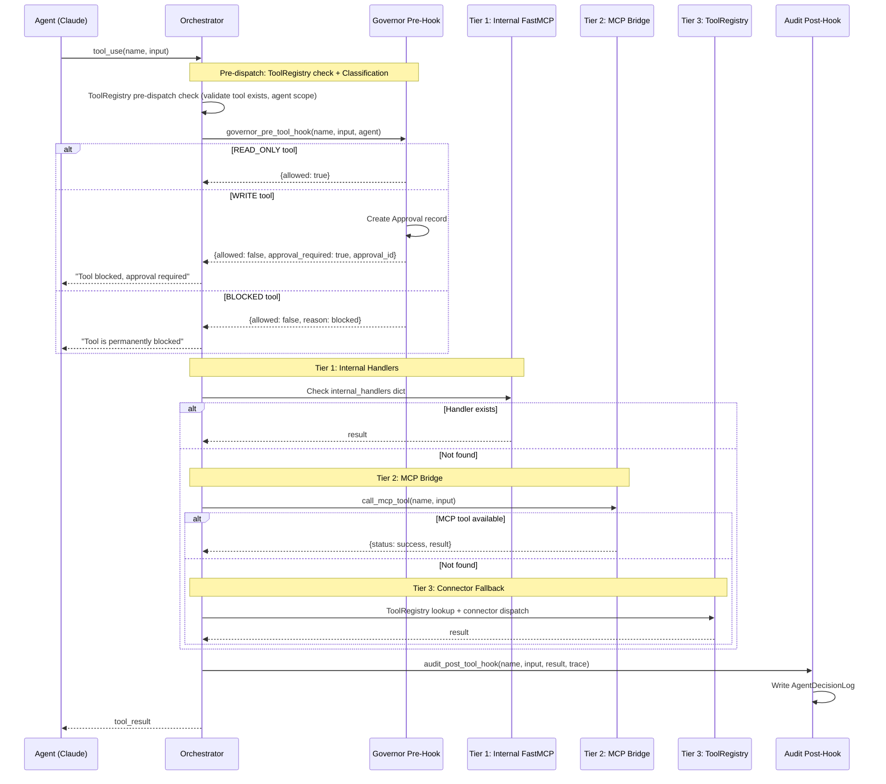
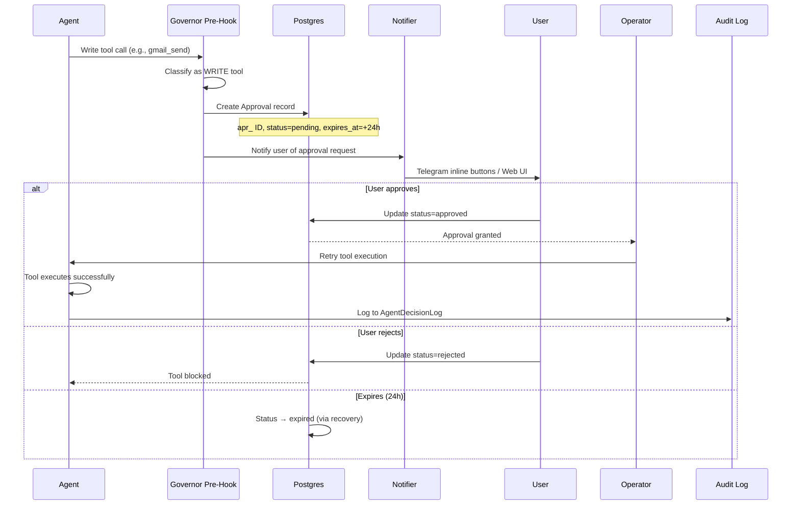

# Tool Resolution & MCP Architecture

## 3-Tier Tool Dispatch

When an agent requests a tool, the orchestrator resolves it through three tiers:
internal intelligence handlers -> MCP bridge -> ToolRegistry/Connector fallback.
All tool calls are workspace-scoped; the workspace_id is resolved from the authenticated user context and threaded through every dispatch layer.



## Tier 1: Internal Intelligence Handlers

FastMCP tools wrapping the intelligence services layer:

| Tool | Purpose |
|------|---------|
| `ingest_event` | Normalize, score, dedup raw events |
| `search` | Unified search across memories, entities, events via TriSearch |
| `update_entity` | Create/update entity |
| `plan_command` | Create plan from command |
| `get_active_plans` | List in-flight plans |
| `evaluate_policy` | Governor policy check |
| `approve_action` | Process approval decision |
| `get_briefing` | Retrieve daily briefing |
| `get_observation_cursor` | Read source cursor |
| `update_observation_cursor` | Write source cursor |
| `report_observation` | Record observation results |
| `update_execution` | Update execution status |
| `extract_preferences` | Learn user preferences |
| `build_context` | Assemble context pack |
| `verify_run` | Verify execution output |

### ToolRegistry Pre-Dispatch

Before entering the tier cascade, `_execute_tool()` performs a ToolRegistry pre-dispatch check:

1. Look up tool definition in ToolRegistry by name
2. Validate the calling agent has the tool in its `tool_scope`
3. If the tool is disabled or unknown, return an error immediately

In `hooks.py`, the governor pre-hook uses ToolRegistry lookup to classify tools (read/write/blocked) with a hardcoded fallback set for tools not yet registered in the database.

## Tier 2: External MCP Servers

Connected via the `MCP Bridge` singleton (`src/connectors/mcp_bridge.py`). The bridge supports five external server types: Google Workspace, GitHub, Slack, Playwright, and Filesystem.

| Server | Transport | Tools Provided |
|--------|-----------|---------------|
| **Google Workspace** | stdio (`uvx google-workspace-mcp`) | gmail_*, calendar_*, drive_*, docs_*, sheets_*, tasks_*, contacts_* |
| **GitHub** | stdio (`npx @modelcontextprotocol/server-github`) | Repo search, PR review, issues, code analysis |
| **Slack** | stdio (`npx slack-mcp-server`) | Messages, threads, channels, reactions (also used for Slack notification delivery) |
| **Playwright** | stdio (`npx @playwright/mcp --headless`) | Navigate, click, fill, screenshot, extract |
| **Filesystem** | stdio (`npx @modelcontextprotocol/server-filesystem`) | Read, write, edit, directory ops, search |

Notable MCP-provided tools include `web_search` (available via external MCP servers for research workflows) and Slack delivery (used by the Notifier for Slack-surface notifications via the MCP bridge rather than direct API calls).

### MCP Bridge Lifecycle

```
App startup → initialize_mcp_bridge()
    → Connect to configured MCP servers
    → list_tools() on each server
    → Build _available_tools dict (name → schema)
    → Log discovered tool count

App shutdown → shutdown_mcp_bridge()
    → Disconnect all MCP clients
```

### Circuit Breaker

Each external MCP server has its own circuit breaker:
- Tracks consecutive failures
- Opens circuit on failure threshold
- Returns error immediately when open
- Resets after cooldown period

## Tier 3: ToolRegistry / Connector Fallback

DB-backed tool definitions (`tool_definitions` table) with connector dispatch:

1. Look up tool in ToolRegistry by name
2. Get `connector_type` (gmail, calendar, slack, github, drive, browser, internal)
3. Instantiate appropriate connector
4. Call `execute_action()` with credentials from OAuth manager
5. Return result

## Approval Flow



## Tool Classification

### Write Tools (Require Approval)

| Category | Tools |
|----------|-------|
| Gmail | send, draft, create_draft, reply |
| Calendar | create_event, update_event |
| Slack | post_message, send_message, react, update_message |
| GitHub | create_issue, comment, create_pr, merge_pr |
| Telegram | send_telegram, send_approval_prompt |

### Read-Only Tools (Always Allowed)

| Category | Tools |
|----------|-------|
| Intelligence | search, get_active_plans, get_briefing |
| Gmail/Calendar/Drive | list, read, search operations |
| Cursors | get_observation_cursor, report_observation |

### Blocked Tools (Never Allowed)

| Tools |
|-------|
| gmail_delete, drive_delete, calendar_delete_event |

### Risk Classification

| Risk Level | Examples |
|-----------|----------|
| **High** | gmail_send, github_merge_pr, slack_post_message |
| **Medium** | Most write tools (create_draft, update_event) |
| **Critical** | All blocked tools |

## Per-Agent Tool Scopes

Each agent has a curated set of allowed tools, enforced at two levels:

1. **Tool filtering** (`_get_tools_for_agent()`) - Only scoped tools included in Claude API call
2. **Governor pre-hook** - Second gate for write tools regardless of scope

| Agent | Tool Scope Summary |
|-------|-------------------|
| Observer | Gmail/Calendar/Drive/Slack/GitHub read + cursor tools |
| Librarian | update_entity, search |
| Planner | plan_command, get_active_plans, search |
| Governor | evaluate_policy, approve_action |
| Operator | All write tools + execution tracking |
| Presenter | get_briefing, search, send_telegram, push_ui_update |
| Researcher | All read tools + web_search + Playwright |
| Persona | search, extract_preferences |

## Audit Logging

Every tool invocation is logged via the audit post-hook:

```python
AgentDecisionLog:
    log_id: str         # Unique ID
    trace_id: str       # Correlation
    span_id: str        # Agent span
    agent_name: str     # Which agent called the tool
    tool_name: str      # Tool invoked
    input_summary: str  # Truncated input (500 chars)
    output_summary: str # Truncated output (500 chars)
    tokens_used: int    # Token cost of this call
    latency_ms: int     # Duration
```

This enables:
- Compliance auditing of all external writes
- Cost attribution per agent per tool
- Latency monitoring and optimization
- Debugging tool failures with full context
