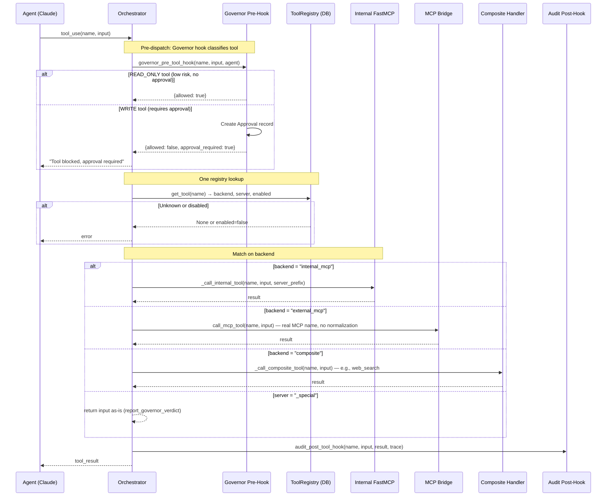

# Tool Resolution & MCP Architecture

## Unified Registry Dispatch

All tools are served through MCP. When an agent requests a tool, the orchestrator does one registry lookup and one match on `backend`:



## Tool Catalog (Single Source of Truth)

Tool identity lives in 2 files:
- **`src/tools/catalog.py`** — Definitions (`InternalToolDef` + `ExternalToolSeed`)
- **`src/tools/intelligence_server.py`** — MCP function implementations

### Internal Tools (19)

Defined as `InternalToolDef` entries in `catalog.py`. Served via in-process FastMCP.

| Tool | Server | Purpose |
|------|--------|---------|
| `ingest_event` | intelligence | Normalize, score, dedup raw events |
| `search` | intelligence | Unified search via TriSearch (Qdrant + FTS + Neo4j) |
| `update_entity` | intelligence | Create/update entity |
| `get_active_plans` | intelligence | List in-flight plans |
| `evaluate_policy` | intelligence | Governor policy check |
| `approve_action` | intelligence | Process approval decision |
| `get_briefing` | intelligence | Retrieve daily briefing |
| `get_observation_cursor` | intelligence | Read source cursor |
| `update_observation_cursor` | intelligence | Write source cursor |
| `report_observation` | intelligence | Record observation results |
| `update_execution` | intelligence | Update execution status |
| `extract_preferences` | intelligence | Learn user preferences |
| `get_goal_memories` | intelligence | Retrieve goal memories |
| `build_context` | intelligence | Assemble context pack |
| `verify_run` | intelligence | Verify execution output |
| `send_telegram` | communication | Send Telegram message |
| `send_approval_prompt` | communication | Send approval prompt |
| `push_ui_update` | communication | Push A2UI surface update |
| `report_governor_verdict` | _special | Return input as-is (inline dispatch) |

### External Tool Seeds (144)

Defined as `ExternalToolSeed` entries in `catalog.py`. Served via external MCP servers.

| Server | Tools | Verified | Naming |
|--------|-------|----------|--------|
| Google Workspace | 18 | Yes | snake_case (`search_gmail_messages`, `get_events`, etc.) |
| GitHub | 22 | No | snake_case (`create_pull_request`, `list_issues`, etc.) |
| Slack | 8 | No | snake_case (`slack_post_message`, `slack_get_channel_history`) |
| Notion | 22 | Yes | `API-` kebab-case (`API-post-page`, `API-patch-page`) |
| Linear | 24 | Yes | `linear_` snake_case (`linear_create_issue`, `linear_get_issue`) |
| Playwright | 22 | Yes | `browser_` snake_case (`browser_navigate`, `browser_snapshot`) |
| Filesystem | 14 | Yes | snake_case (`read_text_file`, `write_file`, `search_files`) |
| Atlassian | 13 | No | camelCase (`getJiraIssue`, `createJiraIssue`) |
| Composite | 1 | N/A | `web_search` (multi-MCP orchestration) |

### Unknown Discovered Tools

When an MCP server connects and reports tools not in the catalog, they auto-register:
- `capability=None` → invisible to all agents until admin maps capability
- `source="discovered"`, `risk_level="medium"`, `requires_approval=True`
- Safe by design — deny by default

## Authorization: Capability-Based

Agents have capability scopes (not tool lists). `SubAgent.can_use_tool()` does one registry lookup:

```
tool_name → ToolRegistry.get_tool() → tool.capability → check agent scope
```

| Agent | Capability Scope Summary |
|-------|-------------------------|
| Observer | email.*, calendar.*, doc.*, messaging.*, issue.*, workflow.*, filesystem.read/list/search + internal cursor/observation tools |
| Librarian | internal.update_entity, internal.search |
| Planner | internal.get_plans, internal.get_goals, internal.search |
| Governor | internal.evaluate_policy, internal.approve_action |
| Operator | email.send/draft, calendar.create/update/delete, messaging.send/reply, issue.*, workflow.*, doc.create/update + internal.update_execution |
| Presenter | internal.get_briefing, internal.search, internal.send_telegram, internal.push_ui, messaging.send |
| Researcher | internal.search + all read capabilities + search.web, browser.* |
| Persona | internal.search, internal.extract_preferences |

## Governor Tool Policy

Two separate policy layers:

1. **Decision-level** (`AUTO_EXECUTE_DECISIONS` in governor.py): "Should this Planner decision skip approval?" — applies to decision types like `search`, `summarize`, `acknowledge`
2. **Tool-level** (`Governor.is_auto_execute_tool()`): "Should this specific tool call require approval?" — derives from registry `risk_level` + `requires_approval`

## MCP Bridge

Connected via `src/connectors/mcp_bridge.py`. Session pool manages per-user authenticated connections with circuit breaking.

### Session Pool

- Per `(workspace_id, server_name, user_id)` sessions
- Real MCP names stored and dispatched directly — no normalization
- Circuit breaker per server (consecutive failure tracking, cooldown)
- Retry with exponential backoff for transient errors

### Startup Flow

```
App startup → seed_defaults() (163 tools from catalog)
            → validate_registry() (6 cross-checks)
            → initialize_mcp_bridge()
            → Connect to configured MCP servers
            → list_tools() on each server
            → Register discovered tools in DB
```

## Audit Logging

Every tool invocation is logged via the audit post-hook:

```
AgentDecisionLog:
    log_id, trace_id, span_id, agent_name,
    tool_name, input_summary (500 chars),
    output_summary (500 chars), tokens_used, latency_ms
```
